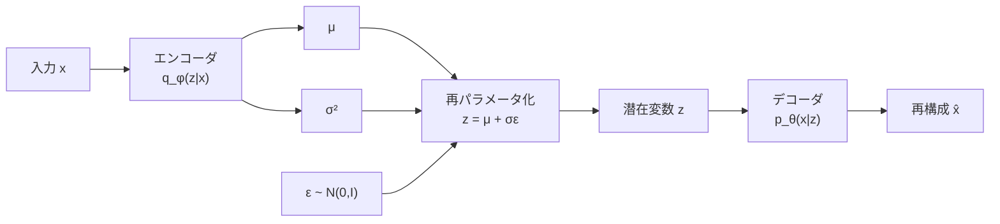
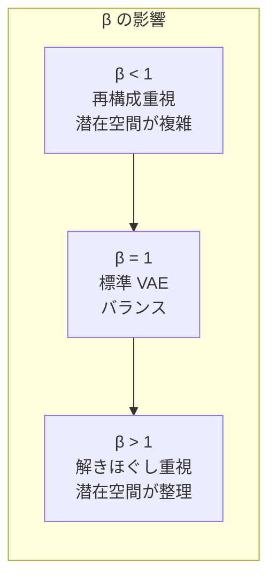

---
tags:
  - generative-models
  - VAE
  - variational-inference
  - beta-VAE
  - VQ-VAE
created: "2026-04-19"
status: draft
---

# 02 — VAE 完全解説

## 1. VAE の直感的理解

VAE (Variational Autoencoder) は、データ $\mathbf{x}$ の背後にある潜在変数 $\mathbf{z}$ を仮定し、エンコーダ $q_\phi(\mathbf{z}|\mathbf{x})$ とデコーダ $p_\theta(\mathbf{x}|\mathbf{z})$ を同時に学習する生成モデル。



---

## 2. 変分下界（ELBO）

### 2.1 導出

対数周辺尤度 $\log p_\theta(\mathbf{x})$ を直接最大化するのは困難（$p_\theta(\mathbf{x}) = \int p_\theta(\mathbf{x}|\mathbf{z})p(\mathbf{z})d\mathbf{z}$ の積分が扱えない）。

変分推論を導入:

$$\log p_\theta(\mathbf{x}) = \text{ELBO} + D_{\text{KL}}(q_\phi(\mathbf{z}|\mathbf{x}) \| p_\theta(\mathbf{z}|\mathbf{x}))$$

$D_{\text{KL}} \geq 0$ より:

$$\log p_\theta(\mathbf{x}) \geq \text{ELBO} = \mathbb{E}_{q_\phi(\mathbf{z}|\mathbf{x})}[\log p_\theta(\mathbf{x}|\mathbf{z})] - D_{\text{KL}}(q_\phi(\mathbf{z}|\mathbf{x}) \| p(\mathbf{z}))$$

### 2.2 ELBO の2つの項

| 項 | 意味 | 直感 |
|----|------|------|
| $\mathbb{E}_{q}[\log p_\theta(\mathbf{x}|\mathbf{z})]$ | 再構成誤差 | デコーダの品質 |
| $-D_{\text{KL}}(q_\phi \| p)$ | 正則化項 | 潜在空間の整然さ |

---

## 3. 再パラメータ化トリック

### 3.1 問題

$\mathbf{z} \sim q_\phi(\mathbf{z}|\mathbf{x})$ からのサンプリングは確率的操作であり、勾配を逆伝播できない。

### 3.2 解決

$q_\phi(\mathbf{z}|\mathbf{x}) = \mathcal{N}(\mu_\phi(\mathbf{x}), \text{diag}(\sigma_\phi^2(\mathbf{x})))$ と仮定し:

$$\mathbf{z} = \mu_\phi(\mathbf{x}) + \sigma_\phi(\mathbf{x}) \odot \epsilon, \quad \epsilon \sim \mathcal{N}(\mathbf{0}, \mathbf{I})$$

確率性を $\epsilon$ に分離することで、$\mu$ と $\sigma$ に対する勾配計算が可能に。

---

## 4. PyTorch 実装

```python
import torch
import torch.nn as nn
import torch.nn.functional as F

class VAE(nn.Module):
    def __init__(self, input_dim=784, hidden_dim=400, latent_dim=20):
        super().__init__()
        self.latent_dim = latent_dim

        # エンコーダ
        self.encoder = nn.Sequential(
            nn.Linear(input_dim, hidden_dim),
            nn.ReLU(),
            nn.Linear(hidden_dim, hidden_dim),
            nn.ReLU(),
        )
        self.fc_mu = nn.Linear(hidden_dim, latent_dim)
        self.fc_logvar = nn.Linear(hidden_dim, latent_dim)

        # デコーダ
        self.decoder = nn.Sequential(
            nn.Linear(latent_dim, hidden_dim),
            nn.ReLU(),
            nn.Linear(hidden_dim, hidden_dim),
            nn.ReLU(),
            nn.Linear(hidden_dim, input_dim),
            nn.Sigmoid(),
        )

    def encode(self, x):
        h = self.encoder(x)
        return self.fc_mu(h), self.fc_logvar(h)

    def reparameterize(self, mu, logvar):
        std = torch.exp(0.5 * logvar)
        eps = torch.randn_like(std)
        return mu + std * eps

    def decode(self, z):
        return self.decoder(z)

    def forward(self, x):
        mu, logvar = self.encode(x.view(-1, 784))
        z = self.reparameterize(mu, logvar)
        x_recon = self.decode(z)
        return x_recon, mu, logvar

def vae_loss(x_recon, x, mu, logvar):
    """VAE の損失関数 = 再構成誤差 + KL ダイバージェンス"""
    # 再構成誤差（Binary Cross-Entropy）
    recon_loss = F.binary_cross_entropy(x_recon, x.view(-1, 784), reduction="sum")

    # KL ダイバージェンス（解析解）
    # D_KL(N(mu, sigma^2) || N(0, 1)) = -0.5 * sum(1 + log(sigma^2) - mu^2 - sigma^2)
    kl_loss = -0.5 * torch.sum(1 + logvar - mu.pow(2) - logvar.exp())

    return recon_loss + kl_loss

# 学習ループ
model = VAE()
optimizer = torch.optim.Adam(model.parameters(), lr=1e-3)

for epoch in range(50):
    model.train()
    total_loss = 0
    for batch_x, _ in train_loader:
        x_recon, mu, logvar = model(batch_x)
        loss = vae_loss(x_recon, batch_x, mu, logvar)
        optimizer.zero_grad()
        loss.backward()
        optimizer.step()
        total_loss += loss.item()
    print(f"Epoch {epoch}: Loss = {total_loss / len(train_loader.dataset):.4f}")
```

---

## 5. β-VAE

### 5.1 動機

標準 VAE の KL 項の重みを調整して **解きほぐされた表現（Disentangled Representation）** を学習:

$$\mathcal{L}_{\beta\text{-VAE}} = \mathbb{E}_{q}[\log p_\theta(\mathbf{x}|\mathbf{z})] - \beta \cdot D_{\text{KL}}(q_\phi(\mathbf{z}|\mathbf{x}) \| p(\mathbf{z}))$$

- $\beta = 1$: 標準 VAE
- $\beta > 1$: 解きほぐしを促進（再構成品質は低下）
- $\beta < 1$: 再構成品質を優先



### 5.2 解きほぐされた表現

潜在変数の各次元が独立した意味のある要因を捉える:

```
z[0]: 顔の向き
z[1]: 表情
z[2]: 髪の色
z[3]: 照明条件
...
```

---

## 6. VQ-VAE（Vector Quantized VAE）

### 6.1 離散的な潜在空間

連続的な潜在空間の代わりに、**離散的なコードブック** を使用:

$$z_q = \arg\min_{e_k \in \mathcal{E}} \|z_e - e_k\|_2$$

### 6.2 損失関数

$$\mathcal{L} = \|x - \hat{x}\|_2^2 + \|sg[z_e] - e\|_2^2 + \beta \|z_e - sg[e]\|_2^2$$

- $sg[\cdot]$: Stop-gradient 演算子
- 第2項: コードブック損失
- 第3項: コミットメント損失

```python
class VectorQuantizer(nn.Module):
    def __init__(self, num_embeddings=512, embedding_dim=64, commitment_cost=0.25):
        super().__init__()
        self.embedding = nn.Embedding(num_embeddings, embedding_dim)
        self.commitment_cost = commitment_cost

    def forward(self, z_e):
        # z_e: (B, D, H, W) -> (B*H*W, D)
        z_e_flat = z_e.permute(0, 2, 3, 1).reshape(-1, z_e.shape[1])

        # 最近傍のコードブックエントリを検索
        distances = torch.cdist(z_e_flat, self.embedding.weight)
        indices = distances.argmin(dim=1)
        z_q_flat = self.embedding(indices)

        # 損失
        codebook_loss = F.mse_loss(z_q_flat, z_e_flat.detach())
        commitment_loss = F.mse_loss(z_e_flat, z_q_flat.detach())
        loss = codebook_loss + self.commitment_cost * commitment_loss

        # Straight-Through Estimator
        z_q = z_e + (z_q_flat.view_as(z_e.permute(0,2,3,1)).permute(0,3,1,2) - z_e).detach()

        return z_q, loss, indices
```

### 6.3 VQ-VAE-2 と応用

VQ-VAE-2 は階層的な離散潜在空間を使い、高解像度の画像生成を実現。Stable Diffusion の VAE コンポーネントにも VQ の考え方が活きている。

---

## 7. 発展的な VAE

| モデル | 改良点 |
|--------|--------|
| Conditional VAE | 条件 $c$ を追加: $p(\mathbf{x}|\mathbf{z}, c)$ |
| Hierarchical VAE | 複数層の潜在変数 |
| NVAE | 深い階層 + 残差接続 |
| Diffusion VAE | 拡散モデルをデコーダに使用 |

---

## 8. ハンズオン演習

### 演習 1: MNIST VAE

上記の VAE を MNIST で学習し、(a) 潜在空間の2D可視化 (b) 潜在空間の補間による画像生成 を行え。

### 演習 2: β-VAE の解きほぐし

CelebA データセットで $\beta = 0.5, 1.0, 4.0, 10.0$ の β-VAE を学習し、潜在変数の各次元を変化させて生成画像の変化を観察せよ。

### 演習 3: VQ-VAE の実装

VQ-VAE を CIFAR-10 で学習し、コードブックの利用率と再構成品質を分析せよ。

---

## 9. まとめ

- VAE は変分推論に基づく生成モデルで、ELBO を最大化して学習
- 再パラメータ化トリックが勾配計算の鍵
- β-VAE は KL 項の重みで解きほぐされた表現を学習
- VQ-VAE は離散コードブックで高品質な潜在表現を実現
- VAE のデコーダは Stable Diffusion 等の重要コンポーネント

---

## 参考文献

- Kingma & Welling, "Auto-Encoding Variational Bayes" (2014)
- Higgins et al., "beta-VAE: Learning Basic Visual Concepts with a Constrained Variational Framework" (2017)
- van den Oord et al., "Neural Discrete Representation Learning" (VQ-VAE, 2017)
