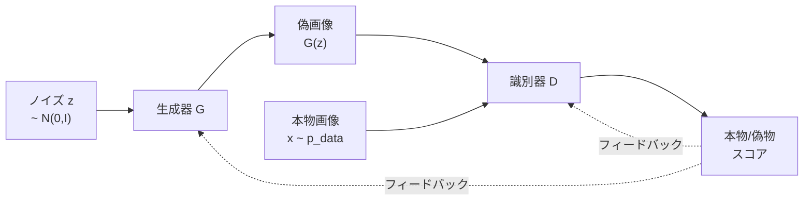
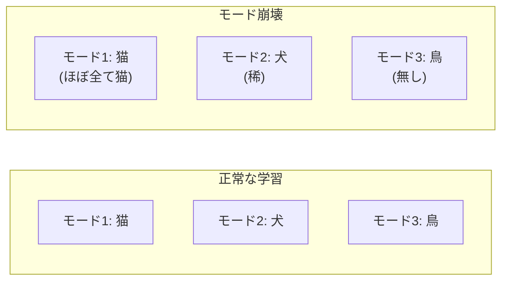

---
tags:
  - generative-models
  - GAN
  - WGAN
  - StyleGAN
  - mode-collapse
created: "2026-04-19"
status: draft
---

# 03 — GAN 完全解説

## 1. GAN の基本概念

GAN (Generative Adversarial Network) は、**生成器 (Generator) G** と **識別器 (Discriminator) D** の2つのネットワークが敵対的に学習する生成モデル。



---

## 2. Min-Max ゲーム

### 2.1 目的関数

$$\min_G \max_D V(D, G) = \mathbb{E}_{\mathbf{x} \sim p_{\text{data}}}[\log D(\mathbf{x})] + \mathbb{E}_{\mathbf{z} \sim p_z}[\log(1 - D(G(\mathbf{z})))]$$

### 2.2 最適識別器

$G$ を固定したとき:

$$D^*(\mathbf{x}) = \frac{p_{\text{data}}(\mathbf{x})}{p_{\text{data}}(\mathbf{x}) + p_g(\mathbf{x})}$$

### 2.3 最適生成器

$D = D^*$ のとき、$G$ の目的関数は $p_g = p_{\text{data}}$ で最小値 $-\log 4$ を取る。この最小化はJensen-Shannon ダイバージェンスの最小化と等価:

$$C(G) = -\log 4 + 2 \cdot D_{\text{JS}}(p_{\text{data}} \| p_g)$$

---

## 3. 実装

```python
import torch
import torch.nn as nn

class Generator(nn.Module):
    def __init__(self, latent_dim=100, img_shape=(1, 28, 28)):
        super().__init__()
        self.img_shape = img_shape
        dim = img_shape[0] * img_shape[1] * img_shape[2]

        self.model = nn.Sequential(
            nn.Linear(latent_dim, 256),
            nn.LeakyReLU(0.2),
            nn.BatchNorm1d(256),
            nn.Linear(256, 512),
            nn.LeakyReLU(0.2),
            nn.BatchNorm1d(512),
            nn.Linear(512, 1024),
            nn.LeakyReLU(0.2),
            nn.BatchNorm1d(1024),
            nn.Linear(1024, dim),
            nn.Tanh(),
        )

    def forward(self, z):
        img = self.model(z)
        return img.view(z.size(0), *self.img_shape)

class Discriminator(nn.Module):
    def __init__(self, img_shape=(1, 28, 28)):
        super().__init__()
        dim = img_shape[0] * img_shape[1] * img_shape[2]

        self.model = nn.Sequential(
            nn.Linear(dim, 512),
            nn.LeakyReLU(0.2),
            nn.Dropout(0.3),
            nn.Linear(512, 256),
            nn.LeakyReLU(0.2),
            nn.Dropout(0.3),
            nn.Linear(256, 1),
            nn.Sigmoid(),
        )

    def forward(self, img):
        return self.model(img.view(img.size(0), -1))

# 学習
G = Generator()
D = Discriminator()
opt_G = torch.optim.Adam(G.parameters(), lr=2e-4, betas=(0.5, 0.999))
opt_D = torch.optim.Adam(D.parameters(), lr=2e-4, betas=(0.5, 0.999))
criterion = nn.BCELoss()

for epoch in range(200):
    for real_imgs, _ in dataloader:
        batch_size = real_imgs.size(0)
        real_labels = torch.ones(batch_size, 1)
        fake_labels = torch.zeros(batch_size, 1)

        # --- 識別器の学習 ---
        z = torch.randn(batch_size, 100)
        fake_imgs = G(z).detach()
        d_loss = criterion(D(real_imgs), real_labels) + \
                 criterion(D(fake_imgs), fake_labels)
        opt_D.zero_grad()
        d_loss.backward()
        opt_D.step()

        # --- 生成器の学習 ---
        z = torch.randn(batch_size, 100)
        fake_imgs = G(z)
        g_loss = criterion(D(fake_imgs), real_labels)  # 偽物を本物と判定させる
        opt_G.zero_grad()
        g_loss.backward()
        opt_G.step()
```

---

## 4. モード崩壊（Mode Collapse）

### 4.1 問題

生成器がデータ分布の一部のモードのみを生成するようになる現象。



### 4.2 対策

| 手法 | アプローチ |
|------|-----------|
| Minibatch Discrimination | ミニバッチ内の多様性を識別器に入力 |
| Unrolled GAN | 識別器の数ステップ先を考慮 |
| WGAN | Wasserstein 距離の採用 |
| Spectral Normalization | 識別器のリプシッツ制約 |

---

## 5. WGAN（Wasserstein GAN）

### 5.1 Wasserstein 距離

Earth Mover's Distance とも呼ばれる:

$$W(p_r, p_g) = \inf_{\gamma \in \Pi(p_r, p_g)} \mathbb{E}_{(x,y) \sim \gamma}[\|x - y\|]$$

Kantorovich-Rubinstein 双対:

$$W(p_r, p_g) = \sup_{\|f\|_L \leq 1} \mathbb{E}_{x \sim p_r}[f(x)] - \mathbb{E}_{x \sim p_g}[f(x)]$$

### 5.2 WGAN-GP（Gradient Penalty）

リプシッツ制約を勾配ペナルティで実現:

$$\mathcal{L}_{\text{GP}} = \lambda \mathbb{E}_{\hat{x}}[(\|\nabla_{\hat{x}} D(\hat{x})\|_2 - 1)^2]$$

$\hat{x}$ は本物と偽物の線形補間点。

```python
def gradient_penalty(D, real, fake, device):
    alpha = torch.rand(real.size(0), 1, 1, 1, device=device)
    interpolated = (alpha * real + (1 - alpha) * fake).requires_grad_(True)
    d_interpolated = D(interpolated)
    gradients = torch.autograd.grad(
        outputs=d_interpolated,
        inputs=interpolated,
        grad_outputs=torch.ones_like(d_interpolated),
        create_graph=True,
    )[0]
    gradients = gradients.view(gradients.size(0), -1)
    gp = ((gradients.norm(2, dim=1) - 1) ** 2).mean()
    return gp
```

---

## 6. StyleGAN の主要技法

| 技法 | 説明 |
|------|------|
| Mapping Network | $z \rightarrow w$ で潜在空間を非絡み化 |
| AdaIN | スタイルを各層に注入 |
| Style Mixing | 異なる $w$ を層ごとに混合 |
| Noise Injection | 確率的なディテールを追加 |
| Truncation Trick | $w' = \bar{w} + \psi(w - \bar{w})$ で品質と多様性を調整 |

---

## 7. 学習安定化テクニック

| テクニック | 効果 |
|-----------|------|
| Spectral Normalization | D のリプシッツ定数を1に制約 |
| Two-Timescale Update | D と G に異なる学習率 |
| Progressive Growing | 低解像度→高解像度へ段階的に学習 |
| R1 Regularization | $R_1 = \frac{\gamma}{2}\mathbb{E}[\|\nabla D(x)\|^2]$ |
| Exponential Moving Average | G の重みの EMA で安定した生成 |

---

## 8. ハンズオン演習

### 演習 1: GAN の学習ダイナミクス観察

MNIST で GAN を学習し、D と G の損失の推移、生成画像の品質変化を epoch ごとに記録せよ。

### 演習 2: WGAN-GP の実装

上記の GAN を WGAN-GP に改修し、学習の安定性とモード崩壊の抑制を確認せよ。

### 演習 3: 潜在空間の探索

学習済み GAN の潜在空間で2つのベクトルの補間を行い、生成画像の滑らかな変化を観察せよ。

---

## 9. まとめ

- GAN は G と D の敵対的学習で暗黙的に分布を学習
- Min-Max ゲームの理論的最適解は $p_g = p_{\text{data}}$
- モード崩壊と学習不安定性が主な課題
- WGAN は Wasserstein 距離で安定した学習を実現
- StyleGAN は潜在空間の操作性と高品質生成を両立
- Spectral Normalization, R1 正則化等の安定化技法が実践上重要

---

## 参考文献

- Goodfellow et al., "Generative Adversarial Nets" (2014)
- Arjovsky et al., "Wasserstein GAN" (2017)
- Karras et al., "A Style-Based Generator Architecture for GANs" (2019)
