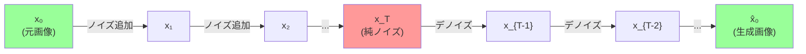
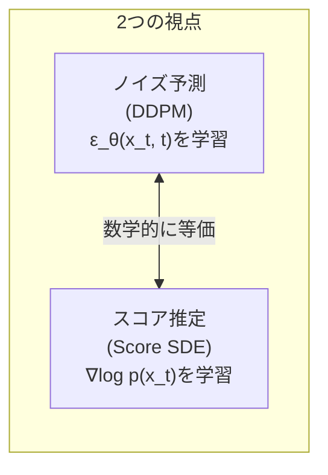

---
tags:
  - generative-models
  - diffusion
  - DDPM
  - score-matching
  - DDIM
created: "2026-04-19"
status: draft
---

# 04 — 拡散モデル（Diffusion Models）

## 1. 拡散モデルの直感

データに段階的にノイズを加え（前方過程）、そのノイズを段階的に除去する方法を学ぶ（逆方向過程）。



---

## 2. DDPM（Denoising Diffusion Probabilistic Models）

### 2.1 前方過程（Forward Process）

データ $\mathbf{x}_0$ にガウスノイズを段階的に追加:

$$q(\mathbf{x}_t | \mathbf{x}_{t-1}) = \mathcal{N}(\mathbf{x}_t; \sqrt{1-\beta_t}\mathbf{x}_{t-1}, \beta_t \mathbf{I})$$

$\alpha_t = 1 - \beta_t$, $\bar{\alpha}_t = \prod_{s=1}^{t} \alpha_s$ とすると:

$$q(\mathbf{x}_t | \mathbf{x}_0) = \mathcal{N}(\mathbf{x}_t; \sqrt{\bar{\alpha}_t}\mathbf{x}_0, (1-\bar{\alpha}_t)\mathbf{I})$$

直接 $\mathbf{x}_0$ から任意の $t$ ステップ目を計算可能:

$$\mathbf{x}_t = \sqrt{\bar{\alpha}_t}\mathbf{x}_0 + \sqrt{1-\bar{\alpha}_t}\boldsymbol{\epsilon}, \quad \boldsymbol{\epsilon} \sim \mathcal{N}(\mathbf{0}, \mathbf{I})$$

### 2.2 逆方向過程（Reverse Process）

$$p_\theta(\mathbf{x}_{t-1} | \mathbf{x}_t) = \mathcal{N}(\mathbf{x}_{t-1}; \boldsymbol{\mu}_\theta(\mathbf{x}_t, t), \sigma_t^2 \mathbf{I})$$

### 2.3 学習目的関数

ノイズ $\boldsymbol{\epsilon}$ を予測するように学習:

$$\mathcal{L}_{\text{simple}} = \mathbb{E}_{t, \mathbf{x}_0, \boldsymbol{\epsilon}}\left[\|\boldsymbol{\epsilon} - \boldsymbol{\epsilon}_\theta(\mathbf{x}_t, t)\|^2\right]$$

---

## 3. 実装

```python
import torch
import torch.nn as nn
import numpy as np

class DiffusionModel:
    def __init__(self, num_timesteps=1000, beta_start=1e-4, beta_end=0.02):
        self.T = num_timesteps
        self.betas = torch.linspace(beta_start, beta_end, num_timesteps)
        self.alphas = 1 - self.betas
        self.alpha_bars = torch.cumprod(self.alphas, dim=0)

    def forward_diffusion(self, x0, t, noise=None):
        """前方過程: x0 から xt を計算"""
        if noise is None:
            noise = torch.randn_like(x0)
        alpha_bar_t = self.alpha_bars[t].view(-1, 1, 1, 1)
        xt = torch.sqrt(alpha_bar_t) * x0 + torch.sqrt(1 - alpha_bar_t) * noise
        return xt, noise

    def train_step(self, model, x0, optimizer):
        """1ステップの学習"""
        batch_size = x0.shape[0]
        t = torch.randint(0, self.T, (batch_size,))

        xt, noise = self.forward_diffusion(x0, t)

        # ノイズ予測
        predicted_noise = model(xt, t)
        loss = nn.functional.mse_loss(predicted_noise, noise)

        optimizer.zero_grad()
        loss.backward()
        optimizer.step()
        return loss.item()

    @torch.no_grad()
    def sample(self, model, shape, device):
        """逆方向過程でサンプリング"""
        x = torch.randn(shape, device=device)

        for t in reversed(range(self.T)):
            t_batch = torch.full((shape[0],), t, device=device, dtype=torch.long)
            predicted_noise = model(x, t_batch)

            alpha = self.alphas[t]
            alpha_bar = self.alpha_bars[t]
            beta = self.betas[t]

            # 平均の計算
            mean = (1 / torch.sqrt(alpha)) * (
                x - (beta / torch.sqrt(1 - alpha_bar)) * predicted_noise
            )

            if t > 0:
                noise = torch.randn_like(x)
                sigma = torch.sqrt(beta)
                x = mean + sigma * noise
            else:
                x = mean

        return x
```

---

## 4. Score Matching

### 4.1 スコア関数

$$\mathbf{s}_\theta(\mathbf{x}) = \nabla_{\mathbf{x}} \log p_\theta(\mathbf{x})$$

スコア関数はデータの確率密度が増加する方向を指す。

### 4.2 DDPM との関係

ノイズ予測 $\boldsymbol{\epsilon}_\theta$ とスコアの関係:

$$\mathbf{s}_\theta(\mathbf{x}_t, t) = -\frac{\boldsymbol{\epsilon}_\theta(\mathbf{x}_t, t)}{\sqrt{1 - \bar{\alpha}_t}}$$



---

## 5. DDIM（Denoising Diffusion Implicit Models）

### 5.1 決定論的サンプリング

DDPM は各ステップで確率的だが、DDIM は **決定論的** なサンプリングが可能:

$$\mathbf{x}_{t-1} = \sqrt{\bar{\alpha}_{t-1}} \underbrace{\left(\frac{\mathbf{x}_t - \sqrt{1-\bar{\alpha}_t}\boldsymbol{\epsilon}_\theta(\mathbf{x}_t, t)}{\sqrt{\bar{\alpha}_t}}\right)}_{\text{予測された } \mathbf{x}_0} + \sqrt{1-\bar{\alpha}_{t-1}} \cdot \boldsymbol{\epsilon}_\theta(\mathbf{x}_t, t)$$

### 5.2 ステップ数の削減

DDIM は任意のサブシーケンス $\{\tau_1, \tau_2, \ldots, \tau_S\} \subset \{1, \ldots, T\}$ でサンプリング可能。$T=1000$ ステップ → $S=50$ ステップでも高品質。

---

## 6. ノイズスケジュール

### 6.1 種類

| スケジュール | 式 | 特徴 |
|-------------|-----|------|
| Linear | $\beta_t = \beta_1 + \frac{t-1}{T-1}(\beta_T - \beta_1)$ | 標準的 |
| Cosine | $\bar{\alpha}_t = \frac{f(t)}{f(0)}$, $f(t)=\cos^2(\frac{t/T+s}{1+s}\frac{\pi}{2})$ | 改善された品質 |
| Sigmoid | S字カーブ | 中間で急変 |

### 6.2 SNR（信号対ノイズ比）

$$\text{SNR}(t) = \frac{\bar{\alpha}_t}{1 - \bar{\alpha}_t}$$

ノイズスケジュールの設計は SNR の単調減少として理解できる。

---

## 7. 数学的基礎の整理

| 概念 | 式 | 役割 |
|------|-----|------|
| 前方過程 | $q(\mathbf{x}_t|\mathbf{x}_0)$ | ノイズ追加 |
| 逆過程 | $p_\theta(\mathbf{x}_{t-1}|\mathbf{x}_t)$ | デノイズ |
| 学習目的 | $\|\boldsymbol{\epsilon} - \boldsymbol{\epsilon}_\theta\|^2$ | ノイズ予測 |
| スコア | $\nabla \log p(\mathbf{x})$ | 確率密度の勾配 |
| ELBO | $\sum_t D_{\text{KL}}(q \| p_\theta)$ | 変分下界 |

---

## 8. ハンズオン演習

### 演習 1: DDPM の学習

MNIST で DDPM を学習し、生成過程（$\mathbf{x}_T \rightarrow \mathbf{x}_0$）の各ステップを可視化せよ。

### 演習 2: ノイズスケジュールの比較

Linear と Cosine スケジュールで DDPM を学習し、FID スコアと生成品質を比較せよ。

### 演習 3: DDIM による高速サンプリング

同じ学習済みモデルで DDPM（1000ステップ）と DDIM（50, 100, 200 ステップ）のサンプリング品質と速度を比較せよ。

---

## 9. まとめ

- 拡散モデルはノイズの段階的追加と除去に基づく生成手法
- DDPM はノイズ予測をシンプルな MSE 損失で学習
- スコアマッチングとノイズ予測は数学的に等価
- DDIM は決定論的サンプリングとステップ数削減を実現
- ノイズスケジュール（特に Cosine）が品質に大きく影響
- 拡散モデルは品質・多様性・安定性の全てで優れる

---

## 参考文献

- Ho et al., "Denoising Diffusion Probabilistic Models" (2020)
- Song et al., "Score-Based Generative Modeling through SDEs" (2021)
- Song et al., "Denoising Diffusion Implicit Models" (DDIM, 2021)
