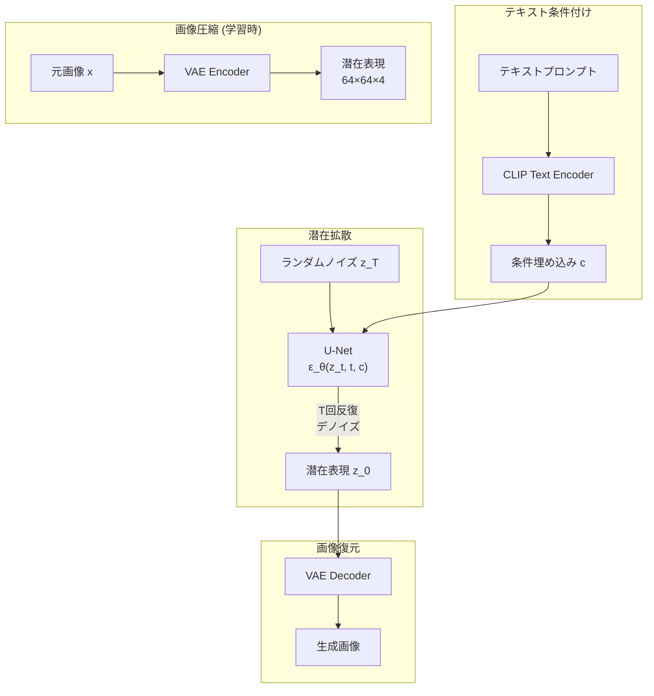
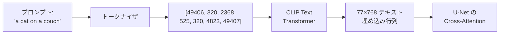

---
tags:
  - generative-models
  - Stable-Diffusion
  - latent-diffusion
  - U-Net
  - CLIP
  - LoRA
created: "2026-04-19"
status: draft
---

# 05 — Stable Diffusion 解剖

## 1. アーキテクチャ全体像

Stable Diffusion は **Latent Diffusion Model (LDM)** に基づく。ピクセル空間ではなく VAE の潜在空間で拡散を行うことで、計算コストを劇的に削減。



---

## 2. VAE コンポーネント

### 2.1 役割

画像 $(512 \times 512 \times 3)$ を潜在空間 $(64 \times 64 \times 4)$ に圧縮。空間的に $8 \times$ のダウンサンプリング。

```python
from diffusers import AutoencoderKL

vae = AutoencoderKL.from_pretrained("stabilityai/sd-vae-ft-mse")

# エンコード
latent = vae.encode(image).latent_dist.sample()
latent = latent * vae.config.scaling_factor  # 0.18215

# デコード
image_reconstructed = vae.decode(latent / vae.config.scaling_factor).sample
```

### 2.2 KL vs MSE ファインチューニング

| VAE | 特徴 |
|-----|------|
| KL-regularized | 潜在空間の構造が整理 |
| MSE-finetuned | 再構成品質が高い |

---

## 3. U-Net（ノイズ予測ネットワーク）

### 3.1 構造

拡散モデルの中核。残差ブロック + Attention を組み合わせた U 字型構造。

```python
# U-Net の主要コンポーネント
class ResidualBlock(nn.Module):
    """時間埋め込みを含む残差ブロック"""
    def __init__(self, in_ch, out_ch, time_emb_dim):
        super().__init__()
        self.conv1 = nn.Conv2d(in_ch, out_ch, 3, padding=1)
        self.conv2 = nn.Conv2d(out_ch, out_ch, 3, padding=1)
        self.time_mlp = nn.Linear(time_emb_dim, out_ch)
        self.norm1 = nn.GroupNorm(8, out_ch)
        self.norm2 = nn.GroupNorm(8, out_ch)

    def forward(self, x, t_emb):
        h = self.norm1(torch.nn.functional.silu(self.conv1(x)))
        h = h + self.time_mlp(t_emb)[:, :, None, None]
        h = self.norm2(torch.nn.functional.silu(self.conv2(h)))
        return h + x if x.shape == h.shape else h

class CrossAttention(nn.Module):
    """テキスト条件付き Cross-Attention"""
    def __init__(self, dim, context_dim, num_heads=8):
        super().__init__()
        self.num_heads = num_heads
        self.head_dim = dim // num_heads
        self.to_q = nn.Linear(dim, dim)
        self.to_k = nn.Linear(context_dim, dim)
        self.to_v = nn.Linear(context_dim, dim)
        self.to_out = nn.Linear(dim, dim)

    def forward(self, x, context):
        B, N, _ = x.shape
        q = self.to_q(x).view(B, N, self.num_heads, self.head_dim).transpose(1, 2)
        k = self.to_k(context).view(B, -1, self.num_heads, self.head_dim).transpose(1, 2)
        v = self.to_v(context).view(B, -1, self.num_heads, self.head_dim).transpose(1, 2)

        attn = (q @ k.transpose(-2, -1)) / (self.head_dim ** 0.5)
        attn = attn.softmax(dim=-1)
        out = (attn @ v).transpose(1, 2).reshape(B, N, -1)
        return self.to_out(out)
```

### 3.2 時間埋め込み

Sinusoidal embedding でタイムステップ $t$ をベクトルに変換し、各ブロックに注入:

$$\text{PE}(t, 2i) = \sin(t / 10000^{2i/d}), \quad \text{PE}(t, 2i+1) = \cos(t / 10000^{2i/d})$$

---

## 4. CLIP Text Encoder

### 4.1 テキスト条件付け

プロンプトを 77 トークン × 768 次元（SD 1.x）or 2048 次元（SDXL）のベクトル列にエンコード。



### 4.2 SDXL のデュアルエンコーダ

SDXL は OpenCLIP ViT-G + CLIP ViT-L の2つのテキストエンコーダを使用し、条件付けを強化。

---

## 5. Classifier-Free Guidance（CFG）

条件付きと無条件のノイズ予測を線形結合:

$$\hat{\boldsymbol{\epsilon}} = \boldsymbol{\epsilon}_\theta(\mathbf{z}_t, t, \emptyset) + s \cdot (\boldsymbol{\epsilon}_\theta(\mathbf{z}_t, t, c) - \boldsymbol{\epsilon}_\theta(\mathbf{z}_t, t, \emptyset))$$

| $s$ の値 | 効果 |
|-----------|------|
| $s = 1$ | CFG なし |
| $s = 7.5$ | 標準的 |
| $s > 15$ | 過度に条件に忠実（品質低下） |

学習時: ランダムに条件をドロップ（$p = 0.1$ 程度）して無条件予測も学習。

---

## 6. LoRA（Low-Rank Adaptation）

### 6.1 原理

全重みの更新の代わりに、低ランク行列の積で近似:

$$W' = W + \Delta W = W + BA$$

$B \in \mathbb{R}^{d \times r}$, $A \in \mathbb{R}^{r \times k}$ で $r \ll \min(d, k)$。

```python
class LoRALayer(nn.Module):
    def __init__(self, original_layer, rank=4, alpha=1.0):
        super().__init__()
        self.original = original_layer
        in_features = original_layer.in_features
        out_features = original_layer.out_features

        self.lora_A = nn.Parameter(torch.randn(in_features, rank) * 0.01)
        self.lora_B = nn.Parameter(torch.zeros(rank, out_features))
        self.scaling = alpha / rank

    def forward(self, x):
        original_out = self.original(x)
        lora_out = (x @ self.lora_A @ self.lora_B) * self.scaling
        return original_out + lora_out
```

### 6.2 実用的なファインチューニング

```python
from diffusers import StableDiffusionPipeline
from peft import LoraConfig

# LoRA でスタイル学習
config = LoraConfig(
    r=4,
    lora_alpha=4,
    target_modules=["to_q", "to_v", "to_k", "to_out.0"],
    lora_dropout=0.1,
)
```

---

## 7. ハンズオン演習

### 演習 1: パイプラインの分解

Stable Diffusion の各コンポーネント（VAE, CLIP, U-Net, Scheduler）を個別に呼び出し、全体のパイプラインを手動で再構築せよ。

### 演習 2: CFG スケールの実験

$s = 1, 3, 7.5, 15, 30$ で同じプロンプトの画像を生成し、品質と忠実度のトレードオフを分析せよ。

### 演習 3: LoRA ファインチューニング

特定のスタイル（例: 浮世絵、ピクセルアート）の画像 20-50 枚で LoRA を学習し、生成品質を評価せよ。

---

## 8. まとめ

- Stable Diffusion は VAE + U-Net + CLIP の3コンポーネントで構成
- 潜在空間での拡散により計算コストを $48 \times$ 以上削減
- Cross-Attention でテキスト条件を U-Net に注入
- CFG がテキスト-画像の整合性制御の鍵（$s = 7.5$ が標準）
- LoRA により少量データ・低コストでスタイルカスタマイズ可能

---

## 参考文献

- Rombach et al., "High-Resolution Image Synthesis with Latent Diffusion Models" (2022)
- Hu et al., "LoRA: Low-Rank Adaptation of Large Language Models" (2022)
- Radford et al., "Learning Transferable Visual Models From Natural Language Supervision" (CLIP, 2021)
