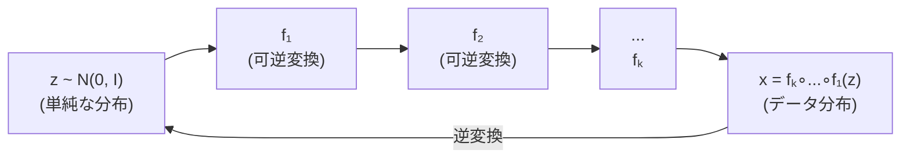
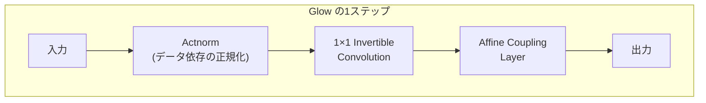

---
tags:
  - generative-models
  - normalizing-flow
  - RealNVP
  - Glow
  - invertible
created: "2026-04-19"
status: draft
---

# 06 — フローベースモデル（Flow-Based Models）

## 1. 正規化フローの基本概念

正規化フロー（Normalizing Flow）は、**可逆変換** の連鎖により単純な分布を複雑なデータ分布に変換する生成モデル。正確な尤度計算が可能な点が最大の特徴。



### 1.1 変数変換の公式

$\mathbf{x} = f(\mathbf{z})$ が可逆変換のとき:

$$p_X(\mathbf{x}) = p_Z(f^{-1}(\mathbf{x})) \left|\det \frac{\partial f^{-1}}{\partial \mathbf{x}}\right| = p_Z(\mathbf{z}) \left|\det \frac{\partial f}{\partial \mathbf{z}}\right|^{-1}$$

対数尤度:

$$\log p_X(\mathbf{x}) = \log p_Z(\mathbf{z}) - \log \left|\det \frac{\partial f}{\partial \mathbf{z}}\right|$$

$K$ 個の変換の合成:

$$\log p_X(\mathbf{x}) = \log p_Z(\mathbf{z}_0) - \sum_{k=1}^{K} \log \left|\det \frac{\partial f_k}{\partial \mathbf{z}_{k-1}}\right|$$

---

## 2. 設計上の制約

フローの各変換 $f_k$ は以下を満たす必要がある:

1. **可逆**: $f^{-1}$ が存在し効率的に計算可能
2. **ヤコビアン行列式**: $\det \frac{\partial f}{\partial \mathbf{z}}$ が効率的に計算可能

一般的に $d \times d$ 行列の行列式計算は $O(d^3)$ であり、高次元では非実用的。三角行列なら $O(d)$ で計算可能。

---

## 3. RealNVP（Real-valued Non-Volume Preserving）

### 3.1 Affine Coupling Layer

入力を2分割 $\mathbf{z} = [\mathbf{z}_{1:d}, \mathbf{z}_{d+1:D}]$ し:

$$\mathbf{y}_{1:d} = \mathbf{z}_{1:d}$$
$$\mathbf{y}_{d+1:D} = \mathbf{z}_{d+1:D} \odot \exp(s(\mathbf{z}_{1:d})) + t(\mathbf{z}_{1:d})$$

逆変換:
$$\mathbf{z}_{d+1:D} = (\mathbf{y}_{d+1:D} - t(\mathbf{y}_{1:d})) \odot \exp(-s(\mathbf{y}_{1:d}))$$

ヤコビアン行列は三角行列になり:

$$\log|\det J| = \sum_{j=d+1}^{D} s(\mathbf{z}_{1:d})_j$$

```python
import torch
import torch.nn as nn

class AffineCouplingLayer(nn.Module):
    def __init__(self, dim, hidden_dim=256, mask_type="even"):
        super().__init__()
        self.dim = dim
        # マスク（どの次元を変換するか）
        if mask_type == "even":
            self.mask = torch.arange(dim) % 2 == 0
        else:
            self.mask = torch.arange(dim) % 2 == 1

        # スケール s とシフト t を出力するネットワーク
        self.net = nn.Sequential(
            nn.Linear(dim, hidden_dim),
            nn.ReLU(),
            nn.Linear(hidden_dim, hidden_dim),
            nn.ReLU(),
            nn.Linear(hidden_dim, dim * 2),  # s と t を結合
        )

    def forward(self, z):
        z_masked = z * self.mask.float().to(z.device)
        st = self.net(z_masked)
        s, t = st.chunk(2, dim=-1)
        s = torch.tanh(s) * 2  # スケールを制限

        # 変換
        x = z_masked + (1 - self.mask.float().to(z.device)) * (z * torch.exp(s) + t)
        log_det = (s * (1 - self.mask.float().to(z.device))).sum(dim=-1)
        return x, log_det

    def inverse(self, x):
        x_masked = x * self.mask.float().to(x.device)
        st = self.net(x_masked)
        s, t = st.chunk(2, dim=-1)
        s = torch.tanh(s) * 2

        z = x_masked + (1 - self.mask.float().to(x.device)) * ((x - t) * torch.exp(-s))
        return z
```

---

## 4. Glow

### 4.1 改良点

Glow (Kingma & Dhariwal, 2018) は RealNVP を改良:



### 4.2 1x1 Invertible Convolution

チャネルの混合を学習可能な重み行列 $\mathbf{W}$ で行う:

$$\log|\det J| = h \cdot w \cdot \log|\det \mathbf{W}|$$

LU 分解で効率的に計算:

```python
class InvertibleConv1x1(nn.Module):
    def __init__(self, num_channels):
        super().__init__()
        # ランダム直交行列で初期化
        W = torch.linalg.qr(torch.randn(num_channels, num_channels))[0]
        # LU 分解
        P, L, U = torch.linalg.lu(W)
        self.register_buffer("P", P)
        self.L = nn.Parameter(L)
        self.U = nn.Parameter(U)
        self.log_s = nn.Parameter(torch.log(torch.abs(torch.diag(U))))

    def forward(self, x):
        # x: (B, C, H, W)
        W = self.P @ self.L @ (self.U * torch.diag(torch.exp(self.log_s)))
        log_det = x.shape[2] * x.shape[3] * self.log_s.sum()
        return torch.nn.functional.conv2d(x, W.unsqueeze(-1).unsqueeze(-1)), log_det
```

### 4.3 Actnorm

データの最初のミニバッチで平均と分散を初期化するバイアスとスケール:

$$y = s \odot (x - b)$$

---

## 5. 現代のフローベースモデル

### 5.1 Continuous Normalizing Flow（CNF）

離散的な変換の連鎖の代わりに、**常微分方程式（ODE）** で連続的なフローを定義:

$$\frac{d\mathbf{z}(t)}{dt} = f_\theta(\mathbf{z}(t), t)$$

### 5.2 Flow Matching

拡散モデルとフローの統合。Stable Diffusion 3 や Flux で採用:

$$\mathcal{L}_{\text{FM}} = \mathbb{E}_{t, q(\mathbf{x}_1)}\left[\|v_\theta(\phi_t(\mathbf{x}_0, \mathbf{x}_1), t) - (\mathbf{x}_1 - \mathbf{x}_0)\|^2\right]$$

$\phi_t(\mathbf{x}_0, \mathbf{x}_1) = (1-t)\mathbf{x}_0 + t\mathbf{x}_1$: 直線的な補間パス。

---

## 6. 比較

| 特性 | フローベース | VAE | GAN | 拡散 |
|------|------------|-----|-----|------|
| 正確な尤度 | ○ | × (ELBO) | × | × (近似) |
| 可逆性 | ○ | × | × | × |
| 生成品質 | 中〜高 | 中 | 高 | 最高 |
| 学習安定性 | 高い | 高い | 低い | 高い |
| 計算コスト | 高い | 低い | 中 | 高い |

---

## 7. ハンズオン演習

### 演習 1: 2D フローの可視化

2D のガウス分布を RealNVP で複雑な分布（例: 二重螺旋、半月型）に変換し、各層の変換を可視化せよ。

### 演習 2: Glow で画像生成

CIFAR-10 で Glow を学習し、潜在空間の補間と温度サンプリング（$T = 0.5, 0.7, 1.0$）の効果を比較せよ。

### 演習 3: 対数尤度の計算

学習済みフローモデルでテストデータの対数尤度 (bits per dimension) を計算し、他のモデルと比較せよ。

---

## 8. まとめ

- 正規化フローは可逆変換で正確な尤度計算が可能な唯一の深層生成モデル
- RealNVP の Affine Coupling Layer は三角ヤコビアンで効率的
- Glow は 1x1 Invertible Conv + Actnorm で改良
- Flow Matching は拡散モデルとフローを統合した最新手法
- 正確な尤度計算は密度推定や異常検知で特に有用

---

## 参考文献

- Dinh et al., "Density estimation using Real-NVP" (2017)
- Kingma & Dhariwal, "Glow: Generative Flow with Invertible 1x1 Convolutions" (2018)
- Lipman et al., "Flow Matching for Generative Modeling" (2023)
