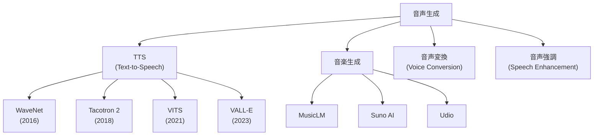

---
tags:
  - generative-models
  - audio-generation
  - TTS
  - WaveNet
  - VALL-E
created: "2026-04-19"
status: draft
---

# 07 — 音声生成

## 1. 音声生成の全体像



---

## 2. 音声の基礎知識

### 2.1 音声信号の表現

| 表現 | 説明 | 用途 |
|------|------|------|
| 波形 (Waveform) | 時間領域の振幅列 | 生の音声 |
| スペクトログラム | 時間-周波数表現 | 分析・可視化 |
| メルスペクトログラム | メル尺度のスペクトログラム | TTS の中間表現 |
| MFCC | メル周波数ケプストラム係数 | 特徴量 |

```python
import librosa
import librosa.display
import numpy as np
import matplotlib.pyplot as plt

# 音声の読み込みとメルスペクトログラムの計算
y, sr = librosa.load("audio.wav", sr=22050)

# メルスペクトログラム
mel_spec = librosa.feature.melspectrogram(
    y=y, sr=sr, n_mels=80, n_fft=1024, hop_length=256
)
mel_spec_db = librosa.power_to_db(mel_spec, ref=np.max)

plt.figure(figsize=(12, 4))
librosa.display.specshow(mel_spec_db, sr=sr, hop_length=256,
                          x_axis="time", y_axis="mel")
plt.colorbar(format="%+2.0f dB")
plt.title("Mel Spectrogram")
plt.show()
```

---

## 3. WaveNet

### 3.1 自己回帰波形生成

DeepMind (2016) の WaveNet は、波形のサンプル $x_t$ を直接自己回帰的に生成:

$$p(\mathbf{x}) = \prod_{t=1}^{T} p(x_t | x_1, \ldots, x_{t-1})$$

**Dilated Causal Convolution** で広い受容野を効率的に実現:

```python
class DilatedCausalConv(nn.Module):
    def __init__(self, channels, dilation):
        super().__init__()
        self.conv = nn.Conv1d(
            channels, channels * 2,
            kernel_size=2,
            dilation=dilation,
            padding=dilation  # causal padding
        )

    def forward(self, x):
        out = self.conv(x)
        out = out[:, :, :x.size(2)]  # causal trim
        # Gated activation
        tanh_out, sigmoid_out = out.chunk(2, dim=1)
        return torch.tanh(tanh_out) * torch.sigmoid(sigmoid_out)
```

### 3.2 μ-law 量子化

連続的な音声振幅を離散値に量子化:

$$f(x) = \text{sign}(x) \frac{\ln(1 + \mu|x|)}{\ln(1 + \mu)}, \quad \mu = 255$$

---

## 4. Tacotron 2

### 4.1 2段階パイプライン


1. **テキスト → メルスペクトログラム**: Seq2Seq + Attention
2. **メルスペクトログラム → 波形**: Vocoder（WaveNet, HiFi-GAN）

### 4.2 Vocoder の進化

| Vocoder | 速度 | 品質 |
|---------|------|------|
| WaveNet | 非常に遅い | 最高 |
| WaveRNN | やや遅い | 高い |
| WaveGlow | リアルタイム | 高い |
| HiFi-GAN | 超高速 | 高い |
| BigVGAN | 超高速 | 最高 |

---

## 5. VALL-E

### 5.1 音声の言語モデル

VALL-E (Microsoft, 2023) は音声合成を **言語モデルのタスク** として定式化:

- 音声を **Neural Codec** (EnCodec) で離散トークンに変換
- 3秒の参照音声から話者の声質を模倣
- テキスト + 参照トークン → 音声トークンを自己回帰的に生成

```python
# 概念的なパイプライン
# 1. EnCodec で音声をトークンに変換
from encodec import EncodecModel

encoder = EncodecModel.encodec_model_24khz()
encoder.set_target_bandwidth(6.0)

# audio_tensor: (1, 1, num_samples)
encoded_frames = encoder.encode(audio_tensor)
# codes: 離散トークン (num_codebooks, num_frames)

# 2. VALL-E で条件付き生成（疑似コード）
# input: text_tokens + reference_audio_tokens
# output: generated_audio_tokens
# 3. EnCodec デコーダで波形に復元
```

### 5.2 Zero-shot TTS

わずか3秒の音声サンプルで、任意のテキストをその声で読み上げ可能。

---

## 6. 音楽生成

### 6.1 主要モデル

| モデル | 開発元 | 特徴 |
|--------|--------|------|
| MusicLM | Google | テキスト→音楽 |
| MusicGen | Meta | オープンソース |
| Jukebox | OpenAI | 歌声も生成 |
| Suno AI | Suno | 商用レベルの品質 |
| Stable Audio | Stability AI | 拡散ベース |

### 6.2 MusicGen の使用例

```python
from audiocraft.models import MusicGen
from audiocraft.data.audio import audio_write

model = MusicGen.get_pretrained("facebook/musicgen-medium")
model.set_generation_params(duration=15)  # 15秒

descriptions = ["upbeat electronic dance music with synths"]
wav = model.generate(descriptions)

audio_write("generated_music", wav[0].cpu(), model.sample_rate)
```

---

## 7. TTS の最新動向

### 7.1 End-to-End TTS

| モデル | 特徴 |
|--------|------|
| VITS | VAE + Flow + GAN の統合 |
| NaturalSpeech 2/3 | 拡散ベース、ゼロショット |
| VoiceBox | Flow Matching ベース |
| F5-TTS | Flow Matching、高品質 |

### 7.2 感情・スタイル制御

テキスト + 話者 + 感情/スタイルの条件付けで細かな制御が可能に。

---

## 8. ハンズオン演習

### 演習 1: メルスペクトログラムの分析

異なる音声（男性/女性、感情の違い）のメルスペクトログラムを比較し、特徴的な差異を分析せよ。

### 演習 2: HiFi-GAN Vocoder

学習済み HiFi-GAN にメルスペクトログラムを入力し、波形を復元。生成音声の品質を MOS（Mean Opinion Score）で主観評価せよ。

### 演習 3: MusicGen で音楽生成

異なるテキストプロンプトで音楽を生成し、ジャンル・テンポ・楽器の制御性を評価せよ。

---

## 9. まとめ

- 音声生成は WaveNet → Tacotron → VALL-E と急速に進化
- Neural Codec（EnCodec）による離散化が LLM ベースの音声生成を可能に
- VALL-E は3秒の参照で Zero-shot TTS を実現
- 音楽生成も MusicGen 等で実用段階に到達
- End-to-End モデル（VITS, NaturalSpeech）が品質と速度を両立

---

## 参考文献

- van den Oord et al., "WaveNet: A Generative Model for Raw Audio" (2016)
- Wang et al., "VALL-E: Neural Codec Language Models are Zero-Shot Text to Speech Synthesizers" (2023)
- Copet et al., "Simple and Controllable Music Generation" (MusicGen, 2023)
