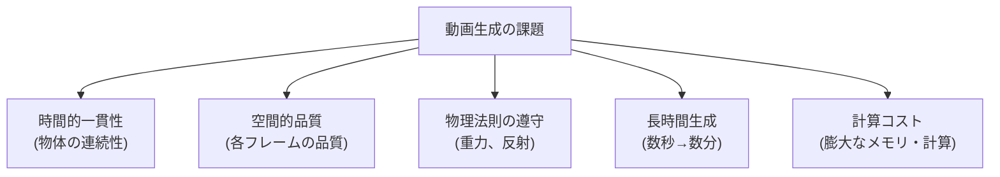
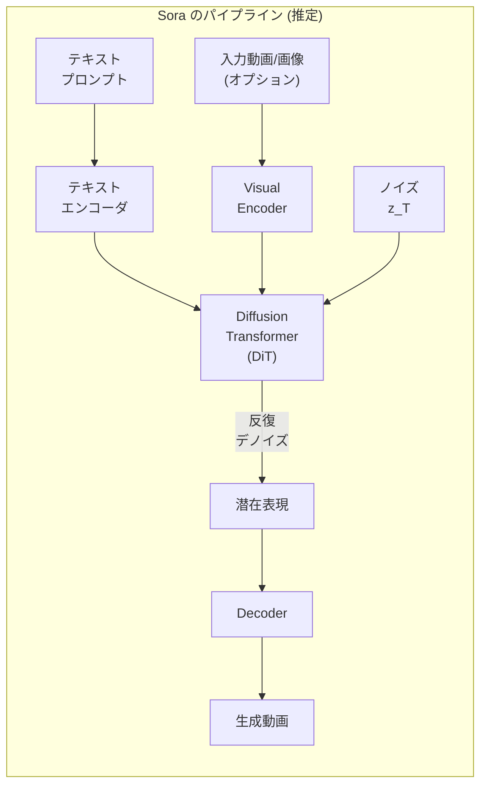

---
tags:
  - generative-models
  - video-generation
  - Sora
  - spatiotemporal
  - consistency
created: "2026-04-19"
status: draft
---

# 08 — 動画生成

## 1. 動画生成の課題

動画は画像の時系列であり、**空間的品質** + **時間的一貫性** の両方が求められる。フレーム数 $T$、解像度 $H \times W$ のため、データ量は画像の $T$ 倍以上。



---

## 2. 動画生成の発展

| 年 | モデル | 特徴 |
|----|--------|------|
| 2022 | Make-A-Video (Meta) | テキスト→動画、画像モデルを時間拡張 |
| 2023 | Gen-2 (Runway) | テキスト/画像→動画 |
| 2023 | Stable Video Diffusion | 画像→動画 |
| 2024 | Sora (OpenAI) | 1分の高品質動画、物理理解 |
| 2024 | Kling (Kuaishou) | リアルな人物動画 |
| 2024 | Movie Gen (Meta) | 動画 + 音声の統合生成 |
| 2025 | Veo 2 (Google) | 4K 2分動画 |

---

## 3. Sora 解説

### 3.1 アーキテクチャ

Sora は **Diffusion Transformer (DiT)** をベースとした時空間パッチモデル:



### 3.2 時空間パッチ

動画を **3D パッチ**（時間 $\times$ 高さ $\times$ 幅）に分割:

$$\text{パッチ数} = \frac{T}{p_t} \times \frac{H}{p_h} \times \frac{W}{p_w}$$

可変解像度・可変長をサポート（ViT のパッチ概念の3D拡張）。

### 3.3 Sora の特徴的能力

| 能力 | 説明 |
|------|------|
| 長時間生成 | 最大1分の高品質動画 |
| 可変アスペクト比 | 横長、縦長、正方形 |
| 物理理解 | 物理法則に基づく動き |
| 3D 一貫性 | カメラ移動時の奥行き |
| シミュレーション | ゲーム、デジタル世界 |

---

## 4. 時空間モデリング

### 4.1 3D U-Net

2D U-Net の畳み込みとAttentionを3D（時空間）に拡張:

```python
import torch.nn as nn

class SpatioTemporalConv(nn.Module):
    """空間と時間の畳み込みを分離"""
    def __init__(self, in_ch, out_ch):
        super().__init__()
        # 空間畳み込み (1×3×3)
        self.spatial_conv = nn.Conv3d(
            in_ch, out_ch,
            kernel_size=(1, 3, 3),
            padding=(0, 1, 1)
        )
        # 時間畳み込み (3×1×1)
        self.temporal_conv = nn.Conv3d(
            out_ch, out_ch,
            kernel_size=(3, 1, 1),
            padding=(1, 0, 0)
        )
        self.norm = nn.GroupNorm(8, out_ch)

    def forward(self, x):
        # x: (B, C, T, H, W)
        x = self.spatial_conv(x)
        x = self.temporal_conv(x)
        return nn.functional.silu(self.norm(x))

class TemporalAttention(nn.Module):
    """フレーム間の Attention"""
    def __init__(self, dim, num_heads=8):
        super().__init__()
        self.attn = nn.MultiheadAttention(dim, num_heads, batch_first=True)

    def forward(self, x):
        # x: (B, C, T, H, W) -> 各空間位置でフレーム間Attention
        B, C, T, H, W = x.shape
        x = x.permute(0, 3, 4, 2, 1).reshape(B * H * W, T, C)
        x = self.attn(x, x, x)[0]
        return x.reshape(B, H, W, T, C).permute(0, 4, 3, 1, 2)
```

### 4.2 Temporal Attention の種類

| 手法 | 計算量 | 品質 |
|------|--------|------|
| Full Spatiotemporal | $O((THW)^2)$ | 最高 |
| Factorized (空間→時間) | $O(T(HW)^2 + HW \cdot T^2)$ | 高い |
| Causal Temporal | $O(T^2)$ per position | 自己回帰的 |
| Sliding Window | $O(Tw)$ | 効率的 |

---

## 5. 一貫性の課題

### 5.1 主な一貫性の問題

| 問題 | 説明 | 対策 |
|------|------|------|
| フリッカー | フレーム間のちらつき | Temporal Attention |
| 形状変化 | 物体の形が不自然に変化 | 3D表現の活用 |
| テクスチャ変化 | 表面の見た目が変動 | フレーム間損失 |
| 物理的不整合 | 重力無視等 | 物理シミュレーション統合 |

### 5.2 一貫性向上の手法

```python
# フレーム間の一貫性損失（概念的）
def temporal_consistency_loss(frames):
    """隣接フレーム間の特徴の一貫性を促進"""
    loss = 0
    for i in range(len(frames) - 1):
        # 光学フロー推定
        flow = estimate_flow(frames[i], frames[i + 1])
        # フロー適用後の差分
        warped = warp_frame(frames[i], flow)
        loss += nn.functional.l1_loss(warped, frames[i + 1])
    return loss / (len(frames) - 1)
```

---

## 6. 実用的な動画生成

### 6.1 Stable Video Diffusion

```python
from diffusers import StableVideoDiffusionPipeline
from PIL import Image
import torch

pipe = StableVideoDiffusionPipeline.from_pretrained(
    "stabilityai/stable-video-diffusion-img2vid-xt",
    torch_dtype=torch.float16,
)
pipe.to("cuda")

# 画像から動画を生成
image = Image.open("input.jpg").resize((1024, 576))
frames = pipe(
    image,
    num_frames=25,
    decode_chunk_size=8,
    motion_bucket_id=127,
    noise_aug_strength=0.02,
).frames[0]
```

### 6.2 AnimateDiff

既存の画像生成モデルに Motion Module を追加して動画化:

```python
from diffusers import AnimateDiffPipeline, MotionAdapter

adapter = MotionAdapter.from_pretrained("guoyww/animatediff-motion-adapter-v1-5-3")
pipe = AnimateDiffPipeline.from_pretrained(
    "runwayml/stable-diffusion-v1-5",
    motion_adapter=adapter,
    torch_dtype=torch.float16,
)
```

---

## 7. ハンズオン演習

### 演習 1: Stable Video Diffusion

異なる入力画像で SVD を実行し、動きの自然さとテキスト制御性を評価せよ。

### 演習 2: AnimateDiff

AnimateDiff で生成された動画の時間的一貫性を、フレーム間 SSIM と光学フローの滑らかさで定量的に評価せよ。

### 演習 3: 動画品質指標

FVD (Frechet Video Distance) を実装し、生成動画と実動画の距離を計算せよ。

---

## 8. まとめ

- 動画生成は空間品質 + 時間一貫性の二重の課題がある
- Sora は DiT ベースの時空間パッチモデルで革新的な品質を達成
- 時空間 Attention（特に Factorized）が効率と品質のバランスの鍵
- フリッカー、形状変化、物理的不整合が主な一貫性の課題
- SVD, AnimateDiff 等がオープンソースで利用可能
- 動画生成は急速に進化中で、数分の高品質動画生成が現実的に

---

## 参考文献

- Brooks et al., "Video generation models as world simulators" (Sora, 2024)
- Blattmann et al., "Stable Video Diffusion" (2023)
- Guo et al., "AnimateDiff: Animate Your Personalized Text-to-Image Diffusion Models" (2023)
