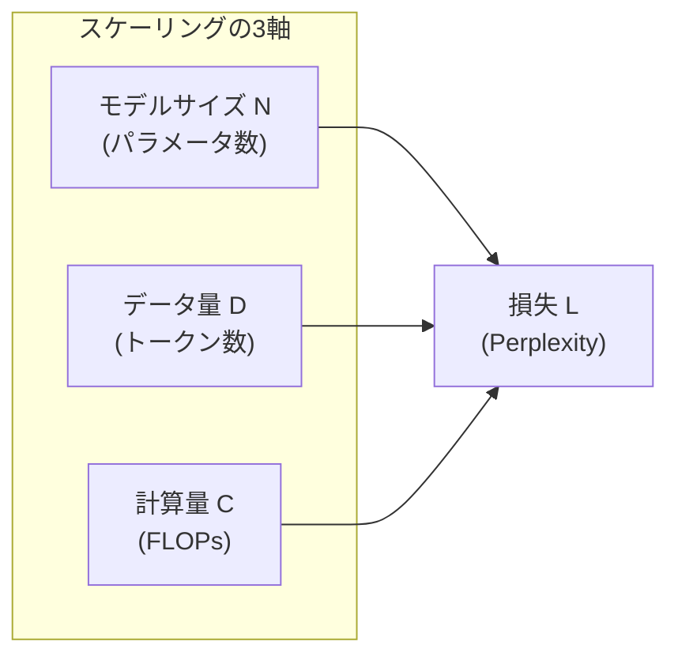
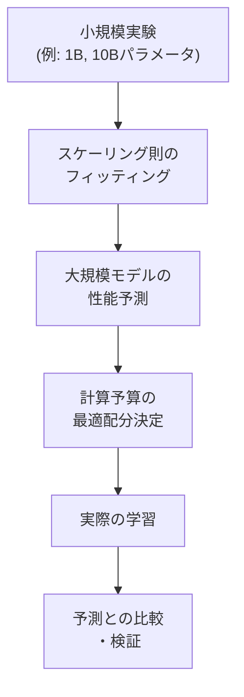

---
tags:
  - LLM
  - scaling-laws
  - Chinchilla
  - compute-optimal
created: "2026-04-19"
status: draft
---

# 01 — スケーリング則（Scaling Laws）

## 1. スケーリング則とは

LLM のパフォーマンス（損失 $L$）が、モデルサイズ $N$、データ量 $D$、計算量 $C$ に対してべき乗則（Power Law）に従うという経験則。

$$L(N) \propto N^{-\alpha_N}, \quad L(D) \propto D^{-\alpha_D}, \quad L(C) \propto C^{-\alpha_C}$$



---

## 2. Kaplan et al. (2020) — OpenAI のスケーリング則

### 2.1 主要な発見

$$L(N, D) = \left(\frac{N_c}{N}\right)^{\alpha_N / \alpha_D} + \left(\frac{D_c}{D}\right)$$

具体的な指数:
- $L(N) \propto N^{-0.076}$
- $L(D) \propto D^{-0.095}$
- $L(C) \propto C^{-0.050}$

### 2.2 計算予算の最適配分（Kaplan版）

計算予算 $C$ が固定のとき:
- **パラメータ数を優先して増やすべき**
- データ量はモデルサイズほど重要ではない
- → 大きなモデルを少ないデータで学習

$$N_{\text{opt}} \propto C^{0.73}, \quad D_{\text{opt}} \propto C^{0.27}$$

---

## 3. Chinchilla（Hoffmann et al., 2022）

### 3.1 Kaplan との違い

Chinchilla の研究は Kaplan のスケーリング則を **修正**:

$$L(N, D) = E + \frac{A}{N^\alpha} + \frac{B}{D^\beta}$$

$E \approx 1.69$, $A \approx 406.4$, $\alpha \approx 0.34$, $B \approx 410.7$, $\beta \approx 0.28$

### 3.2 Compute-Optimal な学習

| 方針 | Kaplan (2020) | Chinchilla (2022) |
|------|--------------|-------------------|
| N vs D のバランス | N を優先 | **N と D を均等に増やす** |
| 最適比率 | $D \propto N^{0.37}$ | $D \approx 20N$ |
| 結論 | 大モデル、少データ | **データ量も同等に重要** |

```python
import numpy as np
import matplotlib.pyplot as plt

def chinchilla_loss(N, D, A=406.4, B=410.7, E=1.69, alpha=0.34, beta=0.28):
    """Chinchilla のスケーリング則による損失推定"""
    return E + A / (N ** alpha) + B / (D ** beta)

def compute_optimal(C_flops, ratio=6):
    """計算最適なN, Dを計算 (C ≈ 6ND)"""
    # D = 20N (Chinchilla ルール)
    N_opt = np.sqrt(C_flops / (ratio * 20))
    D_opt = 20 * N_opt
    return N_opt, D_opt

# 例: 10^24 FLOPs の予算
C = 1e24
N_opt, D_opt = compute_optimal(C)
print(f"最適パラメータ数: {N_opt:.2e}")
print(f"最適データ量: {D_opt:.2e} トークン")
print(f"推定損失: {chinchilla_loss(N_opt, D_opt):.4f}")
```

### 3.3 主要モデルの Chinchilla 最適性

| モデル | パラメータ | 学習トークン | 比率 D/N | Chinchilla最適? |
|--------|-----------|-------------|----------|----------------|
| GPT-3 | 175B | 300B | 1.7 | 大幅に不足 |
| Chinchilla | 70B | 1.4T | 20 | 最適 |
| LLaMA-2 70B | 70B | 2T | 29 | やや過学習側 |
| LLaMA-3 8B | 8B | 15T | 1875 | 大幅に超過 |

---

## 4. 予測可能性



### 4.1 予測の信頼性

- **損失（Perplexity）**: 高い予測精度
- **下流タスク性能**: 予測が難しい（特に Emergent Abilities）
- **安全性**: 予測不可能な振る舞い

---

## 5. 計算量の推定

### 5.1 FLOPs の計算

Transformer の学習に必要な FLOPs:

$$C \approx 6ND$$

- $N$: パラメータ数（非埋め込み）
- $D$: 学習トークン数
- 係数 6: forward pass (2) + backward pass (4)

```python
def estimate_training_cost(N_params, D_tokens, gpu_flops=312e12, num_gpus=1024):
    """学習時間の推定"""
    C_flops = 6 * N_params * D_tokens
    gpu_hours = C_flops / (gpu_flops * num_gpus * 3600)
    utilization = 0.4  # MFU (Model FLOPs Utilization)
    actual_hours = gpu_hours / utilization
    return {
        "total_flops": C_flops,
        "gpu_hours": gpu_hours,
        "actual_hours": actual_hours,
        "actual_days": actual_hours / 24,
    }

# 例: LLaMA-3 70B の学習コスト推定
cost = estimate_training_cost(N_params=70e9, D_tokens=15e12, num_gpus=16384)
print(f"推定学習日数: {cost['actual_days']:.0f} 日")
```

---

## 6. Chinchilla 以降の議論

### 6.1 Over-training

推論コスト削減のため、Chinchilla 最適より **小さいモデルを長く学習** する傾向:

- LLaMA-3 8B: 15T トークン（$D/N = 1875$）
- 推論効率を重視した戦略

### 6.2 繰り返し学習

データが有限の場合、同じデータを複数エポック学習するリスク:
- 過学習、記憶の増加
- 品質の高いデータの繰り返しは効果的

---

## 7. ハンズオン演習

### 演習 1: スケーリング曲線のフィッティング

異なるサイズ（1M, 10M, 100M パラメータ）のモデルを MNIST/CIFAR で学習し、べき乗則のフィッティングを行え。

### 演習 2: Compute-Optimal の計算

$10^{20}$, $10^{22}$, $10^{24}$ FLOPs の計算予算に対して Chinchilla 最適な $N$ と $D$ を計算し、既存モデルとの対応を確認せよ。

### 演習 3: 学習コスト見積もり

自社のGPUリソース（例: A100 x 8台）で学習可能な最大のモデルサイズと、それに必要な学習時間を見積もれ。

---

## 8. まとめ

- LLM の性能はモデルサイズ・データ量・計算量のべき乗則に従う
- Chinchilla はデータ量の重要性を示し「$D \approx 20N$」を提唱
- 実務では推論コストも考慮し Over-training 戦略が主流に
- スケーリング則は小規模実験から大規模モデルの性能を予測可能
- 計算予算 $C \approx 6ND$ で学習コストを見積もれる

---

## 参考文献

- Kaplan et al., "Scaling Laws for Neural Language Models" (2020)
- Hoffmann et al., "Training Compute-Optimal Large Language Models" (Chinchilla, 2022)
- Sardana & Frankle, "Beyond Chinchilla-Optimal: Accounting for Inference" (2023)
