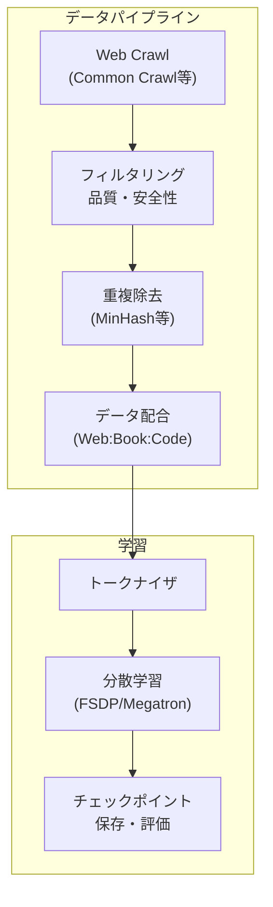
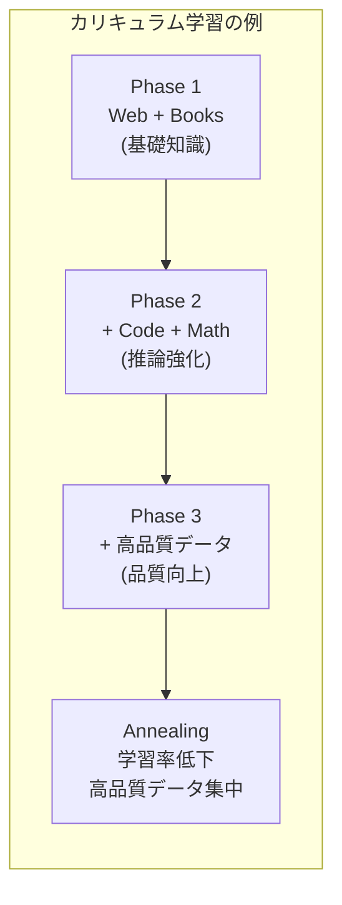

---
tags:
  - LLM
  - pretraining
  - distributed-training
  - data-curation
created: "2026-04-19"
status: draft
---

# 02 — 事前学習（Pre-training）

## 1. 事前学習の全体像

LLM の事前学習は、大規模テキストコーパスで次トークン予測を行う自己教師学習。



---

## 2. データ収集とクリーニング

### 2.1 データソース

| ソース | 規模 | 品質 | 例 |
|--------|------|------|-----|
| Web Crawl | 数十TB | 低〜中 | Common Crawl |
| 書籍 | 数百GB | 高 | Project Gutenberg |
| 学術論文 | 数百GB | 高 | arXiv, S2ORC |
| コード | 数TB | 中〜高 | GitHub, The Stack |
| Wikipedia | 数十GB | 高 | 全言語版 |
| 対話データ | 数百GB | 中 | Reddit, StackOverflow |

### 2.2 品質フィルタリング

```python
import re
from collections import Counter

class TextQualityFilter:
    """テキスト品質フィルタの例"""

    def __init__(self):
        self.min_words = 50
        self.max_words = 100000
        self.min_avg_word_len = 3
        self.max_symbol_ratio = 0.1
        self.max_duplicate_line_ratio = 0.3

    def filter(self, text: str) -> bool:
        words = text.split()

        # 単語数チェック
        if not (self.min_words <= len(words) <= self.max_words):
            return False

        # 平均単語長チェック
        avg_word_len = sum(len(w) for w in words) / len(words)
        if avg_word_len < self.min_avg_word_len:
            return False

        # 特殊文字比率
        symbol_count = sum(1 for c in text if not c.isalnum() and not c.isspace())
        if symbol_count / len(text) > self.max_symbol_ratio:
            return False

        # 重複行の比率
        lines = text.split("\n")
        line_counts = Counter(lines)
        duplicate_lines = sum(c - 1 for c in line_counts.values() if c > 1)
        if duplicate_lines / max(len(lines), 1) > self.max_duplicate_line_ratio:
            return False

        return True
```

### 2.3 重複除去（Deduplication）

```python
from datasketch import MinHash, MinHashLSH

def create_minhash(text: str, num_perm: int = 128) -> MinHash:
    """MinHash による近似重複検出"""
    m = MinHash(num_perm=num_perm)
    # 5-gram で特徴化
    words = text.split()
    for i in range(len(words) - 4):
        ngram = " ".join(words[i:i+5])
        m.update(ngram.encode("utf-8"))
    return m

# LSH インデックスの構築
lsh = MinHashLSH(threshold=0.8, num_perm=128)
# 各文書を登録し、類似文書を検出して除去
```

---

## 3. データ配合（Data Mixture）

### 3.1 ドメイン比率の重要性

LLaMA 3 のデータ配合（推定）:

| ドメイン | 比率 | 目的 |
|----------|------|------|
| Web テキスト | ~50% | 一般知識 |
| コード | ~17% | 推論能力 |
| 書籍 | ~10% | 深い知識 |
| 学術論文 | ~5% | 専門知識 |
| Wikipedia | ~3% | 事実知識 |
| 数学 | ~5% | 数学的推論 |
| 多言語 | ~10% | 多言語能力 |

### 3.2 カリキュラム学習

学習の段階でデータ配合を変える手法:



---

## 4. 学習設定

### 4.1 ハイパーパラメータ

```python
# 典型的な LLM の学習設定
config = {
    "model_size": "7B",
    "hidden_dim": 4096,
    "num_layers": 32,
    "num_heads": 32,
    "vocab_size": 32000,
    "max_seq_len": 4096,

    # 最適化
    "optimizer": "AdamW",
    "lr": 3e-4,
    "min_lr": 3e-5,
    "warmup_steps": 2000,
    "lr_schedule": "cosine",
    "weight_decay": 0.1,
    "grad_clip": 1.0,
    "beta1": 0.9,
    "beta2": 0.95,

    # バッチ
    "batch_size": 4_000_000,  # トークン数
    "total_tokens": 2_000_000_000_000,  # 2T トークン
}
```

### 4.2 学習率スケジュール

$$\text{lr}(t) = \begin{cases} \text{lr}_{\max} \cdot \frac{t}{T_{\text{warmup}}} & t < T_{\text{warmup}} \\ \text{lr}_{\min} + \frac{1}{2}(\text{lr}_{\max} - \text{lr}_{\min})(1 + \cos(\pi \frac{t - T_{\text{warmup}}}{T_{\text{total}} - T_{\text{warmup}}})) & t \geq T_{\text{warmup}} \end{cases}$$

---

## 5. 分散学習戦略

### 5.1 並列化の種類

| 手法 | 分割対象 | 通信量 |
|------|----------|--------|
| Data Parallel (DP) | データ | 勾配の AllReduce |
| Tensor Parallel (TP) | 行列演算 | アクティベーション |
| Pipeline Parallel (PP) | レイヤー | アクティベーション |
| FSDP / ZeRO | パラメータ+勾配+状態 | パラメータの AllGather |
| Sequence Parallel (SP) | シーケンス長 | アクティベーション |

### 5.2 3D 並列化

```python
# Megatron-LM スタイルの 3D 並列設定例
parallel_config = {
    "tensor_parallel_size": 8,    # 1ノード内の GPU 間
    "pipeline_parallel_size": 4,  # ノード間でレイヤー分割
    "data_parallel_size": 32,     # 残りのGPUでデータ並列
    # 合計: 8 × 4 × 32 = 1024 GPU
}
```

### 5.3 FSDP（Fully Sharded Data Parallel）

```python
from torch.distributed.fsdp import FullyShardedDataParallel as FSDP

model = FSDP(
    model,
    sharding_strategy=ShardingStrategy.FULL_SHARD,
    mixed_precision=MixedPrecision(
        param_dtype=torch.bfloat16,
        reduce_dtype=torch.float32,
    ),
    auto_wrap_policy=transformer_auto_wrap_policy,
)
```

---

## 6. 学習の安定性

### 6.1 よくある問題と対策

| 問題 | 症状 | 対策 |
|------|------|------|
| 損失スパイク | 損失が突然急増 | 学習率低下、チェックポイントから再開 |
| 勾配爆発 | grad norm 急増 | gradient clipping |
| NaN/Inf | 計算が破綻 | bf16 使用、skip NaN batches |
| 収束停滞 | 損失が下がらない | データ配合の調整 |

---

## 7. ハンズオン演習

### 演習 1: データフィルタリング

Common Crawl のサンプルデータに品質フィルタを適用し、フィルタ前後のテキスト品質を比較せよ。

### 演習 2: 小規模事前学習

GPT-2 アーキテクチャ（125M パラメータ）で Wikipedia 日本語版を事前学習し、Perplexity の推移を記録せよ。

### 演習 3: FSDP の実験

PyTorch FSDP で 1B パラメータモデルの学習を複数 GPU で実行し、スループットとメモリ使用量を計測せよ。

---

## 8. まとめ

- 事前学習はデータ品質が最終性能を決める最大の要因
- データクリーニング（フィルタリング + 重複除去）が不可欠
- データ配合とカリキュラム学習が性能を左右
- 分散学習（TP + PP + DP）が大規模学習の鍵
- bf16 + gradient clipping + 損失監視で学習安定性を確保

---

## 参考文献

- Touvron et al., "LLaMA: Open and Efficient Foundation Language Models" (2023)
- Penedo et al., "The RefinedWeb Dataset for Falcon LLM" (2023)
- Rae et al., "Scaling Language Models: Methods, Analysis & Insights from Training Gopher" (2022)
