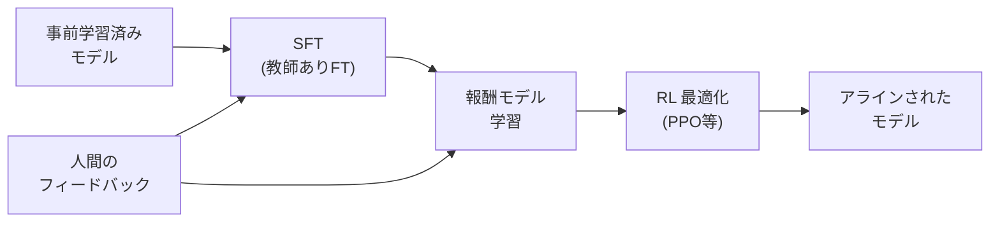
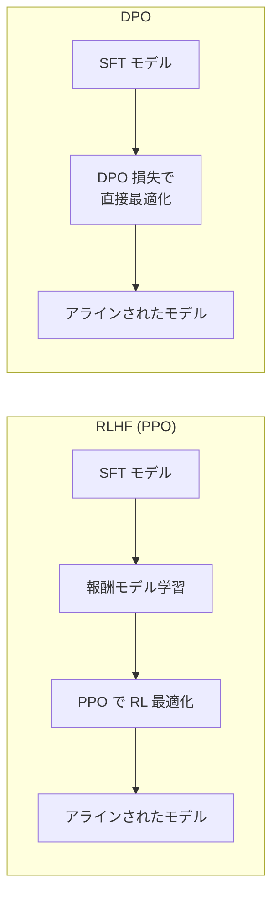

---
tags:
  - LLM
  - RLHF
  - RLAIF
  - PPO
  - DPO
created: "2026-04-19"
status: draft
---

# 03 — RLHF / RLAIF

## 1. なぜ RLHF が必要か

事前学習済み LLM は「次トークン予測」に最適化されているが、人間にとって有用・安全・正直な応答を生成するとは限らない。RLHF は **人間の選好（Preference）** に基づいてモデルを調整する。



---

## 2. 3段階パイプライン

### 2.1 Step 1: SFT（Supervised Fine-Tuning）

高品質な指示-応答ペアで教師あり学習:

```python
# SFT のデータ形式
sft_data = [
    {
        "instruction": "Pythonでフィボナッチ数列を計算する関数を書いてください",
        "response": "def fibonacci(n):\n    if n <= 1:\n        return n\n    return fibonacci(n-1) + fibonacci(n-2)"
    },
]
```

### 2.2 Step 2: 報酬モデル（Reward Model）

人間のペアワイズ比較データから学習:

$$\mathcal{L}_{\text{RM}} = -\mathbb{E}_{(x, y_w, y_l) \sim \mathcal{D}} [\log \sigma(r_\phi(x, y_w) - r_\phi(x, y_l))]$$

- $(x, y_w, y_l)$: プロンプト $x$ に対して $y_w$ が $y_l$ より選好される

```python
import torch
import torch.nn as nn

class RewardModel(nn.Module):
    def __init__(self, base_model):
        super().__init__()
        self.backbone = base_model
        self.reward_head = nn.Linear(base_model.config.hidden_size, 1)

    def forward(self, input_ids, attention_mask):
        outputs = self.backbone(input_ids, attention_mask=attention_mask)
        # 最後のトークンの隠れ状態からスカラー報酬を予測
        last_hidden = outputs.last_hidden_state[:, -1, :]
        reward = self.reward_head(last_hidden).squeeze(-1)
        return reward

def reward_loss(reward_model, chosen_ids, rejected_ids, chosen_mask, rejected_mask):
    r_chosen = reward_model(chosen_ids, chosen_mask)
    r_rejected = reward_model(rejected_ids, rejected_mask)
    loss = -torch.log(torch.sigmoid(r_chosen - r_rejected)).mean()
    return loss
```

### 2.3 Step 3: PPO による最適化

$$\max_\pi \mathbb{E}_{x \sim \mathcal{D}, y \sim \pi(y|x)} [r_\phi(x, y)] - \beta D_{\text{KL}}[\pi(y|x) \| \pi_{\text{ref}}(y|x)]$$

KL ペナルティ $\beta$ は元のモデルからの乖離を抑制し、報酬ハッキングを防止。

---

## 3. DPO（Direct Preference Optimization）

### 3.1 報酬モデル不要のアプローチ

DPO は RLHF の目的関数を **閉形式で解き**、PPO を不要にする:

$$\mathcal{L}_{\text{DPO}} = -\mathbb{E}_{(x, y_w, y_l)} \left[\log \sigma\left(\beta \log \frac{\pi_\theta(y_w|x)}{\pi_{\text{ref}}(y_w|x)} - \beta \log \frac{\pi_\theta(y_l|x)}{\pi_{\text{ref}}(y_l|x)}\right)\right]$$



### 3.2 DPO の実装

```python
import torch.nn.functional as F

def dpo_loss(policy_model, ref_model, chosen_ids, rejected_ids, beta=0.1):
    """Direct Preference Optimization の損失関数"""
    # ポリシーモデルの対数確率
    pi_chosen_logprob = get_log_probs(policy_model, chosen_ids)
    pi_rejected_logprob = get_log_probs(policy_model, rejected_ids)

    # 参照モデルの対数確率
    with torch.no_grad():
        ref_chosen_logprob = get_log_probs(ref_model, chosen_ids)
        ref_rejected_logprob = get_log_probs(ref_model, rejected_ids)

    # DPO 損失
    chosen_reward = beta * (pi_chosen_logprob - ref_chosen_logprob)
    rejected_reward = beta * (pi_rejected_logprob - ref_rejected_logprob)

    loss = -F.logsigmoid(chosen_reward - rejected_reward).mean()
    return loss

def get_log_probs(model, input_ids):
    """トークンごとの対数確率の合計を計算"""
    outputs = model(input_ids[:, :-1])
    logits = outputs.logits
    log_probs = F.log_softmax(logits, dim=-1)
    token_log_probs = torch.gather(
        log_probs, 2, input_ids[:, 1:].unsqueeze(-1)
    ).squeeze(-1)
    return token_log_probs.sum(dim=-1)
```

---

## 4. RLAIF（RL from AI Feedback）

### 4.1 Constitutional AI

Anthropic が提案。人間の代わりに **AI 自身** がフィードバックを提供:

1. **Critique**: AI が自身の応答を憲法（ルール集）に基づいて批評
2. **Revision**: 批評に基づいて応答を修正
3. 修正ペアから報酬モデルを学習

### 4.2 利点と課題

| 側面 | RLHF | RLAIF |
|------|------|-------|
| コスト | 高い（人間のアノテーション） | 低い（AI が自動評価） |
| スケーラビリティ | 限定的 | 高い |
| バイアス | 人間のバイアス | AI のバイアス |
| 品質 | 高い（特にエッジケース） | 改善中 |

---

## 5. 人間フィードバックの設計

### 5.1 選好データの収集

| 方式 | 説明 | 精度 |
|------|------|------|
| ペアワイズ比較 | A vs B でどちらが良いか | 高い |
| リッカート尺度 | 1-5 の点数評価 | 中 |
| ランキング | 複数応答の順位付け | 中〜高 |
| Best-of-N | N個から最良を選択 | 高い |

### 5.2 アノテーションの品質管理

```python
# アノテーター間の一致度を Cohen's κ で測定
from sklearn.metrics import cohen_kappa_score

annotator1 = [1, 0, 1, 1, 0, 1, 0, 1, 1, 0]  # 1=A preferred, 0=B preferred
annotator2 = [1, 0, 1, 0, 0, 1, 1, 1, 1, 0]

kappa = cohen_kappa_score(annotator1, annotator2)
print(f"Cohen's κ: {kappa:.3f}")
# κ > 0.6 が望ましい
```

---

## 6. 最新手法

| 手法 | 特徴 |
|------|------|
| DPO | 報酬モデル不要、シンプル |
| IPO | DPO の過学習問題を緩和 |
| KTO | 単一応答の好み/不好みで学習 |
| ORPO | SFT と選好最適化を統合 |
| SimPO | 参照モデル不要の簡潔な手法 |

---

## 7. ハンズオン演習

### 演習 1: 報酬モデルの学習

小規模な選好データセットで報酬モデルを学習し、新しいプロンプトに対する報酬スコアの妥当性を検証せよ。

### 演習 2: DPO の実装

GPT-2 サイズのモデルに DPO を適用し、SFT のみのモデルとの応答品質の違いを比較せよ。

### 演習 3: RLAIF パイプライン

LLM を使って選好データを自動生成し、その品質を人間のアノテーションと比較せよ。

---

## 8. まとめ

- RLHF は事前学習済み LLM を人間の選好に合わせる標準手法
- 3段階: SFT → 報酬モデル → PPO（KLペナルティ付き）
- DPO は報酬モデルと PPO を不要にした効率的な代替手法
- RLAIF / Constitutional AI は AI フィードバックでスケーラビリティを向上
- アノテーション品質（一致度 $\kappa > 0.6$）が最終性能を左右

---

## 参考文献

- Ouyang et al., "Training language models to follow instructions with human feedback" (2022)
- Rafailov et al., "Direct Preference Optimization" (2023)
- Bai et al., "Constitutional AI: Harmlessness from AI Feedback" (2022)
