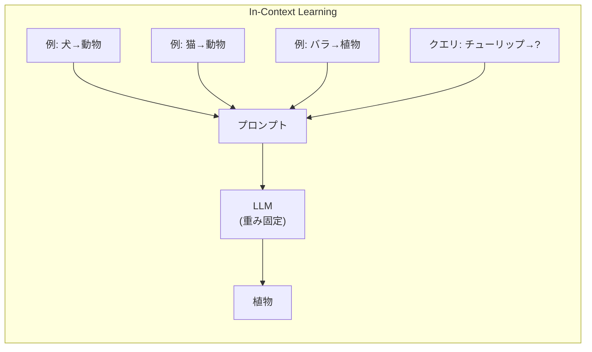
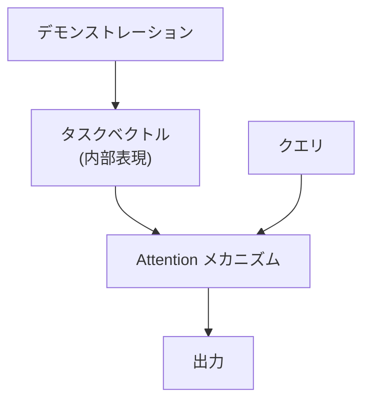

---
tags:
  - LLM
  - in-context-learning
  - ICL
  - few-shot
created: "2026-04-19"
status: draft
---

# 04 — In-Context Learning（ICL）

## 1. ICL とは

In-Context Learning は、LLM が **パラメータを更新せずに**、プロンプト内の例示（デモンストレーション）からタスクを学習する能力。GPT-3 で初めて大規模に実証された。



### 1.1 ICL の特筆すべき点

- **勾配更新なし**: 推論時のみ
- **タスク指定の柔軟性**: 例示を変えるだけで異なるタスクに適用
- **スケーリング**: モデルサイズが大きいほど ICL 能力が向上

---

## 2. ICL のメカニズム仮説

### 2.1 暗黙的なベイズ推論仮説

LLM の ICL は暗黙的にベイズ推論を行っている:

$$P(\text{output}|\text{query}, \text{demos}) \approx \sum_{\text{task}} P(\text{output}|\text{query}, \text{task}) P(\text{task}|\text{demos})$$

デモンストレーションからタスクの事後分布を推定し、クエリに適用。

### 2.2 暗黙的な勾配降下仮説

Transformer の Self-Attention は、暗黙的に1ステップの勾配降下を実行している:

$$\text{Attention Output} \approx W_0 x_q + \eta \sum_i (y_i - W_0 x_i) x_i^T x_q$$

```python
import numpy as np

def implicit_gradient_descent(demos_x, demos_y, query_x, W0, eta=0.01):
    """ICL の暗黙的な勾配降下の概念的実装"""
    # デモンストレーションからの「勾配」
    gradient = np.zeros_like(W0)
    for x, y in zip(demos_x, demos_y):
        error = y - W0 @ x
        gradient += np.outer(error, x)

    # 暗黙的な重み更新
    W_updated = W0 + eta * gradient

    # クエリに適用
    return W_updated @ query_x
```

### 2.3 タスクベクトル仮説

ICL はプロンプト内に「タスクベクトル」を構築し、それを使って出力を生成:



---

## 3. プロンプト依存性

### 3.1 例示の順序

例示の順序を変えるだけで精度が大きく変動:

```python
# 順序 A: 精度 95%
prompt_a = """
Positive: I love this movie
Negative: This is terrible
Positive: Great product
Text: The food was amazing
Sentiment:"""

# 順序 B: 精度 72% (同じ例、異なる順序)
prompt_b = """
Negative: This is terrible
Positive: Great product
Positive: I love this movie
Text: The food was amazing
Sentiment:"""
```

### 3.2 例示の選択方法

| 戦略 | 方法 | 効果 |
|------|------|------|
| ランダム | 無作為に選択 | ベースライン |
| 類似度ベース | 入力に近い例を選択 | 高い |
| 多様性ベース | カバレッジを最大化 | 安定性向上 |
| 影響関数 | 各例の寄与度で選択 | 理論的に最適 |

### 3.3 ラベルの正確さの影響

驚くべきことに、**ラベルがランダムでも** ICL はある程度機能する（Min et al., 2022）:

- ラベルが正しい場合: 精度 80%
- ラベルがランダムな場合: 精度 60%
- ラベルなしの Zero-shot: 精度 50%

→ ICL は「入力-出力のフォーマット」と「ラベル空間」の情報も活用している。

---

## 4. Many-shot ICL

### 4.1 Long Context の活用

コンテキストウィンドウの拡大（100K+トークン）により、数百〜数千の例示が可能に:

```python
# Many-shot ICL の例
def build_many_shot_prompt(examples, query, max_examples=500):
    """大量の例示を含むプロンプトの構築"""
    prompt = "以下の例に従って分類してください。\n\n"
    for i, (text, label) in enumerate(examples[:max_examples]):
        prompt += f"テキスト: {text}\n分類: {label}\n\n"
    prompt += f"テキスト: {query}\n分類:"
    return prompt
```

### 4.2 Many-shot の効果

| 例示数 | 精度（典型的） | 備考 |
|--------|---------------|------|
| 0 (Zero-shot) | 60% | ベースライン |
| 3 (Few-shot) | 75% | 標準的 |
| 30 | 82% | 改善 |
| 300 | 88% | 大幅改善 |
| 3000 | 90%+ | ファインチューニングに近い |

---

## 5. ICL の限界

### 5.1 プロンプト感度

- フォーマットの微小な変更で精度が変動
- 最適なプロンプトの発見は試行錯誤

### 5.2 推論コスト

- 例示が多いほどトークン消費量が増加
- 毎回の推論で全例示を処理

### 5.3 安全性

- 悪意のある例示による攻撃（Prompt Injection）
- 例示にバイアスが含まれる場合の影響

---

## 6. ハンズオン演習

### 演習 1: ICL の例示数と精度

感情分析タスクで例示数を $k = 0, 1, 3, 5, 10, 30$ と変化させ、精度の推移をプロットせよ。

### 演習 2: 例示順序の影響

同じ例示セットの順列を10通り試し、精度の分散を測定せよ。

### 演習 3: ラベルランダム化実験

正しいラベル vs ランダムラベル vs 反転ラベルで ICL の精度を比較し、ICL が何を学んでいるかを考察せよ。

---

## 7. まとめ

- ICL は LLM がプロンプト内の例示からタスクを学ぶ画期的な能力
- メカニズムは暗黙的ベイズ推論・暗黙的勾配降下として理解できる
- 例示の選択・順序・フォーマットが精度に大きく影響
- Many-shot ICL はファインチューニングに匹敵する性能を達成可能
- ラベルが不正確でもある程度機能する→フォーマット学習も重要

---

## 参考文献

- Brown et al., "Language Models are Few-Shot Learners" (GPT-3, 2020)
- Min et al., "Rethinking the Role of Demonstrations" (2022)
- Agarwal et al., "Many-Shot In-Context Learning" (2024)
