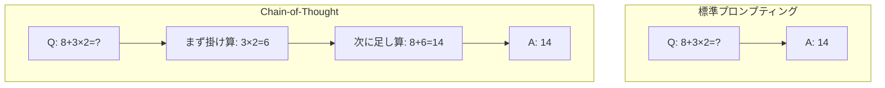
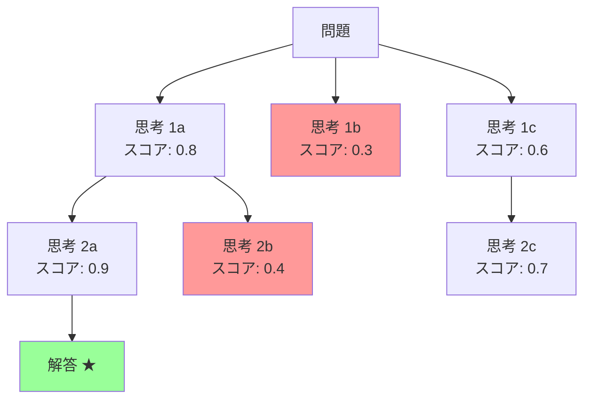

---
tags:
  - LLM
  - chain-of-thought
  - reasoning
  - tree-of-thought
  - inference-scaling
created: "2026-04-19"
status: draft
---

# 05 — Chain-of-Thought 推論

## 1. CoT の基本

Chain-of-Thought (CoT) は、LLM に **中間推論ステップ** を生成させることで、複雑な推論タスクの精度を大幅に向上させる手法。



---

## 2. CoT の種類

### 2.1 Few-shot CoT

推論過程を含む例示を提供:

```python
prompt = """
Q: 公園に5匹の犬がいます。3匹が帰り、7匹が新たに来ました。
   さらに2匹が帰りました。何匹いますか？

A: 最初に5匹います。
   3匹帰ると: 5 - 3 = 2匹
   7匹来ると: 2 + 7 = 9匹
   2匹帰ると: 9 - 2 = 7匹
   答え: 7匹

Q: レストランに12人の客がいます。半分が帰り、新たに8人来ました。
   その後、3人が帰りました。何人いますか？

A:"""
```

### 2.2 Zero-shot CoT

「ステップバイステップで考えてください」を追加するだけ:

$$\text{精度向上率} = \frac{\text{CoT精度} - \text{Direct精度}}{\text{Direct精度}}$$

GSM8K での例:
- Direct: 17.1%
- Zero-shot CoT: 40.7% (+138%)
- Few-shot CoT: 57.1% (+234%)

---

## 3. Tree-of-Thought (ToT)

### 3.1 探索的推論

線形な思考連鎖の代わりに、**木構造** で複数の思考パスを探索:



### 3.2 実装の概念

```python
class TreeOfThought:
    def __init__(self, llm, evaluator, breadth=3, depth=3):
        self.llm = llm
        self.evaluator = evaluator
        self.breadth = breadth
        self.depth = depth

    def solve(self, problem):
        """BFS/DFS で思考木を探索"""
        root = {"state": problem, "thoughts": []}
        queue = [root]

        for d in range(self.depth):
            candidates = []
            for node in queue:
                # 複数の思考を生成
                thoughts = self.llm.generate_thoughts(
                    node["state"], n=self.breadth
                )
                for thought in thoughts:
                    new_state = node["state"] + "\n" + thought
                    score = self.evaluator.evaluate(new_state)
                    candidates.append({
                        "state": new_state,
                        "thoughts": node["thoughts"] + [thought],
                        "score": score,
                    })
            # 上位 k 個を選択
            queue = sorted(candidates, key=lambda x: x["score"],
                          reverse=True)[:self.breadth]

        return queue[0]
```

---

## 4. 推論時計算スケーリング

### 4.1 Test-time Compute

学習時のスケーリング（パラメータ数↑）に加え、**推論時の計算量** を増やすことで性能を向上:

$$\text{Performance} \propto f(\text{Train Compute}) + g(\text{Test-time Compute})$$

| 手法 | 推論時計算量 | 効果 |
|------|------------|------|
| Standard | 1x | ベースライン |
| CoT | 2-3x | 推論タスク改善 |
| Self-Consistency | 5-20x | 安定性向上 |
| ToT | 10-100x | 探索問題に有効 |
| o1/o3 型推論 | 100x+ | 大幅な推論改善 |

### 4.2 o1 / o3 型推論モデル

OpenAI の o1/o3 は、推論時に内部で長い思考連鎖を生成:

```
[ユーザの質問]
↓
[内部思考: 数百〜数千トークンの推論]
  - 問題の分解
  - 複数のアプローチの検討
  - 自己検証
  - エラー修正
↓
[最終回答]
```

**特徴**:
- 推論トークンは非公開（ユーザには見えない）
- 計算量と精度のトレードオフを制御可能
- 数学・コーディング・科学で大幅な精度向上

---

## 5. Self-Consistency

同じプロンプトで複数回サンプリングし、多数決:

```python
def self_consistency(llm, prompt, n=10, temperature=0.7):
    """Self-Consistency: 多数決で最終回答を決定"""
    answers = []
    for _ in range(n):
        response = llm.generate(prompt, temperature=temperature)
        answer = extract_answer(response)
        answers.append(answer)

    # 多数決
    from collections import Counter
    counter = Counter(answers)
    best, count = counter.most_common(1)[0]
    return best, count / n  # 回答と信頼度
```

---

## 6. CoT の制約と議論

### 6.1 CoT が効果的なタスク

- 数学的推論（GSM8K, MATH）
- 論理パズル
- マルチステップの問題解決
- コード生成

### 6.2 CoT が効果的でないタスク

- 単純な知識検索
- 感情分析（直感的判断）
- 短い応答が求められるタスク

### 6.3 CoT の忠実性問題

生成された推論過程が実際の内部推論を反映しているとは限らない:

- モデルは正しい答えに「合理的に見える」推論を事後的に構築することがある
- 推論ステップにエラーがあっても正解に至ることがある

---

## 7. ハンズオン演習

### 演習 1: CoT の効果測定

GSM8K の問題 50 問に対して Direct / Zero-shot CoT / Few-shot CoT の正答率を比較せよ。

### 演習 2: Self-Consistency の実装

同じ数学問題に対して n=1, 5, 10, 20 でサンプリングし、多数決の精度と必要コストの関係を分析せよ。

### 演習 3: CoT の忠実性検証

CoT の推論ステップに意図的に誤りを含むプロンプトを作成し、モデルが誤った推論に追従するか検証せよ。

---

## 8. まとめ

- CoT は中間推論ステップにより複雑な推論タスクの精度を大幅に向上
- Zero-shot CoT は「ステップバイステップ」の指示だけで効果的
- ToT は木構造で複数の思考パスを探索する高度な手法
- 推論時計算スケーリング（o1/o3 型）が新たなパラダイム
- Self-Consistency は多数決で安定した回答を得る
- CoT の忠実性（推論過程の正確さ）は未解決の課題

---

## 参考文献

- Wei et al., "Chain-of-Thought Prompting Elicits Reasoning in LLMs" (2022)
- Yao et al., "Tree of Thoughts: Deliberate Problem Solving with LLMs" (2023)
- Wang et al., "Self-Consistency Improves Chain of Thought Reasoning" (2023)
