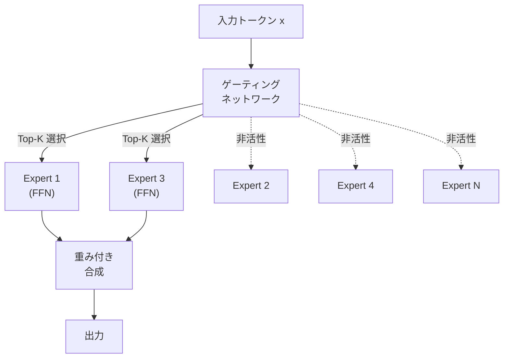
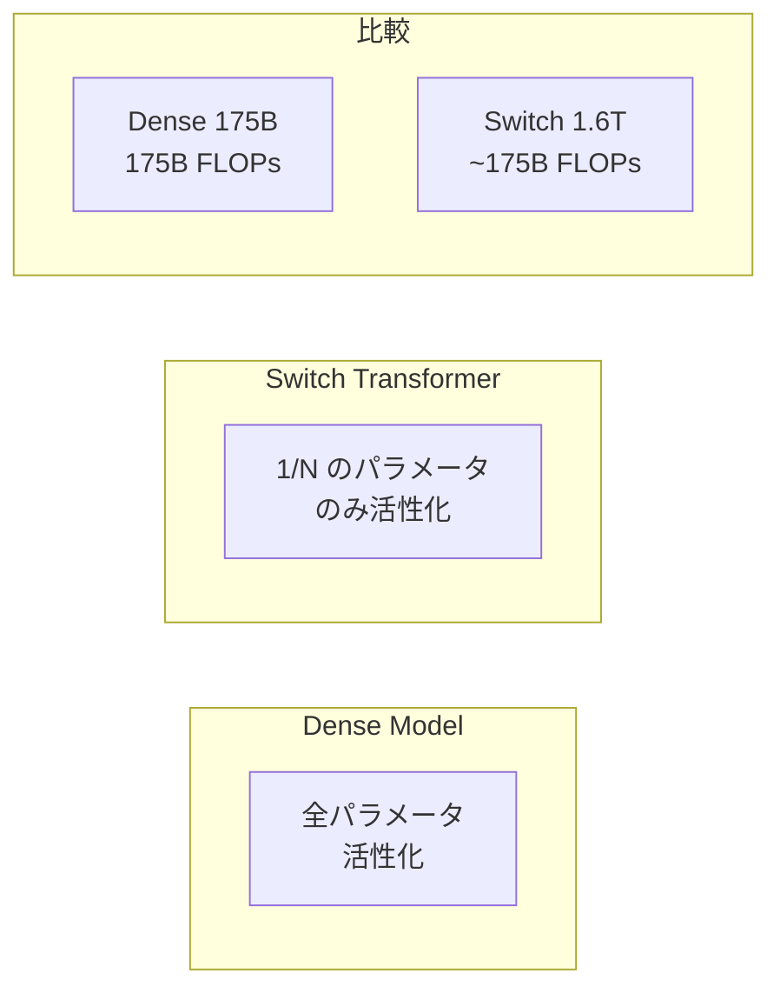

---
tags:
  - LLM
  - MoE
  - Mixture-of-Experts
  - Mixtral
  - Switch-Transformer
created: "2026-04-19"
status: draft
---

# 06 — Mixture of Experts（MoE）

## 1. MoE の基本概念

MoE は、入力に応じて **一部のパラメータのみ活性化** するスパースモデルアーキテクチャ。モデルの総パラメータ数を増やしつつ、推論時の計算コストを抑制。



### 1.1 基本式

$$y = \sum_{i=1}^{N} g_i(\mathbf{x}) \cdot E_i(\mathbf{x})$$

- $g_i(\mathbf{x})$: ゲーティング関数（スパース、Top-K）
- $E_i(\mathbf{x})$: 第 $i$ エキスパートの出力
- $N$: 総エキスパート数
- $K$: 活性化されるエキスパート数（$K \ll N$）

---

## 2. ゲーティングメカニズム

### 2.1 Top-K ゲーティング

```python
import torch
import torch.nn as nn
import torch.nn.functional as F

class TopKGating(nn.Module):
    def __init__(self, input_dim, num_experts, top_k=2):
        super().__init__()
        self.gate = nn.Linear(input_dim, num_experts, bias=False)
        self.top_k = top_k
        self.num_experts = num_experts

    def forward(self, x):
        # ゲートスコアの計算
        logits = self.gate(x)  # (batch, seq, num_experts)

        # Top-K の選択
        top_k_logits, top_k_indices = logits.topk(self.top_k, dim=-1)
        top_k_weights = F.softmax(top_k_logits, dim=-1)

        # スパースなゲート出力
        gates = torch.zeros_like(logits)
        gates.scatter_(-1, top_k_indices, top_k_weights)

        return gates, top_k_indices
```

### 2.2 ノイズ付きゲーティング

探索を促進するためにゲートスコアにノイズを追加:

$$H(\mathbf{x}) = \mathbf{x} \cdot W_g + \text{Softplus}(\mathbf{x} \cdot W_{\text{noise}}) \cdot \epsilon, \quad \epsilon \sim \mathcal{N}(0, 1)$$

---

## 3. 負荷分散（Load Balancing）

### 3.1 問題

ゲーティングが特定のエキスパートに偏ると:
- 一部のエキスパートが過負荷
- 残りのエキスパートが未使用（パラメータの浪費）
- 分散学習での計算バランスが崩壊

### 3.2 補助損失（Auxiliary Loss）

$$\mathcal{L}_{\text{balance}} = \alpha \cdot N \sum_{i=1}^{N} f_i \cdot P_i$$

- $f_i$: エキスパート $i$ に割り当てられたトークンの割合
- $P_i$: エキスパート $i$ が選ばれる平均確率
- $\alpha$: バランス損失の重み（通常 0.01）

```python
def load_balancing_loss(gate_logits, top_k_indices, num_experts, alpha=0.01):
    """負荷分散のための補助損失"""
    # f_i: 各エキスパートに割り当てられたトークンの割合
    counts = torch.zeros(num_experts, device=gate_logits.device)
    for i in range(num_experts):
        counts[i] = (top_k_indices == i).float().sum()
    f = counts / counts.sum()

    # P_i: 各エキスパートが選ばれる平均確率
    probs = F.softmax(gate_logits, dim=-1)
    P = probs.mean(dim=[0, 1])  # (num_experts,)

    return alpha * num_experts * (f * P).sum()
```

---

## 4. Switch Transformer

### 4.1 Top-1 ルーティング

Switch Transformer (Fedus et al., 2022) は **Top-1** でルーティングを簡素化:

$$y = g_{\text{top1}}(\mathbf{x}) \cdot E_{\text{selected}}(\mathbf{x})$$



### 4.2 Expert Capacity

各エキスパートが処理できるトークン数に上限を設定:

$$\text{capacity} = \frac{\text{tokens\_per\_batch}}{N} \times \text{capacity\_factor}$$

$\text{capacity\_factor} > 1$ で overflow を許容。超過分はドロップまたは残差接続でスキップ。

---

## 5. Mixtral

### 5.1 Mixtral 8x7B

Mistral AI の Mixtral は 8 エキスパート × 7B パラメータ:

| 項目 | 値 |
|------|-----|
| 総パラメータ | 46.7B |
| 活性パラメータ | ~12.9B（Top-2） |
| エキスパート数 | 8 |
| 活性エキスパート | 2 |
| エキスパートの粒度 | FFN 層のみ |

### 5.2 MoE の配置

Transformer の **Feed-Forward Network (FFN)** をエキスパートに置換。Self-Attention は共有。

```python
class MoETransformerBlock(nn.Module):
    def __init__(self, dim, num_heads, num_experts=8, top_k=2):
        super().__init__()
        self.attn = nn.MultiheadAttention(dim, num_heads)
        self.norm1 = nn.LayerNorm(dim)
        self.norm2 = nn.LayerNorm(dim)
        self.moe = MoELayer(dim, num_experts, top_k)

    def forward(self, x):
        # Self-Attention（全トークン共通）
        x = x + self.attn(self.norm1(x), self.norm1(x), self.norm1(x))[0]
        # MoE FFN（トークンごとに異なるエキスパート）
        x = x + self.moe(self.norm2(x))
        return x

class MoELayer(nn.Module):
    def __init__(self, dim, num_experts=8, top_k=2, hidden_dim=None):
        super().__init__()
        hidden_dim = hidden_dim or dim * 4
        self.experts = nn.ModuleList([
            nn.Sequential(
                nn.Linear(dim, hidden_dim),
                nn.GELU(),
                nn.Linear(hidden_dim, dim),
            ) for _ in range(num_experts)
        ])
        self.gate = TopKGating(dim, num_experts, top_k)

    def forward(self, x):
        gates, indices = self.gate(x)
        output = torch.zeros_like(x)
        for i, expert in enumerate(self.experts):
            mask = gates[:, :, i].unsqueeze(-1)
            if mask.sum() > 0:
                output += mask * expert(x)
        return output
```

---

## 6. MoE の利点と課題

| 側面 | 利点 | 課題 |
|------|------|------|
| パラメータ効率 | 少ない FLOPs で大容量 | メモリは全エキスパート分必要 |
| スケーラビリティ | エキスパート追加で拡張 | 通信コスト |
| 専門化 | 各エキスパートが得意分野を持つ | 負荷分散が困難 |
| 学習 | Dense より高速に収束 | 学習が不安定になりやすい |

---

## 7. ハンズオン演習

### 演習 1: MoE の実装

上記のコードをベースに MNIST で MoE モデルを学習し、各エキスパートがどの数字に特化するか分析せよ。

### 演習 2: 負荷分散の効果

補助損失の重み $\alpha$ を 0, 0.01, 0.1, 1.0 と変化させ、エキスパート利用率と精度のトレードオフを分析せよ。

### 演習 3: Dense vs MoE 比較

同じ FLOPs 予算で Dense モデルと MoE モデルを学習し、性能を比較せよ。

---

## 8. まとめ

- MoE は入力に応じてエキスパートを選択し、スパースな計算で大容量モデルを実現
- ゲーティングメカニズム（Top-K）がルーティングの鍵
- 負荷分散の補助損失がエキスパートの均等利用を促進
- Mixtral は MoE の実用化の成功例（8x7B、活性 12.9B）
- FFN 層のみを MoE 化し、Attention は共有する設計が主流

---

## 参考文献

- Shazeer et al., "Outrageously Large Neural Networks: The Sparsely-Gated MoE Layer" (2017)
- Fedus et al., "Switch Transformers: Scaling to Trillion Parameter Models" (2022)
- Jiang et al., "Mixtral of Experts" (2024)
