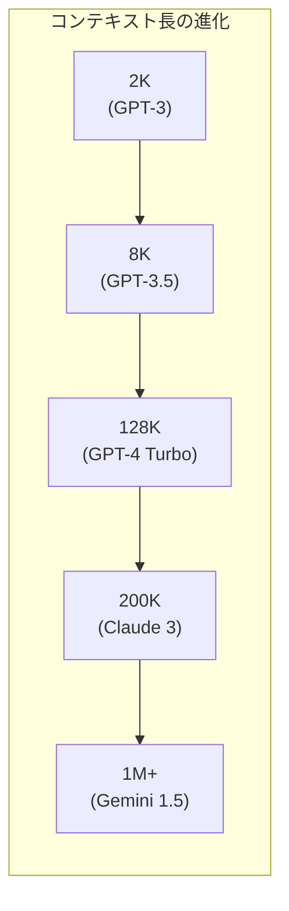
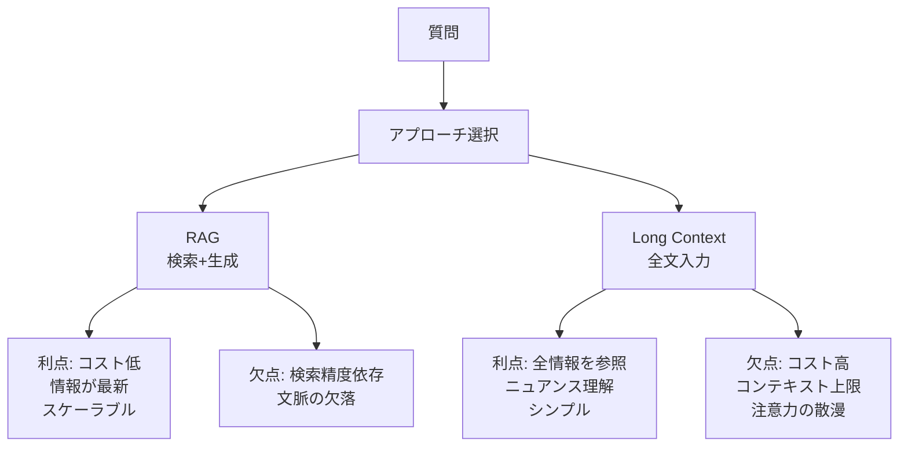

---
tags:
  - LLM
  - context-window
  - RoPE
  - long-context
  - RAG
created: "2026-04-19"
status: draft
---

# 07 — コンテキストウィンドウ

## 1. コンテキストウィンドウとは

LLM が一度に処理できるトークン数の上限。近年急速に拡大。

| モデル | 年 | コンテキスト長 |
|--------|-----|---------------|
| GPT-3 | 2020 | 2,048 |
| GPT-4 | 2023 | 8K / 32K / 128K |
| Claude 3 | 2024 | 200K |
| Gemini 1.5 | 2024 | 1M / 2M |
| Claude 4 | 2025 | 200K / 1M |



---

## 2. 位置エンコーディングと外挿

### 2.1 絶対位置エンコーディング

$$\text{PE}(pos, 2i) = \sin\left(\frac{pos}{10000^{2i/d}}\right)$$

学習時の最大位置を超えると性能が急激に劣化。

### 2.2 RoPE（Rotary Position Embedding）

$$f(\mathbf{q}, m) = R_m \mathbf{q}, \quad R_m = \begin{pmatrix} \cos m\theta & -\sin m\theta \\ \sin m\theta & \cos m\theta \end{pmatrix}$$

位置 $m$ と $n$ のトークン間の Attention は相対位置 $m - n$ のみに依存:

$$\langle f(\mathbf{q}, m), f(\mathbf{k}, n) \rangle = g(\mathbf{q}, \mathbf{k}, m - n)$$

```python
import torch

def apply_rotary_emb(x, freqs):
    """RoPE の適用"""
    # x: (batch, seq_len, num_heads, head_dim)
    x_complex = torch.view_as_complex(x.float().reshape(*x.shape[:-1], -1, 2))
    freqs_complex = torch.polar(torch.ones_like(freqs), freqs)
    x_rotated = x_complex * freqs_complex
    return torch.view_as_real(x_rotated).flatten(-2).type_as(x)

def precompute_freqs(dim, max_seq_len, theta=10000.0):
    """RoPE の周波数を事前計算"""
    freqs = 1.0 / (theta ** (torch.arange(0, dim, 2).float() / dim))
    t = torch.arange(max_seq_len)
    freqs = torch.outer(t, freqs)
    return freqs
```

### 2.3 RoPE の外挿（長文脈対応）

| 手法 | アプローチ | 学習不要? |
|------|-----------|----------|
| Position Interpolation | 位置を縮小 $m' = m \cdot L_{\text{train}} / L_{\text{target}}$ | 要 FT |
| NTK-aware Scaling | $\theta$ を調整 | 一部要 FT |
| YaRN | NTK + Attention scaling | 要 FT |
| Dynamic NTK | 推論時に動的に $\theta$ 調整 | 不要 |

```python
def ntk_aware_rope(dim, max_seq_len, base=10000.0, scale_factor=4.0):
    """NTK-aware RoPE スケーリング"""
    # base を拡大して高周波成分を調整
    new_base = base * (scale_factor ** (dim / (dim - 2)))
    freqs = 1.0 / (new_base ** (torch.arange(0, dim, 2).float() / dim))
    t = torch.arange(max_seq_len)
    return torch.outer(t, freqs)
```

---

## 3. Attention の計算効率

### 3.1 標準 Self-Attention の計算量

$$O(n^2 d)$$

$n = 100K$ の場合、Attention マトリクスだけで $n^2 = 10^{10}$ の計算が必要。

### 3.2 効率的な Attention

| 手法 | 計算量 | 概要 |
|------|--------|------|
| Flash Attention | $O(n^2d)$ 但しIO最適化 | HBM アクセスを削減 |
| Ring Attention | $O(n^2d / P)$ | シーケンスを GPU 間で分散 |
| Sparse Attention | $O(n\sqrt{n}d)$ | パターンベースの間引き |
| Linear Attention | $O(nd^2)$ | カーネル近似 |

### 3.3 Flash Attention

```python
# Flash Attention の使用（PyTorch 2.0+）
import torch.nn.functional as F

# 標準的な Attention（メモリ O(n^2)）
attn_output_standard = F.scaled_dot_product_attention(
    query, key, value,
    attn_mask=None,
    is_causal=True,
)

# Flash Attention は PyTorch が自動で選択
# with torch.backends.cuda.sdp_kernel(enable_flash=True):
```

---

## 4. RAG vs Long Context



### 4.1 使い分けの指針

| シナリオ | 推奨 | 理由 |
|----------|------|------|
| 大規模文書検索 | RAG | 全文書をコンテキストに入れられない |
| 1つの長い文書の分析 | Long Context | 文脈の完全な理解が重要 |
| 最新情報が必要 | RAG | 知識の更新が容易 |
| 微妙なニュアンスの理解 | Long Context | 全体の流れが重要 |
| コスト重視 | RAG | トークン消費を削減 |

---

## 5. Needle-in-a-Haystack テスト

### 5.1 概要

長いコンテキスト中の特定の情報（「針」）をどれだけ正確に取得できるかを測定:

```python
def needle_in_haystack_test(model, context_lengths, needle_positions):
    """Needle-in-a-Haystack テストの実装"""
    results = {}
    needle = "The secret code is: ALPHA-BRAVO-CHARLIE"

    for ctx_len in context_lengths:
        for pos in needle_positions:  # 0.0=先頭, 0.5=中央, 1.0=末尾
            # haystack の生成
            haystack = generate_filler_text(ctx_len)
            insert_pos = int(len(haystack) * pos)
            text = haystack[:insert_pos] + needle + haystack[insert_pos:]

            # 質問
            prompt = text + "\n\nWhat is the secret code?"
            response = model.generate(prompt)

            # 正解判定
            correct = "ALPHA-BRAVO-CHARLIE" in response
            results[(ctx_len, pos)] = correct

    return results
```

### 5.2 典型的な結果パターン

- **Lost in the Middle**: コンテキストの中央部分の情報が最も取得しにくい
- 先頭と末尾の情報は比較的正確に取得される
- モデルサイズが大きいほど中央部分の精度も向上

---

## 6. ハンズオン演習

### 演習 1: RoPE の外挿実験

4K トークンで学習したモデルに Position Interpolation を適用し、8K, 16K での Perplexity の変化を測定せよ。

### 演習 2: RAG vs Long Context 比較

同じ QA タスクに対して RAG と Long Context の回答精度・レイテンシ・コストを比較せよ。

### 演習 3: Needle-in-a-Haystack

利用可能な LLM API に対して Needle-in-a-Haystack テストを実施し、コンテキスト長と挿入位置による精度マップを作成せよ。

---

## 7. まとめ

- コンテキストウィンドウは 2K → 1M+ に急速に拡大
- RoPE の外挿技術（NTK-aware, YaRN）が長文脈対応の鍵
- Flash Attention, Ring Attention が計算効率を改善
- RAG と Long Context は相補的であり、ユースケースで使い分ける
- Needle-in-a-Haystack は長文脈能力の標準ベンチマーク

---

## 参考文献

- Su et al., "RoFormer: Enhanced Transformer with Rotary Position Embedding" (2021)
- Dao et al., "FlashAttention: Fast and Memory-Efficient Exact Attention" (2022)
- Liu et al., "Lost in the Middle: How Language Models Use Long Contexts" (2024)
