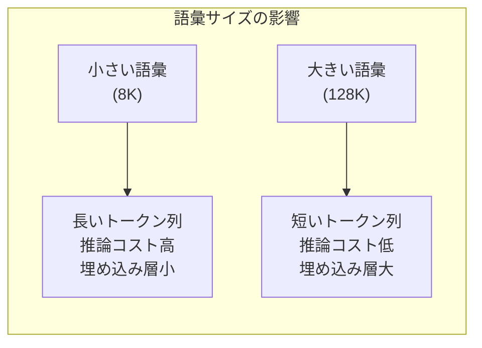

---
tags:
  - LLM
  - tokenizer
  - BPE
  - multilingual
  - vocabulary
created: "2026-04-19"
status: draft
---

# 08 — トークナイザ深掘り

## 1. BPE の実装詳細

### 1.1 Byte-level BPE

GPT-2 以降で採用される Byte-level BPE は、**UTF-8 バイト列** を基本単位とする:

- 初期語彙 = 256 バイト（0x00-0xFF）
- 未知文字が原理的に存在しない
- 全言語を統一的に扱える

```python
class ByteLevelBPE:
    """Byte-level BPE の簡易実装"""

    def __init__(self, vocab_size: int = 50000):
        self.target_vocab_size = vocab_size
        self.merges = {}  # (token_a, token_b) -> merged_token
        self.vocab = {i: bytes([i]) for i in range(256)}

    def train(self, text: str, verbose: bool = False):
        """BPE の学習"""
        # テキストをバイト列に変換
        tokens = list(text.encode("utf-8"))

        num_merges = self.target_vocab_size - 256
        for i in range(num_merges):
            # ペア頻度の計算
            pair_counts = {}
            for j in range(len(tokens) - 1):
                pair = (tokens[j], tokens[j + 1])
                pair_counts[pair] = pair_counts.get(pair, 0) + 1

            if not pair_counts:
                break

            # 最頻ペアを統合
            best_pair = max(pair_counts, key=pair_counts.get)
            new_token = 256 + i
            self.merges[best_pair] = new_token
            self.vocab[new_token] = self.vocab[best_pair[0]] + self.vocab[best_pair[1]]

            # トークン列を更新
            new_tokens = []
            j = 0
            while j < len(tokens):
                if j < len(tokens) - 1 and (tokens[j], tokens[j+1]) == best_pair:
                    new_tokens.append(new_token)
                    j += 2
                else:
                    new_tokens.append(tokens[j])
                    j += 1
            tokens = new_tokens

            if verbose and (i + 1) % 1000 == 0:
                print(f"Merge {i+1}/{num_merges}: {self.vocab[new_token]}")

    def encode(self, text: str) -> list[int]:
        """テキストをトークンIDに変換"""
        tokens = list(text.encode("utf-8"))
        while True:
            pairs = [(tokens[i], tokens[i+1]) for i in range(len(tokens)-1)]
            mergeable = [(p, self.merges[p]) for p in pairs if p in self.merges]
            if not mergeable:
                break
            # 最も早く学習されたマージを優先
            best_pair, new_token = min(mergeable, key=lambda x: x[1])
            new_tokens = []
            i = 0
            while i < len(tokens):
                if i < len(tokens)-1 and (tokens[i], tokens[i+1]) == best_pair:
                    new_tokens.append(new_token)
                    i += 2
                else:
                    new_tokens.append(tokens[i])
                    i += 1
            tokens = new_tokens
        return tokens

    def decode(self, token_ids: list[int]) -> str:
        """トークンIDをテキストに復元"""
        byte_seq = b"".join(self.vocab[t] for t in token_ids)
        return byte_seq.decode("utf-8", errors="replace")
```

---

## 2. 語彙サイズの影響

### 2.1 トレードオフ

$$\text{Fertility}(\text{text}) = \frac{\text{トークン数}}{\text{文字数 or 単語数}}$$



### 2.2 代表的な語彙サイズ

| モデル | 語彙サイズ | トークナイザ |
|--------|-----------|-------------|
| GPT-2 | 50,257 | Byte-level BPE |
| GPT-4 | 100,256 | cl100k_base |
| LLaMA | 32,000 | SentencePiece |
| LLaMA 3 | 128,000 | tiktoken |
| Gemma | 256,000 | SentencePiece |

### 2.3 埋め込み層のパラメータ

$$\text{Embedding パラメータ} = |V| \times d_{\text{model}}$$

| 語彙サイズ | $d_{\text{model}} = 4096$ | 全パラメータに占める割合 |
|-----------|--------------------------|------------------------|
| 32K | 131M | 7B モデルの 1.9% |
| 128K | 524M | 7B モデルの 7.5% |
| 256K | 1,048M | 7B モデルの 15% |

---

## 3. マルチリンガルトークナイザ

### 3.1 言語ごとのトークン効率

同じ意味の文でも言語によりトークン数が大きく異なる:

```python
import tiktoken

enc = tiktoken.get_encoding("cl100k_base")

texts = {
    "English": "The weather is nice today.",
    "日本語": "今日は良い天気ですね。",
    "中文": "今天天气很好。",
    "한국어": "오늘 날씨가 좋습니다.",
    "العربية": "الطقس جميل اليوم.",
}

for lang, text in texts.items():
    tokens = enc.encode(text)
    ratio = len(tokens) / len(text)
    print(f"{lang:10s}: {len(tokens):3d} tokens / {len(text):3d} chars = {ratio:.2f}")
```

### 3.2 言語非効率性の問題

- 英語以外の言語は一般に **2-5倍** のトークン数が必要
- → コストが高い、コンテキストの有効利用が減る
- 対策: 対象言語のデータをトークナイザ学習に十分含める

### 3.3 語彙の拡張

```python
from transformers import AutoTokenizer

# 既存トークナイザの語彙拡張
tokenizer = AutoTokenizer.from_pretrained("meta-llama/Llama-2-7b-hf")

# 新しいトークンを追加
new_tokens = ["プログラミング", "機械学習", "ニューラルネットワーク"]
num_added = tokenizer.add_tokens(new_tokens)
print(f"追加トークン数: {num_added}")
print(f"新しい語彙サイズ: {len(tokenizer)}")

# モデルの埋め込み層もリサイズ
# model.resize_token_embeddings(len(tokenizer))
```

---

## 4. トークン効率

### 4.1 Compression Ratio

$$\text{Compression Ratio} = \frac{\text{元のバイト数}}{\text{トークン数}}$$

理想は 1 トークンあたり 3-4 バイト（英語の場合）。

### 4.2 トークンの「品質」

```python
def analyze_tokenizer(tokenizer, text):
    """トークナイザの品質分析"""
    tokens = tokenizer.encode(text)
    decoded_tokens = [tokenizer.decode([t]) for t in tokens]

    stats = {
        "text_length": len(text),
        "num_tokens": len(tokens),
        "compression_ratio": len(text.encode("utf-8")) / len(tokens),
        "avg_token_length": sum(len(t) for t in decoded_tokens) / len(decoded_tokens),
        "single_char_tokens": sum(1 for t in decoded_tokens if len(t.strip()) <= 1),
    }
    return stats
```

---

## 5. 特殊なトークン処理

### 5.1 数値のトークン化

数値はトークナイザにとって問題的:

```
"12345" → ["123", "45"] or ["1", "23", "45"] or ["12345"]
```

これが LLM の算術能力に影響。桁ごとの分割が有効な場合もある。

### 5.2 コードのトークン化

空白（インデント）が重要な言語（Python）では:

```
4 spaces → 1 token（専用トークン）
vs
4 spaces → 4 tokens（非効率）
```

---

## 6. ハンズオン演習

### 演習 1: BPE の実装

上記の ByteLevelBPE を完成させ、小さなコーパスで学習・推論を行え。マージの過程を可視化。

### 演習 2: 多言語トークン効率の比較

GPT-4, LLaMA 3, Gemma のトークナイザで日本語・英語・中国語のテキストをトークン化し、効率を比較せよ。

### 演習 3: 語彙サイズの最適化

同じコーパスで語彙サイズ 4K, 16K, 32K, 64K の BPE モデルを学習し、下流タスクの性能との関係を分析せよ。

---

## 7. まとめ

- Byte-level BPE は全言語を統一的に扱える現代の標準
- 語彙サイズは推論効率と埋め込み層のトレードオフ
- マルチリンガル対応は語彙の言語バランスが鍵
- トークン効率は言語・ドメインにより大きく異なる
- 数値・コードの処理はトークナイザの重要な設計課題

---

## 参考文献

- Sennrich et al., "Neural Machine Translation of Rare Words with Subword Units" (2016)
- Radford et al., "Language Models are Unsupervised Multitask Learners" (GPT-2, 2019)
- Petrov et al., "Language Model Tokenizers Introduce Unfairness Between Languages" (2024)
