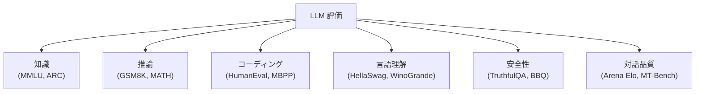
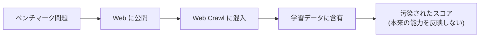

---
tags:
  - LLM
  - evaluation
  - MMLU
  - HumanEval
  - benchmarks
created: "2026-04-19"
status: draft
---

# 09 — LLM 評価

## 1. LLM 評価の難しさ

LLM の評価は、従来の ML モデルの評価とは根本的に異なる。単一のタスクではなく、多様な能力を包括的に測定する必要がある。



---

## 2. 主要ベンチマーク

### 2.1 知識・推論

| ベンチマーク | タスク | 問題数 | 指標 |
|-------------|--------|--------|------|
| MMLU | 57科目の4択問題 | 15,908 | 正答率 |
| MMLU-Pro | MMLU の難化版（10択） | 12,032 | 正答率 |
| ARC-Challenge | 小学校理科 | 1,172 | 正答率 |
| GSM8K | 小学校算数 | 1,319 | 正答率 |
| MATH | 高校/大学数学 | 5,000 | 正答率 |
| BIG-Bench Hard | 多様な難問 | 6,511 | 正答率 |

### 2.2 コーディング

```python
# HumanEval の問題例
def has_close_elements(numbers: list[float], threshold: float) -> bool:
    """Check if in given list of numbers, are any two numbers
    closer to each other than given threshold.
    >>> has_close_elements([1.0, 2.0, 3.0], 0.5)
    False
    >>> has_close_elements([1.0, 2.8, 3.0, 4.0, 5.0, 2.0], 0.3)
    True
    """
    # LLM がこの関数を完成させる
    pass

# 評価: pass@k
# k個のサンプル中に少なくとも1つ正解がある確率
```

$$\text{pass@}k = \mathbb{E}_{\text{problems}}\left[1 - \frac{\binom{n-c}{k}}{\binom{n}{k}}\right]$$

- $n$: 生成サンプル数
- $c$: 正解サンプル数

| ベンチマーク | タスク | 指標 |
|-------------|--------|------|
| HumanEval | 164問の関数完成 | pass@1, pass@10 |
| MBPP | 974問の基本問題 | pass@1 |
| SWE-bench | GitHub Issue の解決 | 解決率 |
| LiveCodeBench | 最新の競プロ問題 | 正答率 |

---

## 3. Arena Elo レーティング

### 3.1 LMSYS Chatbot Arena

人間が2つの匿名モデルの応答を比較し、Elo レーティングを算出:

$$E_A = \frac{1}{1 + 10^{(R_B - R_A)/400}}$$

$$R_A' = R_A + K(S_A - E_A)$$

- $R_A, R_B$: 両モデルのレーティング
- $S_A$: 実際の結果（1=勝ち, 0.5=引き分け, 0=負け）
- $K$: 更新係数

```python
def update_elo(rating_a, rating_b, result_a, k=32):
    """Elo レーティングの更新"""
    expected_a = 1 / (1 + 10 ** ((rating_b - rating_a) / 400))
    new_rating_a = rating_a + k * (result_a - expected_a)
    new_rating_b = rating_b + k * ((1 - result_a) - (1 - expected_a))
    return new_rating_a, new_rating_b
```

### 3.2 MT-Bench

GPT-4 が審査員として8カテゴリの2ターン対話を10点満点で評価:

| カテゴリ | 評価内容 |
|----------|---------|
| Writing | 文章作成能力 |
| Roleplay | ロールプレイ |
| Reasoning | 論理的推論 |
| Math | 数学的問題解決 |
| Coding | プログラミング |
| Extraction | 情報抽出 |
| STEM | 科学技術 |
| Humanities | 人文科学 |

---

## 4. 汚染問題（Data Contamination）

### 4.1 問題

ベンチマークの問題が学習データに含まれていると、評価が無意味に:



### 4.2 汚染検出手法

```python
def detect_contamination(benchmark_texts, training_data, n=13):
    """N-gram ベースの汚染検出"""
    contaminated = []
    training_ngrams = set()

    # 学習データの N-gram を収集
    for doc in training_data:
        words = doc.split()
        for i in range(len(words) - n + 1):
            training_ngrams.add(tuple(words[i:i+n]))

    # ベンチマーク問題との一致を検出
    for idx, text in enumerate(benchmark_texts):
        words = text.split()
        for i in range(len(words) - n + 1):
            if tuple(words[i:i+n]) in training_ngrams:
                contaminated.append(idx)
                break

    return contaminated
```

### 4.3 対策

| 対策 | 説明 |
|------|------|
| 動的ベンチマーク | 定期的に新しい問題を生成（LiveBench） |
| Private テストセット | 非公開の評価セット |
| Canary strings | 学習データ検出用の目印 |
| 人間評価 | Chatbot Arena 等 |

---

## 5. 評価の限界

### 5.1 Goodhart の法則

「指標が目標になると、良い指標ではなくなる」

- MMLU のスコア最適化が実際の知識を反映しない可能性
- ベンチマーク特化のファインチューニング

### 5.2 評価できない側面

- 創造性
- 共感能力
- 長期的な対話の一貫性
- 実世界タスクでの有用性
- 倫理的判断

---

## 6. ハンズオン演習

### 演習 1: MMLU でのモデル比較

lm-evaluation-harness を使い、複数のオープンソースモデルの MMLU スコアを測定し比較せよ。

### 演習 2: HumanEval の実施

OpenAI の HumanEval で pass@1 と pass@10 を測定し、サンプリング温度の影響を分析せよ。

### 演習 3: 汚染検出の実装

上記の N-gram ベースの汚染検出を実装し、公開モデルの学習データにベンチマーク問題が含まれているか調査せよ。

---

## 7. まとめ

- LLM 評価は多面的で、単一の指標では不十分
- MMLU（知識）、GSM8K（推論）、HumanEval（コーディング）が代表的ベンチマーク
- Arena Elo は人間の選好を反映する最も信頼性の高い評価
- データ汚染がベンチマークの信頼性を脅かす
- 動的ベンチマーク（LiveBench）や人間評価が汚染への対策
- 評価の限界を理解し、複数の指標を組み合わせることが重要

---

## 参考文献

- Hendrycks et al., "Measuring Massive Multitask Language Understanding" (MMLU, 2021)
- Chen et al., "Evaluating Large Language Models Trained on Code" (HumanEval, 2021)
- Chiang et al., "Chatbot Arena: An Open Platform for Evaluating LLMs" (2024)
