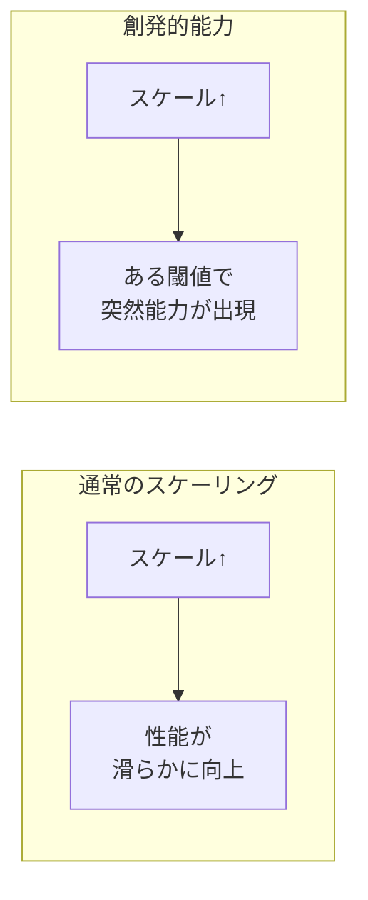
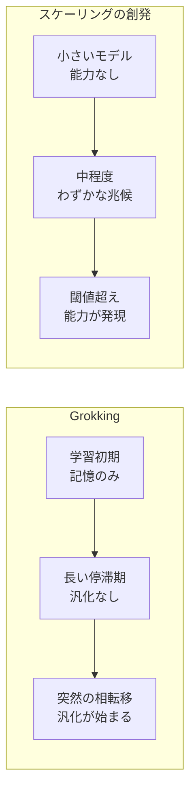

---
tags:
  - LLM
  - emergent-abilities
  - phase-transition
  - scaling-limits
created: "2026-04-19"
status: draft
---

# 10 — 創発的能力（Emergent Abilities）

## 1. 創発的能力とは

創発的能力（Emergent Abilities）とは、小さなモデルでは見られないが、モデルサイズがある閾値を超えると **突然出現する** 能力。



### 1.1 Wei et al. (2022) の定義

「小さなモデルでは存在しないが、大きなモデルでは存在する能力」

---

## 2. 代表的な創発的能力

| 能力 | 出現閾値（概算） | 説明 |
|------|----------------|------|
| Few-shot ICL | ~1B | 例示からタスクを学習 |
| Chain-of-Thought | ~10B | 推論過程の言語化 |
| 複雑な数学推論 | ~100B | 多段階の数学問題 |
| コード生成 | ~10B | 関数の自動生成 |
| 多言語翻訳 | ~10B | 低リソース言語対応 |
| 自己修正 | ~100B | 誤りの自己検出・修正 |

### 2.1 BIG-Bench での観察

```python
import numpy as np
import matplotlib.pyplot as plt

# 創発的能力の典型的パターン（概念的データ）
model_sizes = [0.1, 0.5, 1, 5, 10, 50, 100, 500]  # Bパラメータ

# タスクA: 滑らかなスケーリング
task_a = [20, 25, 30, 40, 50, 65, 75, 85]

# タスクB: 創発的（Phase Transition）
task_b = [0, 0, 2, 5, 8, 10, 65, 90]

fig, axes = plt.subplots(1, 2, figsize=(12, 5))
axes[0].semilogx(model_sizes, task_a, "o-")
axes[0].set_title("タスクA: 滑らかなスケーリング")
axes[0].set_ylabel("精度 (%)")

axes[1].semilogx(model_sizes, task_b, "o-", color="red")
axes[1].set_title("タスクB: 創発的能力")
axes[1].axhline(y=50, color="gray", linestyle="--", label="ランダム以上")
axes[1].legend()

for ax in axes:
    ax.set_xlabel("モデルサイズ (Bパラメータ)")
plt.tight_layout()
plt.show()
```

---

## 3. Phase Transition（相転移）

### 3.1 物理学のアナロジー

水が氷になる相転移のように、LLM の能力もある閾値で不連続に変化:

$$\text{能力}(N) \approx \begin{cases} 0 & N < N_{\text{critical}} \\ f(N) & N \geq N_{\text{critical}} \end{cases}$$

### 3.2 Grokking との関連

Grokking: 学習データの記憶から **突然** 汎化が始まる現象:



---

## 4. 「創発」は幻想か？

### 4.1 Schaeffer et al. (2023) の反論

**主張**: 創発的能力は **評価指標の選び方** による見かけの現象にすぎない。

```python
# 指標の選び方で見え方が変わる例

# Binary accuracy (閾値ベース) → 創発的に見える
def binary_accuracy(correct_tokens, total_tokens):
    """全トークンが正しい場合のみ正解"""
    return 1 if correct_tokens == total_tokens else 0

# Token-level accuracy → 滑らかに見える
def token_accuracy(correct_tokens, total_tokens):
    """トークンレベルの正答率"""
    return correct_tokens / total_tokens

# 同じモデルの性能でも:
# binary_accuracy: 0, 0, 0, 0, 0.05, 0.8 (創発的)
# token_accuracy:  0.1, 0.2, 0.3, 0.5, 0.7, 0.95 (滑らか)
```

### 4.2 議論の整理

| 立場 | 主張 | 根拠 |
|------|------|------|
| 創発は実在する | 質的に新しい能力が出現 | BIG-Bench の多数のタスク |
| 創発は見かけ | 指標の非線形性が原因 | Token-level では滑らか |
| 中間的立場 | 一部は実在、一部は見かけ | タスクに依存 |

---

## 5. スケーリングの限界

### 5.1 現在の課題

- **データの枯渇**: 高品質テキストデータは有限
- **計算コスト**: 指数関数的な投資が必要
- **性能の飽和**: べき乗則の指数は小さい（$\alpha \approx 0.07$）
- **評価の天井**: 既存ベンチマークでの飽和

### 5.2 性能向上の見積もり

Perplexity を $x\%$ 改善するために必要な計算量の増加:

$$\frac{C_{\text{new}}}{C_{\text{old}}} = \left(\frac{L_{\text{old}}}{L_{\text{new}}}\right)^{1/\alpha_C} = \left(\frac{1}{1 - x/100}\right)^{1/0.05}$$

$5\%$ の Perplexity 改善に計算量は **約 2.7 倍** 必要。

### 5.3 スケーリングを超える方向性

| 方向性 | アプローチ |
|--------|-----------|
| データ品質 | フィルタリング、合成データ |
| アーキテクチャ | MoE, State Space Models |
| 推論時計算 | CoT, ToT, 推論時スケーリング |
| ツール使用 | 検索、計算ツール、コード実行 |
| マルチモーダル | 画像、音声からの学習 |

---

## 6. 合成データとスケーリング

### 6.1 「データの壁」の突破

Web テキストの限界に対し、LLM 自身が学習データを生成:

```python
# 合成データ生成の概念的パイプライン
def generate_synthetic_data(teacher_model, domain, n_samples):
    """教師モデルによる合成データ生成"""
    prompts = generate_diverse_prompts(domain, n_samples)
    synthetic_data = []
    for prompt in prompts:
        response = teacher_model.generate(prompt, temperature=0.7)
        # 品質フィルタリング
        if quality_filter(response):
            synthetic_data.append({"prompt": prompt, "response": response})
    return synthetic_data
```

### 6.2 Model Collapse リスク

自身の出力で学習を繰り返すと分布が縮退する「Model Collapse」に注意。

---

## 7. ハンズオン演習

### 演習 1: スケーリング曲線の描画

異なるサイズ（125M, 350M, 1.3B, 2.7B）のモデルで複数タスクの精度を測定し、創発パターンを観察せよ。

### 演習 2: 指標による見え方の違い

同じ結果データを Binary accuracy と Token-level accuracy で可視化し、「創発」の見え方の違いを確認せよ。

### 演習 3: 性能予測

小規模実験の結果からべき乗則をフィッティングし、10倍規模のモデルの性能を予測。実測値と比較せよ。

---

## 8. まとめ

- 創発的能力は LLM スケーリングの最も興味深い現象の一つ
- Few-shot ICL、CoT、コード生成等がスケールに伴い出現
- 「創発は評価指標の産物」という反論も有力で、議論が継続中
- スケーリングの限界（データ、計算コスト、飽和）が認識されている
- 推論時計算スケーリング、合成データ、ツール使用が次の方向性
- 真の理解には、能力の「なぜ」と「いつ」の解明が必要

---

## 参考文献

- Wei et al., "Emergent Abilities of Large Language Models" (2022)
- Schaeffer et al., "Are Emergent Abilities of LLMs a Mirage?" (2023)
- Villalobos et al., "Will we run out of data? Limits of LLM scaling" (2024)
