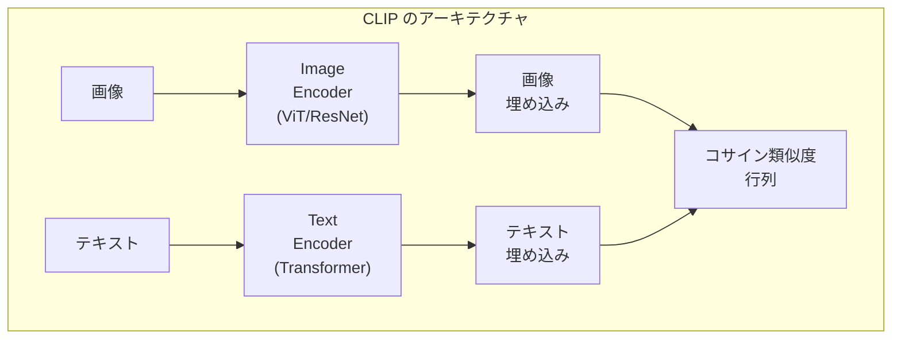
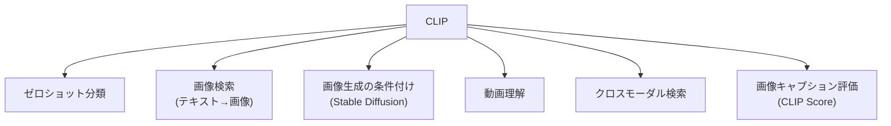

---
tags:
  - multimodal
  - CLIP
  - contrastive-learning
  - zero-shot
created: "2026-04-19"
status: draft
---

# 01 — CLIP 完全解説

## 1. CLIP の革新

CLIP (Contrastive Language-Image Pre-training) は OpenAI が 2021 年に発表した、テキストと画像を共通の埋め込み空間にマッピングするモデル。4億の画像-テキストペアで事前学習。



---

## 2. 対照学習（Contrastive Learning）

### 2.1 目的関数

バッチ内の $N$ 個の画像-テキストペアに対して:

$$\mathcal{L} = -\frac{1}{2N}\sum_{i=1}^{N}\left[\log\frac{\exp(\text{sim}(\mathbf{v}_i, \mathbf{t}_i)/\tau)}{\sum_{j=1}^{N}\exp(\text{sim}(\mathbf{v}_i, \mathbf{t}_j)/\tau)} + \log\frac{\exp(\text{sim}(\mathbf{t}_i, \mathbf{v}_i)/\tau)}{\sum_{j=1}^{N}\exp(\text{sim}(\mathbf{t}_i, \mathbf{v}_j)/\tau)}\right]$$

- $\mathbf{v}_i$: 画像 $i$ の埋め込み
- $\mathbf{t}_i$: テキスト $i$ の埋め込み
- $\tau$: 温度パラメータ（学習可能）

### 2.2 対照学習の直感

正のペア（対応する画像とテキスト）の類似度を最大化し、負のペア（対応しない組み合わせ）の類似度を最小化。

```python
import torch
import torch.nn.functional as F

def clip_loss(image_embeddings, text_embeddings, temperature=0.07):
    """CLIP の対照学習損失"""
    # 正規化
    image_embeddings = F.normalize(image_embeddings, dim=-1)
    text_embeddings = F.normalize(text_embeddings, dim=-1)

    # 類似度行列 (N x N)
    logits = image_embeddings @ text_embeddings.T / temperature

    # ラベル: 対角要素が正のペア
    N = logits.shape[0]
    labels = torch.arange(N, device=logits.device)

    # 画像→テキスト と テキスト→画像 の Cross-Entropy
    loss_i2t = F.cross_entropy(logits, labels)
    loss_t2i = F.cross_entropy(logits.T, labels)

    return (loss_i2t + loss_t2i) / 2
```

---

## 3. ゼロショット分類

### 3.1 プロンプトテンプレート

```python
from transformers import CLIPProcessor, CLIPModel
from PIL import Image

model = CLIPModel.from_pretrained("openai/clip-vit-large-patch14")
processor = CLIPProcessor.from_pretrained("openai/clip-vit-large-patch14")

# ゼロショット画像分類
image = Image.open("cat.jpg")
class_names = ["a photo of a cat", "a photo of a dog", "a photo of a bird"]

inputs = processor(text=class_names, images=image, return_tensors="pt", padding=True)
outputs = model(**inputs)

logits_per_image = outputs.logits_per_image
probs = logits_per_image.softmax(dim=1)
print(f"分類結果: {dict(zip(class_names, probs[0].tolist()))}")
```

### 3.2 プロンプトエンジニアリング

テンプレートの選択が精度に大きく影響:

```python
templates = [
    "a photo of a {}.",
    "a blurry photo of a {}.",
    "a sculpture of a {}.",
    "a drawing of a {}.",
    "a photo of the large {}.",
    "a photo of the small {}.",
]

def ensemble_zero_shot(model, processor, image, class_names, templates):
    """テンプレートアンサンブルによるゼロショット分類"""
    all_text_features = []
    for class_name in class_names:
        texts = [t.format(class_name) for t in templates]
        inputs = processor(text=texts, return_tensors="pt", padding=True)
        text_features = model.get_text_features(**inputs)
        # テンプレートの平均
        avg_feature = text_features.mean(dim=0)
        all_text_features.append(avg_feature)

    text_features = torch.stack(all_text_features)
    text_features = F.normalize(text_features, dim=-1)

    image_inputs = processor(images=image, return_tensors="pt")
    image_features = model.get_image_features(**image_inputs)
    image_features = F.normalize(image_features, dim=-1)

    similarity = image_features @ text_features.T
    return similarity.softmax(dim=-1)
```

---

## 4. CLIP の応用



### 4.1 画像検索

```python
def image_search(query_text, image_database, model, processor, top_k=5):
    """テキストクエリで画像を検索"""
    # クエリのエンコード
    text_inputs = processor(text=[query_text], return_tensors="pt", padding=True)
    text_features = model.get_text_features(**text_inputs)
    text_features = F.normalize(text_features, dim=-1)

    # 画像データベースとの類似度計算
    similarities = text_features @ image_database.T
    top_indices = similarities[0].topk(top_k).indices
    return top_indices
```

### 4.2 CLIP Score

生成画像とテキストの整合性評価:

$$\text{CLIP Score} = \max(\cos(\mathbf{v}, \mathbf{t}), 0) \times 100$$

---

## 5. CLIP の後継モデル

| モデル | 改良点 |
|--------|--------|
| OpenCLIP | オープンソース再実装 |
| SigLIP | シグモイド損失（バッチサイズ制約緩和） |
| EVA-CLIP | スケーリング + 蒸留 |
| MetaCLIP | データキュレーションの改善 |
| DFN-CLIP | データフィルタリングネットワーク |

---

## 6. ハンズオン演習

### 演習 1: ゼロショット分類

CIFAR-10 で CLIP のゼロショット分類精度を測定し、プロンプトテンプレートの影響を分析せよ。

### 演習 2: 画像検索システム

CLIP を使った画像検索システムを構築し、テキストクエリから最も関連する画像を返すデモを作成せよ。

### 演習 3: CLIP Score の計算

テキスト-画像生成モデルの出力に対して CLIP Score を計算し、ガイダンススケールとの相関を分析せよ。

---

## 7. まとめ

- CLIP はテキストと画像を共通空間にマッピングする対照学習モデル
- ゼロショットで ImageNet 精度 76.2% を達成（追加学習なし）
- 対照学習の損失関数がバッチ内の全ペアを活用
- プロンプトテンプレートのアンサンブルで精度を向上
- Stable Diffusion のテキスト条件付けなど、多くの応用に使われる

---

## 参考文献

- Radford et al., "Learning Transferable Visual Models From Natural Language Supervision" (2021)
- Cherti et al., "Reproducible scaling laws for contrastive language-image learning" (OpenCLIP, 2023)
