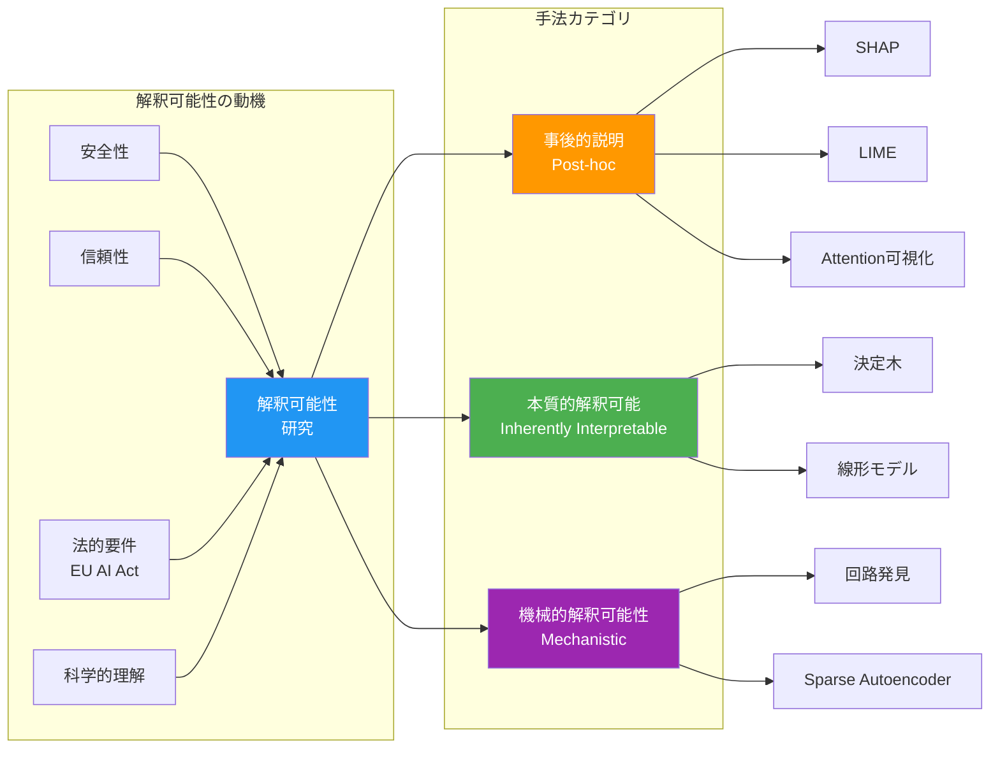
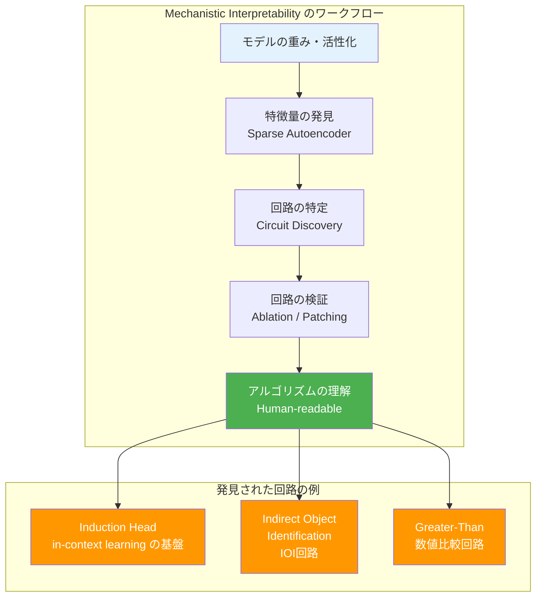

---
tags:
  - ai-safety
  - interpretability
  - explainability
  - mechanistic-interpretability
  - shap
created: "2026-04-19"
status: draft
---

# 解釈可能性 — AI の「思考」を覗く技術

## 1. なぜ解釈可能性が重要か

AI モデルがブラックボックスのままでは、なぜその判断に至ったかが不明であり、安全性・信頼性・法的説明責任を確保できない。解釈可能性（Interpretability）は AI の内部メカニズムを人間が理解できるようにする研究分野である。



## 2. Attention 可視化

Transformer モデルの Attention 重みを可視化することで、モデルがどの入力トークンに「注目」しているかを理解する。

### 2.1 Attention 重みの抽出と可視化

```python
import torch
import numpy as np
from transformers import AutoTokenizer, AutoModel
from typing import List, Tuple

def extract_attention_weights(
    text: str,
    model_name: str = "bert-base-uncased"
) -> Tuple[List[str], np.ndarray]:
    """
    テキストから Attention 重みを抽出する
    
    Returns:
        tokens: トークンのリスト
        attention: shape (num_layers, num_heads, seq_len, seq_len)
    """
    tokenizer = AutoTokenizer.from_pretrained(model_name)
    model = AutoModel.from_pretrained(model_name, output_attentions=True)
    
    inputs = tokenizer(text, return_tensors="pt")
    
    with torch.no_grad():
        outputs = model(**inputs)
    
    # Attention weights: tuple of (num_layers,) each (batch, heads, seq, seq)
    attention = torch.stack(outputs.attentions).squeeze(1)  # (layers, heads, seq, seq)
    tokens = tokenizer.convert_ids_to_tokens(inputs["input_ids"][0])
    
    return tokens, attention.numpy()


def attention_rollout(attention_matrices: np.ndarray) -> np.ndarray:
    """
    Attention Rollout: 全層の Attention を統合して
    入力トークンから出力への総合的な注目度を計算
    
    Abnar & Zuidema (2020) の手法
    """
    num_layers = attention_matrices.shape[0]
    
    # 各層で全ヘッドの平均を取る
    avg_attention = attention_matrices.mean(axis=1)  # (layers, seq, seq)
    
    # 残差接続を考慮: 0.5 * attention + 0.5 * identity
    seq_len = avg_attention.shape[-1]
    identity = np.eye(seq_len)
    
    rollout = identity.copy()
    for layer in range(num_layers):
        # 残差接続を加味
        attention_with_residual = 0.5 * avg_attention[layer] + 0.5 * identity
        # 行の正規化
        attention_with_residual /= attention_with_residual.sum(axis=-1, keepdims=True)
        # 累積
        rollout = rollout @ attention_with_residual
    
    return rollout


def visualize_attention_text(tokens: List[str], attention_scores: np.ndarray):
    """テキストベースで Attention を可視化"""
    # CLS トークンからの注目度
    cls_attention = attention_scores[0]  # CLS → 各トークン
    
    # 正規化
    min_val, max_val = cls_attention.min(), cls_attention.max()
    normalized = (cls_attention - min_val) / (max_val - min_val + 1e-8)
    
    print("Attention 可視化 (CLS → 各トークン):")
    print("-" * 50)
    for token, score in zip(tokens, normalized):
        bar = "█" * int(score * 30)
        print(f"  {token:15s} [{score:.3f}] {bar}")


# 使用例
# tokens, attn = extract_attention_weights("The cat sat on the mat.")
# rollout = attention_rollout(attn)
# visualize_attention_text(tokens, rollout)
```

### 2.2 Attention の限界

```python
"""
注意: Attention 重みの解釈には注意が必要

Jain & Wallace (2019) "Attention is not Explanation" の主張:
1. Attention 重みと特徴量の重要度は必ずしも相関しない
2. 異なる Attention パターンでも同じ出力が得られることがある
3. Attention は「説明」ではなく「1つの中間表現」にすぎない

Wiegreffe & Pinter (2019) の反論:
- Attention が完全に無意味ではないが、単独での解釈は避けるべき
- 他の手法（SHAP, Probing）と併用すべき
"""

attention_caveats = {
    "利点": [
        "計算済みで追加コストなし",
        "直感的に理解しやすい",
        "モデルの内部状態を直接反映",
    ],
    "限界": [
        "因果関係を示さない（相関のみ）",
        "複数ヘッドの統合方法が不明確",
        "残差接続やLayerNormの影響を無視",
        "忠実性（faithfulness）が保証されない",
    ],
    "推奨": [
        "探索的分析には有用",
        "正式な説明にはSHAP/LIMEを併用",
        "Mechanistic Interpretability で補完",
    ]
}

for category, items in attention_caveats.items():
    print(f"\n【{category}】")
    for item in items:
        print(f"  - {item}")
```

## 3. SHAP（SHapley Additive exPlanations）

ゲーム理論の Shapley 値に基づく特徴量の貢献度計算手法。

```python
import numpy as np
from itertools import combinations
from typing import Callable, Dict, List

def compute_shapley_values(
    model_predict: Callable,
    features: Dict[str, float],
    baseline: Dict[str, float] = None
) -> Dict[str, float]:
    """
    Shapley 値を厳密に計算（特徴量数が少ない場合のみ実用的）
    
    φ_i = Σ_{S⊆N\{i}} |S|!(|N|-|S|-1)! / |N|! * [v(S∪{i}) - v(S)]
    
    Args:
        model_predict: 特徴量辞書 → 予測値
        features: 説明対象の入力特徴量
        baseline: ベースライン特徴量（None なら 0）
    """
    feature_names = list(features.keys())
    n = len(feature_names)
    
    if baseline is None:
        baseline = {k: 0.0 for k in feature_names}
    
    shapley_values = {}
    
    for i, target_feature in enumerate(feature_names):
        phi_i = 0.0
        other_features = [f for f in feature_names if f != target_feature]
        
        # 全ての部分集合 S ⊆ N\{i} を列挙
        for subset_size in range(len(other_features) + 1):
            for subset in combinations(other_features, subset_size):
                subset = set(subset)
                
                # v(S): target_feature なしの予測
                input_without = baseline.copy()
                for f in subset:
                    input_without[f] = features[f]
                v_without = model_predict(input_without)
                
                # v(S ∪ {i}): target_feature ありの予測
                input_with = input_without.copy()
                input_with[target_feature] = features[target_feature]
                v_with = model_predict(input_with)
                
                # 重み計算
                s = len(subset)
                import math
                weight = math.factorial(s) * math.factorial(n - s - 1) / math.factorial(n)
                
                phi_i += weight * (v_with - v_without)
        
        shapley_values[target_feature] = phi_i
    
    return shapley_values


# デモ: ローン審査モデル
def loan_model(features: dict) -> float:
    """簡略化されたローン審査モデル"""
    score = (
        features.get("income", 0) * 0.004 +
        features.get("credit_score", 0) * 0.01 +
        features.get("debt_ratio", 0) * (-0.5) +
        features.get("employment_years", 0) * 0.08
    )
    return max(0, min(1, score))

applicant = {
    "income": 60,          # 万円
    "credit_score": 75,    # 0-100
    "debt_ratio": 0.3,     # 負債比率
    "employment_years": 5  # 勤続年数
}

shapley = compute_shapley_values(loan_model, applicant)

print("=== ローン審査の SHAP 分析 ===")
print(f"予測スコア: {loan_model(applicant):.3f}")
print(f"\n各特徴量の貢献度 (Shapley値):")
for feature, value in sorted(shapley.items(), key=lambda x: abs(x[1]), reverse=True):
    direction = "+" if value > 0 else ""
    bar = "█" * int(abs(value) * 50)
    print(f"  {feature:20s}: {direction}{value:.4f} {bar}")
```

## 4. LIME（Local Interpretable Model-agnostic Explanations）

```python
import numpy as np
from typing import Callable, List, Tuple

class SimpleLIME:
    """
    LIME の簡略実装
    
    任意のブラックボックスモデルを局所的に線形モデルで近似する
    """
    
    def __init__(self, kernel_width: float = 0.75):
        self.kernel_width = kernel_width
    
    def explain(
        self,
        model_predict: Callable,
        instance: np.ndarray,
        num_samples: int = 1000,
        num_features: int = None,
    ) -> Tuple[np.ndarray, float]:
        """
        インスタンスの予測を局所的に説明する
        
        1. インスタンス周辺のサンプルを生成
        2. 各サンプルの予測を取得
        3. 距離に応じた重み付きで線形モデルをフィット
        """
        n_features = len(instance)
        if num_features is None:
            num_features = n_features
        
        # 1. 摂動サンプルの生成（特徴量のオン/オフ）
        perturbations = np.random.binomial(1, 0.5, (num_samples, n_features))
        
        # 摂動を適用したインスタンスを生成
        perturbed_instances = []
        for p in perturbations:
            perturbed = instance.copy()
            perturbed[p == 0] = 0  # オフの特徴量をゼロに
            perturbed_instances.append(perturbed)
        
        perturbed_instances = np.array(perturbed_instances)
        
        # 2. モデルの予測を取得
        predictions = np.array([model_predict(x) for x in perturbed_instances])
        
        # 3. カーネル重みの計算（コサイン距離）
        distances = np.sqrt(((perturbations - 1) ** 2).sum(axis=1))
        weights = np.exp(-(distances ** 2) / (self.kernel_width ** 2))
        
        # 4. 重み付き線形回帰
        W = np.diag(weights)
        X = perturbations
        y = predictions
        
        # (X^T W X)^{-1} X^T W y
        try:
            coefficients = np.linalg.solve(
                X.T @ W @ X + 1e-6 * np.eye(n_features),
                X.T @ W @ y
            )
        except np.linalg.LinAlgError:
            coefficients = np.zeros(n_features)
        
        # R^2 スコア
        y_pred = X @ coefficients
        ss_res = np.sum(weights * (y - y_pred) ** 2)
        ss_tot = np.sum(weights * (y - np.average(y, weights=weights)) ** 2)
        r_squared = 1 - ss_res / (ss_tot + 1e-8)
        
        return coefficients, r_squared


# デモ
def nonlinear_model(x: np.ndarray) -> float:
    """非線形モデル（ブラックボックス）"""
    return float(np.sin(x[0]) + x[1]**2 + 0.5 * x[2] * x[3])

lime = SimpleLIME(kernel_width=1.0)
instance = np.array([1.0, 0.5, 2.0, -1.0])

coefficients, r2 = lime.explain(nonlinear_model, instance, num_samples=5000)

print("=== LIME による局所的説明 ===")
print(f"インスタンス: {instance}")
print(f"モデル予測: {nonlinear_model(instance):.4f}")
print(f"局所線形モデルの R²: {r2:.4f}")
print(f"\n特徴量の局所的重要度:")
for i, coef in enumerate(coefficients):
    bar = "█" * int(abs(coef) * 20)
    sign = "+" if coef > 0 else ""
    print(f"  x[{i}] = {instance[i]:6.2f} → 係数: {sign}{coef:.4f} {bar}")
```

## 5. Mechanistic Interpretability（機械的解釈可能性）

### 5.1 概要

Mechanistic Interpretability は、ニューラルネットワーク内部の**具体的なアルゴリズム**を特定する研究アプローチ。Anthropic が精力的に推進している。



### 5.2 Sparse Autoencoder による特徴量発見

```python
import numpy as np

class SimpleSparseAutoencoder:
    """
    Sparse Autoencoder (SAE) の簡略実装
    
    LLM の中間層の活性化ベクトルを、解釈可能な特徴量に分解する
    Anthropic の "Towards Monosemanticity" (2023) に基づく
    """
    
    def __init__(self, input_dim: int, hidden_dim: int, sparsity_coef: float = 0.1):
        self.input_dim = input_dim
        self.hidden_dim = hidden_dim  # 通常 input_dim の 4-64 倍
        self.sparsity_coef = sparsity_coef
        
        # 重みの初期化
        self.encoder_weight = np.random.randn(hidden_dim, input_dim) * 0.01
        self.encoder_bias = np.zeros(hidden_dim)
        self.decoder_weight = np.random.randn(input_dim, hidden_dim) * 0.01
        self.decoder_bias = np.zeros(input_dim)
    
    def encode(self, x: np.ndarray) -> np.ndarray:
        """活性化ベクトル → スパースな特徴量"""
        pre_activation = x @ self.encoder_weight.T + self.encoder_bias
        return np.maximum(0, pre_activation)  # ReLU で非負・スパースに
    
    def decode(self, features: np.ndarray) -> np.ndarray:
        """スパース特徴量 → 再構成された活性化ベクトル"""
        return features @ self.decoder_weight.T + self.decoder_bias
    
    def compute_loss(self, x: np.ndarray) -> dict:
        """
        損失 = 再構成誤差 + スパース性ペナルティ
        """
        features = self.encode(x)
        reconstruction = self.decode(features)
        
        # 再構成誤差 (MSE)
        recon_loss = np.mean((x - reconstruction) ** 2)
        
        # L1 スパース性ペナルティ
        sparsity_loss = self.sparsity_coef * np.mean(np.abs(features))
        
        # 活性化の統計
        active_features = np.mean(features > 0)  # 非ゼロ特徴量の割合
        
        return {
            "total_loss": recon_loss + sparsity_loss,
            "recon_loss": recon_loss,
            "sparsity_loss": sparsity_loss,
            "active_ratio": active_features,
            "num_active": int(np.sum(features > 0)),
        }
    
    def interpret_features(self, features: np.ndarray, top_k: int = 5) -> list:
        """上位 k 個の活性化特徴量を返す"""
        active_indices = np.argsort(-features)[:top_k]
        return [(int(idx), float(features[idx])) for idx in active_indices if features[idx] > 0]


# デモ
print("=== Sparse Autoencoder による特徴量分解 ===\n")

sae = SimpleSparseAutoencoder(
    input_dim=64,    # モデルの隠れ層次元
    hidden_dim=256,  # 辞書サイズ（4倍に拡張）
    sparsity_coef=0.05
)

# ダミーの活性化ベクトル
dummy_activation = np.random.randn(64) * 0.5

# エンコード
features = sae.encode(dummy_activation)
loss_info = sae.compute_loss(dummy_activation)

print(f"入力次元: {sae.input_dim}")
print(f"辞書サイズ: {sae.hidden_dim}")
print(f"活性化特徴量数: {loss_info['num_active']} / {sae.hidden_dim}")
print(f"スパース比率: {1 - loss_info['active_ratio']:.1%} がゼロ")
print(f"再構成誤差: {loss_info['recon_loss']:.4f}")

top_features = sae.interpret_features(features)
print(f"\n上位活性化特徴量:")
for idx, val in top_features:
    print(f"  Feature #{idx}: {val:.4f}")
```

### 5.3 回路発見：Activation Patching

```python
def activation_patching_demo():
    """
    Activation Patching（因果的介入）の概念デモ
    
    モデルの特定の位置の活性化を「パッチ」して、
    出力への因果的影響を測定する
    """
    
    class SimpleTransformerLayer:
        def __init__(self, dim: int):
            self.attention_output = np.random.randn(dim)
            self.mlp_output = np.random.randn(dim)
        
        def forward(self, x: np.ndarray) -> np.ndarray:
            # 簡略化: attention + MLP + 残差接続
            attn_out = x + self.attention_output
            mlp_out = attn_out + self.mlp_output
            return mlp_out
    
    dim = 8
    num_layers = 4
    layers = [SimpleTransformerLayer(dim) for _ in range(num_layers)]
    
    # クリーンな入力での実行
    clean_input = np.ones(dim)
    clean_activations = [clean_input]
    x = clean_input.copy()
    for layer in layers:
        x = layer.forward(x)
        clean_activations.append(x.copy())
    clean_output = x
    
    # 破損した入力での実行
    corrupted_input = np.zeros(dim)
    x = corrupted_input.copy()
    for layer in layers:
        x = layer.forward(x)
    corrupted_output = x
    
    print("=== Activation Patching デモ ===\n")
    print(f"クリーン出力のノルム: {np.linalg.norm(clean_output):.4f}")
    print(f"破損出力のノルム:    {np.linalg.norm(corrupted_output):.4f}")
    
    # 各層でクリーンな活性化をパッチして影響を測定
    print(f"\n各層の因果的重要度:")
    for patch_layer in range(num_layers):
        x = corrupted_input.copy()
        for i, layer in enumerate(layers):
            if i == patch_layer:
                # この層だけクリーンな活性化に置換
                x = clean_activations[i + 1].copy()
            else:
                x = layer.forward(x)
        
        patched_output = x
        # クリーン出力との類似度で重要度を測定
        recovery = 1 - np.linalg.norm(clean_output - patched_output) / (
            np.linalg.norm(clean_output - corrupted_output) + 1e-8
        )
        bar = "█" * int(max(0, recovery) * 30)
        print(f"  Layer {patch_layer}: 回復率 {recovery:.3f} {bar}")

activation_patching_demo()
```

## 6. ハンズオン演習

### 演習1: SHAP 値の手計算

3つの特徴量を持つ簡単なモデルで Shapley 値を手計算し、上のコードで検証してください。

### 演習2: Attention パターンの分析

BERT の Attention を抽出し、以下の文で主語-動詞の対応関係が Attention に反映されているか調べてください。
- "The keys on the table are mine."
- "The key on the tables is mine."

### 演習3: Sparse Autoencoder の学習

PyTorch で SAE を実装し、小さなモデル（GPT-2 small の特定層）の活性化を分解してみてください。発見された特徴量に意味的なラベルを付けられるか試してください。

## 7. まとめ

| 手法 | スコープ | 忠実性 | コスト | 適用場面 |
|---|---|---|---|---|
| Attention 可視化 | 局所 | 低〜中 | 低 | 探索的分析 |
| SHAP | 局所/大域 | 高 | 高 | 正式な説明 |
| LIME | 局所 | 中 | 中 | モデル非依存の説明 |
| Mechanistic | 大域 | 最高 | 最高 | 安全性研究 |

## 参考文献

- Lundberg & Lee (2017) "A Unified Approach to Interpreting Model Predictions"
- Ribeiro et al. (2016) "Why Should I Trust You?: Explaining the Predictions of Any Classifier"
- Elhage et al. (2022) "Toy Models of Superposition"
- Bricken et al. (2023) "Towards Monosemanticity"
- Conmy et al. (2023) "Towards Automated Circuit Discovery for Mechanistic Interpretability"
