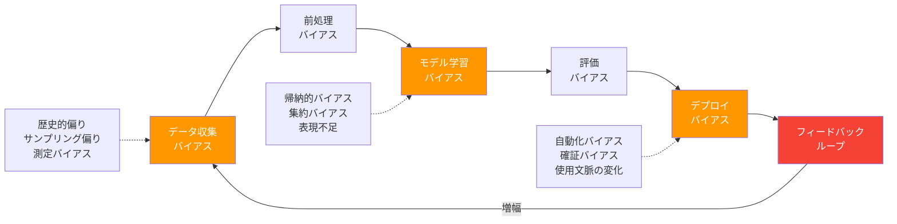

---
tags:
  - ai-safety
  - bias
  - fairness
  - ethics
  - responsible-ai
created: "2026-04-19"
status: draft
---

# バイアスと公平性 — AI における差別の構造と緩和

## 1. AI バイアスの全体像

AI システムにおけるバイアスは、データ収集からモデル設計、デプロイ、フィードバックループに至るパイプライン全体で発生する。バイアスは「偏り」であり、必ずしも悪ではないが、保護属性（性別、人種、年齢等）に基づく不公正な差別につながる場合は問題となる。



## 2. データバイアスの分類と検出

### 2.1 データバイアスの主要タイプ

```python
from dataclasses import dataclass
from typing import List, Dict
import numpy as np

@dataclass
class BiasType:
    name: str
    description: str
    example: str
    detection_method: str

data_biases: List[BiasType] = [
    BiasType(
        name="歴史的バイアス (Historical Bias)",
        description="過去の社会的偏見がデータに反映されている",
        example="過去の採用データで男性が優遇されていた → AIも男性を優遇",
        detection_method="保護属性ごとの統計分析、ドメイン専門家のレビュー"
    ),
    BiasType(
        name="表現バイアス (Representation Bias)",
        description="特定のグループがデータに過少/過大に含まれる",
        example="顔認識の訓練データが白人に偏り → 有色人種の認識精度が低い",
        detection_method="属性ごとのサンプル数比較、人口統計との照合"
    ),
    BiasType(
        name="測定バイアス (Measurement Bias)",
        description="特徴量やラベルの測定方法がグループ間で異なる",
        example="犯罪予測で逮捕率を使用 → 警察の偏見が反映される",
        detection_method="プロキシ変数の特定、因果分析"
    ),
    BiasType(
        name="集約バイアス (Aggregation Bias)",
        description="異なるグループを単一モデルで扱うことで生じる",
        example="HbA1c と糖尿病の関係が民族によって異なるのに同一モデルで予測",
        detection_method="サブグループ分析、交差検証"
    ),
    BiasType(
        name="サンプリングバイアス (Sampling Bias)",
        description="データ収集方法が特定集団に偏っている",
        example="スマホアプリ調査 → デジタルデバイド層が除外される",
        detection_method="収集方法の監査、外部データとの比較"
    ),
]

for bias in data_biases:
    print(f"\n{'='*60}")
    print(f"📊 {bias.name}")
    print(f"  説明: {bias.description}")
    print(f"  例:   {bias.example}")
    print(f"  検出: {bias.detection_method}")
```

### 2.2 データバイアスの定量的検出

```python
import numpy as np
from collections import Counter
from typing import Tuple

class BiasDetector:
    """データセットのバイアスを検出するツール"""
    
    def __init__(self, labels: np.ndarray, protected_attribute: np.ndarray):
        """
        Args:
            labels: ラベル (0 or 1)
            protected_attribute: 保護属性 (0: 非保護グループ, 1: 保護グループ)
        """
        self.labels = labels
        self.protected = protected_attribute
    
    def disparate_impact_ratio(self) -> float:
        """
        差別的影響比率 (Disparate Impact Ratio)
        
        P(Y=1|A=1) / P(Y=1|A=0)
        
        0.8未満 → 4/5ルールにより差別的影響の可能性
        """
        mask_protected = self.protected == 1
        mask_unprotected = self.protected == 0
        
        rate_protected = np.mean(self.labels[mask_protected])
        rate_unprotected = np.mean(self.labels[mask_unprotected])
        
        if rate_unprotected == 0:
            return float('inf')
        return rate_protected / rate_unprotected
    
    def statistical_parity_difference(self) -> float:
        """
        統計的パリティ差
        
        P(Y=1|A=1) - P(Y=1|A=0)
        
        0に近いほど公平
        """
        mask_protected = self.protected == 1
        mask_unprotected = self.protected == 0
        
        rate_protected = np.mean(self.labels[mask_protected])
        rate_unprotected = np.mean(self.labels[mask_unprotected])
        
        return rate_protected - rate_unprotected
    
    def class_imbalance(self) -> dict:
        """各グループのラベル分布"""
        result = {}
        for group in [0, 1]:
            mask = self.protected == group
            group_labels = self.labels[mask]
            result[f"group_{group}"] = {
                "count": int(np.sum(mask)),
                "positive_rate": float(np.mean(group_labels)),
                "negative_rate": float(1 - np.mean(group_labels)),
            }
        return result
    
    def report(self) -> str:
        """バイアスレポートを生成"""
        di = self.disparate_impact_ratio()
        spd = self.statistical_parity_difference()
        imbalance = self.class_imbalance()
        
        lines = [
            "=" * 50,
            "バイアス検出レポート",
            "=" * 50,
            f"サンプル数: {len(self.labels)}",
            f"保護グループ: {int(np.sum(self.protected == 1))}",
            f"非保護グループ: {int(np.sum(self.protected == 0))}",
            "",
            f"Disparate Impact Ratio: {di:.4f}",
            f"  {'⚠ 4/5ルール違反 (< 0.8)' if di < 0.8 else '✓ 4/5ルール適合'}",
            f"Statistical Parity Difference: {spd:.4f}",
            f"  {'⚠ 有意な差あり' if abs(spd) > 0.1 else '✓ 差は小さい'}",
            "",
            "グループ別統計:",
        ]
        for group, stats in imbalance.items():
            lines.append(f"  {group}: n={stats['count']}, 陽性率={stats['positive_rate']:.3f}")
        
        return "\n".join(lines)


# デモ: 偏りのあるローン審査データ
np.random.seed(42)
n = 1000

# 保護属性（例: 性別、0=男性, 1=女性）
protected = np.random.binomial(1, 0.5, n)

# 偏りのあるラベル生成: 女性の承認率が低い
base_rate = 0.6
bias_factor = -0.2  # 女性に対するバイアス
labels = np.random.binomial(1, base_rate + bias_factor * protected)

detector = BiasDetector(labels, protected)
print(detector.report())
```

## 3. アルゴリズムバイアス

### 3.1 モデルが増幅するバイアス

```python
class AlgorithmicBiasDemo:
    """アルゴリズムバイアスのデモンストレーション"""
    
    @staticmethod
    def proxy_discrimination_demo():
        """
        プロキシ差別: 保護属性を直接使わなくても、
        相関する特徴量を通じて差別が発生する
        """
        np.random.seed(42)
        n = 500
        
        # 真のデータ生成過程
        gender = np.random.binomial(1, 0.5, n)  # 保護属性
        
        # 性別と相関する特徴量（プロキシ変数）
        height = 170 + 10 * (1 - gender) + np.random.normal(0, 5, n)
        zipcode = np.random.choice(
            [100, 200, 300],
            n,
            p=[0.5 - 0.2 * 1, 0.3, 0.2 + 0.2 * 1]  # 居住地が性別と相関
        ) * (1 - gender) + np.random.choice([100, 200, 300], n) * gender
        
        # 性別を除いて学習しても...
        print("=== プロキシ差別のデモ ===")
        print("保護属性（性別）を特徴量から除外しても：")
        print(f"  身長と性別の相関: {np.corrcoef(height, gender)[0,1]:.3f}")
        print("  → 身長を通じて間接的に性別の情報が漏洩する")
        print("  → 「性別を使っていない」は公平性の保証にならない")
    
    @staticmethod
    def feedback_loop_demo(iterations: int = 10):
        """
        フィードバックループによるバイアス増幅のシミュレーション
        """
        np.random.seed(42)
        
        # 2つの地域: A（裕福）と B（貧困）
        crime_rate_a = 0.05  # 真の犯罪率
        crime_rate_b = 0.05  # 同じ犯罪率
        
        police_a = 50  # 初期の警察リソース
        police_b = 50
        
        print("=== フィードバックループによるバイアス増幅 ===\n")
        print(f"{'反復':>4} {'地域A検挙数':>10} {'地域B検挙数':>10} {'A配置率':>8} {'B配置率':>8}")
        print("-" * 50)
        
        for i in range(iterations):
            # 検挙数 = 犯罪率 × 警察リソース（検出率が配置に比例）
            arrests_a = np.random.binomial(1000, crime_rate_a * police_a / 100)
            arrests_b = np.random.binomial(1000, crime_rate_b * police_b / 100)
            
            total_arrests = arrests_a + arrests_b + 1
            
            # 予測的ポリシング: 検挙数に基づいてリソース再配分
            police_a = int(100 * arrests_a / total_arrests)
            police_b = 100 - police_a
            
            print(f"{i+1:>4} {arrests_a:>10} {arrests_b:>10} {police_a:>7}% {police_b:>7}%")
        
        print(f"\n結論: 同じ犯罪率でも、初期のわずかなランダム差が")
        print(f"フィードバックループで増幅され、不公平な配分に至る")

AlgorithmicBiasDemo.proxy_discrimination_demo()
print()
AlgorithmicBiasDemo.feedback_loop_demo()
```

## 4. 公平性の数学的定義

### 4.1 主要な公平性基準

```mermaid
graph TB
    A[公平性の定義] --> B[グループ公平性<br/>Group Fairness]
    A --> C[個人公平性<br/>Individual Fairness]
    A --> D[因果的公平性<br/>Causal Fairness]
    
    B --> B1[統計的パリティ<br/>P&#40;Ŷ=1|A=0&#41; = P&#40;Ŷ=1|A=1&#41;]
    B --> B2[均等化オッズ<br/>P&#40;Ŷ=1|A,Y&#41; = P&#40;Ŷ=1|Y&#41;]
    B --> B3[予測パリティ<br/>P&#40;Y=1|Ŷ=1,A&#41; = P&#40;Y=1|Ŷ=1&#41;]
    
    C --> C1[類似入力 → 類似出力<br/>Lipschitz 条件]
    
    D --> D1[反事実的公平性<br/>Counterfactual Fairness]
    D --> D2[パス特有効果<br/>Path-Specific Effects]
    
    style A fill:#2196F3,color:#fff
    style B fill:#FF9800,color:#fff
    style C fill:#4CAF50,color:#fff
    style D fill:#9C27B0,color:#fff
```

### 4.2 公平性基準の実装と不可能性定理

```python
import numpy as np
from typing import Dict

class FairnessMetrics:
    """公平性指標の計算クラス"""
    
    def __init__(
        self,
        y_true: np.ndarray,
        y_pred: np.ndarray,
        protected: np.ndarray
    ):
        self.y_true = y_true
        self.y_pred = y_pred
        self.protected = protected
    
    def _group_rates(self, group_val: int) -> dict:
        mask = self.protected == group_val
        y_t = self.y_true[mask]
        y_p = self.y_pred[mask]
        
        tp = np.sum((y_p == 1) & (y_t == 1))
        fp = np.sum((y_p == 1) & (y_t == 0))
        tn = np.sum((y_p == 0) & (y_t == 0))
        fn = np.sum((y_p == 0) & (y_t == 1))
        
        return {
            "tpr": tp / (tp + fn) if (tp + fn) > 0 else 0,  # 真陽性率
            "fpr": fp / (fp + tn) if (fp + tn) > 0 else 0,  # 偽陽性率
            "ppv": tp / (tp + fp) if (tp + fp) > 0 else 0,  # 精度
            "positive_rate": np.mean(y_p),                    # 陽性率
            "base_rate": np.mean(y_t),                        # 基底率
        }
    
    def statistical_parity(self) -> Dict[str, float]:
        """統計的パリティ: P(Ŷ=1|A=0) = P(Ŷ=1|A=1)"""
        r0 = self._group_rates(0)
        r1 = self._group_rates(1)
        return {
            "group_0_positive_rate": r0["positive_rate"],
            "group_1_positive_rate": r1["positive_rate"],
            "difference": abs(r0["positive_rate"] - r1["positive_rate"]),
            "satisfied": abs(r0["positive_rate"] - r1["positive_rate"]) < 0.05,
        }
    
    def equalized_odds(self) -> Dict[str, float]:
        """均等化オッズ: TPR と FPR が両グループで等しい"""
        r0 = self._group_rates(0)
        r1 = self._group_rates(1)
        return {
            "group_0_tpr": r0["tpr"], "group_1_tpr": r1["tpr"],
            "group_0_fpr": r0["fpr"], "group_1_fpr": r1["fpr"],
            "tpr_difference": abs(r0["tpr"] - r1["tpr"]),
            "fpr_difference": abs(r0["fpr"] - r1["fpr"]),
            "satisfied": (abs(r0["tpr"] - r1["tpr"]) < 0.05 and 
                         abs(r0["fpr"] - r1["fpr"]) < 0.05),
        }
    
    def predictive_parity(self) -> Dict[str, float]:
        """予測パリティ: PPV が両グループで等しい"""
        r0 = self._group_rates(0)
        r1 = self._group_rates(1)
        return {
            "group_0_ppv": r0["ppv"], "group_1_ppv": r1["ppv"],
            "difference": abs(r0["ppv"] - r1["ppv"]),
            "satisfied": abs(r0["ppv"] - r1["ppv"]) < 0.05,
        }
    
    def full_report(self) -> str:
        sp = self.statistical_parity()
        eo = self.equalized_odds()
        pp = self.predictive_parity()
        
        mark = lambda b: "✓" if b else "✗"
        
        return f"""
=== 公平性レポート ===

統計的パリティ {mark(sp['satisfied'])}:
  G0 陽性率: {sp['group_0_positive_rate']:.3f}
  G1 陽性率: {sp['group_1_positive_rate']:.3f}
  差: {sp['difference']:.4f}

均等化オッズ {mark(eo['satisfied'])}:
  TPR差: {eo['tpr_difference']:.4f}, FPR差: {eo['fpr_difference']:.4f}

予測パリティ {mark(pp['satisfied'])}:
  G0 PPV: {pp['group_0_ppv']:.3f}, G1 PPV: {pp['group_1_ppv']:.3f}
  差: {pp['difference']:.4f}

⚠ 不可能性定理 (Chouldechova, 2017):
  基底率が異なるグループ間では、統計的パリティ・均等化オッズ・
  予測パリティを同時に満たすことは数学的に不可能。
  → どの公平性基準を優先するかはドメインと文脈に依存する。
"""


# デモ
np.random.seed(42)
n = 2000
protected = np.random.binomial(1, 0.4, n)
y_true = np.random.binomial(1, 0.5 + 0.1 * protected)  # 基底率が異なる
# バイアスのある予測器
y_pred = np.random.binomial(1, 0.45 + 0.15 * (1 - protected) + 0.1 * y_true)

fm = FairnessMetrics(y_true, y_pred, protected)
print(fm.full_report())
```

## 5. バイアス緩和手法

### 5.1 パイプライン段階別の緩和手法

```python
class BiasMitigation:
    """バイアス緩和手法の実装例"""
    
    @staticmethod
    def reweighting(
        labels: np.ndarray,
        protected: np.ndarray
    ) -> np.ndarray:
        """
        前処理: リウェイティング
        各サンプルに重みを付与して、グループ間の統計的パリティを達成
        """
        n = len(labels)
        weights = np.ones(n)
        
        for a in [0, 1]:
            for y in [0, 1]:
                mask = (protected == a) & (labels == y)
                expected = np.mean(protected == a) * np.mean(labels == y)
                observed = np.mean(mask)
                if observed > 0:
                    weights[mask] = expected / observed
        
        return weights
    
    @staticmethod
    def threshold_adjustment(
        scores: np.ndarray,
        protected: np.ndarray,
        target_rate: float = 0.5
    ) -> np.ndarray:
        """
        後処理: グループごとの閾値調整
        各グループの陽性率が target_rate になるよう閾値を設定
        """
        predictions = np.zeros_like(scores, dtype=int)
        
        for group in [0, 1]:
            mask = protected == group
            group_scores = scores[mask]
            # 目標陽性率を達成する閾値を計算
            threshold = np.percentile(group_scores, (1 - target_rate) * 100)
            predictions[mask] = (group_scores >= threshold).astype(int)
        
        return predictions
    
    @staticmethod
    def adversarial_debiasing_concept():
        """
        学習中: 敵対的デバイアシング（概念説明）
        
        メインタスクのモデルと、保護属性を予測する敵対者を同時に学習。
        敵対者が保護属性を予測できないようにメインモデルを学習する。
        """
        architecture = """
        入力特徴量 X
            │
            ▼
        ┌─────────────┐
        │  特徴抽出器  │
        │  (共有層)    │
        └──────┬──────┘
               │ Z (中間表現)
          ┌────┴────┐
          │         │
          ▼         ▼
        ┌─────┐  ┌──────────┐
        │予測器│  │ 敵対者   │
        │ Ŷ   │  │ Â (保護  │
        │     │  │  属性予測)│
        └─────┘  └──────────┘
          │         │
          ▼         ▼
        L_task    L_adversary
        
        損失: L = L_task - λ * L_adversary
        
        → 中間表現 Z から保護属性が予測不能になる
        → 公平な表現を学習
        """
        return architecture


# デモ
np.random.seed(42)
n = 1000
protected = np.random.binomial(1, 0.5, n)
labels = np.random.binomial(1, 0.6 - 0.2 * protected)
scores = 0.5 + 0.2 * labels - 0.15 * protected + np.random.normal(0, 0.2, n)

print("=== リウェイティングによるバイアス緩和 ===\n")
weights = BiasMitigation.reweighting(labels, protected)
print(f"重みの範囲: [{weights.min():.3f}, {weights.max():.3f}]")
print(f"保護グループの平均重み: {weights[protected==1].mean():.3f}")
print(f"非保護グループの平均重み: {weights[protected==0].mean():.3f}")

print("\n=== 閾値調整によるバイアス緩和 ===\n")
adjusted_pred = BiasMitigation.threshold_adjustment(scores, protected, target_rate=0.5)
for g in [0, 1]:
    mask = protected == g
    print(f"グループ{g}: 陽性率 = {np.mean(adjusted_pred[mask]):.3f}")

print("\n=== 敵対的デバイアシングのアーキテクチャ ===")
print(BiasMitigation.adversarial_debiasing_concept())
```

## 6. ハンズオン演習

### 演習1: データセットのバイアス監査

UCI Adult データセットをダウンロードし、性別・人種ごとの収入分布を分析してください。BiasDetector クラスを使って定量的なレポートを作成してください。

### 演習2: 公平性のトレードオフ可視化

ある二値分類器の閾値を変化させたとき、精度・統計的パリティ・均等化オッズがどうトレードオフするかをグラフ化してください。

### 演習3: 緩和手法の比較

同一データセットに対して、リウェイティング・閾値調整・特徴量除去の3手法を適用し、精度と公平性指標の変化を比較してください。

## 7. まとめ

- バイアスはパイプライン全体で発生し、フィードバックループで増幅される
- 保護属性の除去だけではプロキシ変数を通じた差別を防げない
- 公平性の複数定義は同時に満たせない（不可能性定理）
- 緩和手法は前処理・学習中・後処理の各段階で適用可能
- 技術的解決だけでなく、社会的文脈の理解が不可欠

## 参考文献

- Chouldechova (2017) "Fair Prediction with Disparate Impact"
- Mehrabi et al. (2021) "A Survey on Bias and Fairness in Machine Learning"
- Barocas, Hardt & Narayanan (2019) "Fairness and Machine Learning"
- Zhang et al. (2018) "Mitigating Unwanted Biases with Adversarial Learning"
