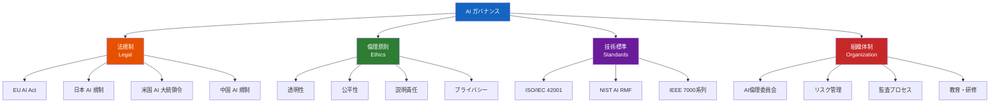
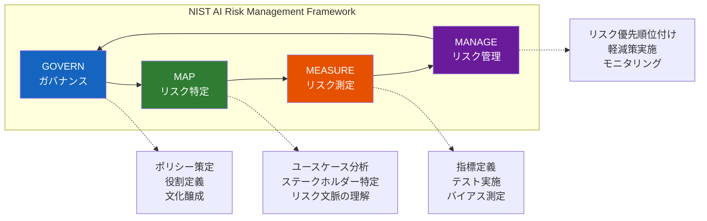

---
tags:
  - ai-safety
  - governance
  - regulation
  - eu-ai-act
  - ethics
created: "2026-04-19"
status: draft
---

# AI ガバナンス — 規制・倫理・組織体制

## 1. AI ガバナンスの全体像

AI ガバナンスとは、AI システムの開発・デプロイ・運用を適切に管理・統制するための枠組みである。技術的安全性だけでなく、法規制・倫理・組織体制・社会的影響を包括する。



## 2. EU AI Act（EU 人工知能法）

### 2.1 リスクベースのアプローチ

EU AI Act は世界初の包括的 AI 規制であり、2024年に成立、2025-2026年にかけて段階的に施行される。リスクに応じた4段階の規制を定める。

```python
from dataclasses import dataclass, field
from enum import Enum
from typing import List

class RiskLevel(Enum):
    UNACCEPTABLE = "禁止 (Unacceptable Risk)"
    HIGH = "高リスク (High Risk)"
    LIMITED = "限定リスク (Limited Risk)"
    MINIMAL = "最小リスク (Minimal Risk)"

@dataclass
class AISystemClassification:
    name: str
    risk_level: RiskLevel
    examples: List[str]
    requirements: List[str]
    penalties: str

classifications = [
    AISystemClassification(
        name="禁止される AI",
        risk_level=RiskLevel.UNACCEPTABLE,
        examples=[
            "ソーシャルスコアリング（政府による市民の行動評価）",
            "公共空間でのリアルタイム生体認証（例外あり）",
            "サブリミナル操作技術",
            "脆弱な人々のターゲティング",
            "感情推論（職場・教育での使用）",
        ],
        requirements=["使用禁止"],
        penalties="最大3,500万ユーロ or 全世界売上高の7%"
    ),
    AISystemClassification(
        name="高リスク AI",
        risk_level=RiskLevel.HIGH,
        examples=[
            "採用・人事評価 AI",
            "信用スコアリング",
            "教育での評価・入試",
            "法執行（予測的ポリシング）",
            "重要インフラ管理",
            "移民・亡命申請の評価",
        ],
        requirements=[
            "リスク管理システムの構築",
            "データガバナンス・品質管理",
            "技術文書の作成",
            "ログ記録と追跡可能性",
            "透明性・情報提供",
            "人間による監視体制",
            "精度・堅牢性・サイバーセキュリティ",
            "適合性評価（Conformity Assessment）",
        ],
        penalties="最大1,500万ユーロ or 全世界売上高の3%"
    ),
    AISystemClassification(
        name="限定リスク AI",
        risk_level=RiskLevel.LIMITED,
        examples=[
            "チャットボット",
            "ディープフェイク生成",
            "感情認識システム",
            "生体カテゴリ分類",
        ],
        requirements=[
            "AI であることの開示",
            "生成コンテンツのラベリング",
            "ユーザーへの通知義務",
        ],
        penalties="最大750万ユーロ or 全世界売上高の1.5%"
    ),
    AISystemClassification(
        name="最小リスク AI",
        risk_level=RiskLevel.MINIMAL,
        examples=[
            "スパムフィルター",
            "ゲーム AI",
            "推薦エンジン（一般的な商品）",
        ],
        requirements=["特別な義務なし（行動規範の自主的遵守を推奨）"],
        penalties="なし"
    ),
]

print("=== EU AI Act リスク分類 ===\n")
for cls in classifications:
    print(f"{'='*60}")
    print(f"【{cls.risk_level.value}】{cls.name}")
    print(f"\n対象例:")
    for ex in cls.examples:
        print(f"  - {ex}")
    print(f"\n要件:")
    for req in cls.requirements:
        print(f"  ✓ {req}")
    print(f"\n罰則: {cls.penalties}")
    print()
```

### 2.2 汎用 AI モデル（GPAI）への規制

```python
@dataclass
class GPAIRegulation:
    """General-Purpose AI Models に対する規制"""
    tier: str
    criteria: str
    obligations: List[str]

gpai_tiers = [
    GPAIRegulation(
        tier="全 GPAI モデル",
        criteria="汎用的に使用可能な AI モデル",
        obligations=[
            "技術文書の作成・維持",
            "下流プロバイダーへの情報提供",
            "EU 著作権法の遵守",
            "訓練データの要約の公開",
        ]
    ),
    GPAIRegulation(
        tier="システミックリスクを有する GPAI",
        criteria="訓練に 10^25 FLOP 以上を使用、または同等の影響力",
        obligations=[
            "全 GPAI の義務に加えて：",
            "モデル評価の実施（安全性テスト含む）",
            "システミックリスクの評価・軽減",
            "重大インシデントの報告",
            "サイバーセキュリティの確保",
            "エネルギー消費量の報告",
        ]
    ),
]

print("=== 汎用AI (GPAI) 規制 ===\n")
for tier in gpai_tiers:
    print(f"[{tier.tier}]")
    print(f"  基準: {tier.criteria}")
    print(f"  義務:")
    for ob in tier.obligations:
        print(f"    - {ob}")
    print()
```

## 3. 日本の AI 戦略と規制

```python
japan_ai_framework = {
    "AI 事業者ガイドライン (2024)": {
        "策定": "総務省・経済産業省",
        "特徴": "法的拘束力なし（ソフトロー）",
        "原則": [
            "人間中心の AI 社会原則の具体化",
            "AI 開発者・提供者・利用者の責務を明確化",
            "リスクベースのアプローチ",
            "既存の法規制（個人情報保護法等）との整合",
        ],
        "対象": "AI の開発者、提供者、利用者すべて",
    },
    "AI 社会原則 (2019, 2024改訂)": {
        "策定": "統合イノベーション戦略推進会議",
        "原則": [
            "人間中心",
            "教育・リテラシー",
            "プライバシー確保",
            "セキュリティ確保",
            "公正競争確保",
            "公平性・説明責任・透明性",
            "イノベーション",
        ],
    },
    "広島 AI プロセス (2023-)": {
        "策定": "G7",
        "特徴": "国際的な AI ガバナンスの枠組み",
        "成果": [
            "高度 AI システムの開発者向け国際指導原則",
            "高度 AI システムの開発者向け行動規範",
            "包括的政策枠組み",
        ],
    },
}

print("=== 日本の AI 戦略・規制枠組み ===\n")
for name, info in japan_ai_framework.items():
    print(f"【{name}】")
    for key, value in info.items():
        if isinstance(value, list):
            print(f"  {key}:")
            for item in value:
                print(f"    - {item}")
        else:
            print(f"  {key}: {value}")
    print()
```

## 4. AI リスク分類フレームワーク



```python
from dataclasses import dataclass
from typing import List, Optional

@dataclass
class AIRiskEntry:
    category: str
    risk: str
    likelihood: str  # Low/Medium/High
    impact: str      # Low/Medium/High
    mitigation: str
    
    @property
    def risk_score(self) -> int:
        score_map = {"Low": 1, "Medium": 2, "High": 3}
        return score_map[self.likelihood] * score_map[self.impact]
    
    @property
    def risk_level(self) -> str:
        score = self.risk_score
        if score >= 6: return "Critical"
        if score >= 4: return "High"
        if score >= 2: return "Medium"
        return "Low"

risk_register = [
    AIRiskEntry("安全性", "モデルの幻覚（Hallucination）", "High", "High",
                "RAG, 事実検証チェーン, 出力フィルタ"),
    AIRiskEntry("安全性", "有害コンテンツ生成", "Medium", "High",
                "RLHF, 出力フィルタ, レッドチーミング"),
    AIRiskEntry("プライバシー", "訓練データの記憶・漏洩", "Medium", "High",
                "差分プライバシー, データ消去, アクセス制御"),
    AIRiskEntry("セキュリティ", "Prompt Injection", "High", "Medium",
                "入力検証, 多層防御, 権限分離"),
    AIRiskEntry("公平性", "保護属性によるバイアス", "Medium", "High",
                "公平性テスト, デバイアシング, 監査"),
    AIRiskEntry("信頼性", "モデルドリフト", "Medium", "Medium",
                "継続的モニタリング, 再学習パイプライン"),
    AIRiskEntry("法的", "著作権侵害", "Medium", "High",
                "訓練データのライセンス管理, 出力のフィルタリング"),
    AIRiskEntry("社会的", "雇用への影響", "High", "High",
                "段階的導入, リスキリング支援, 人間との協働設計"),
]

print("=== AI リスクレジスタ ===\n")
print(f"{'カテゴリ':8s} {'リスク':24s} {'確率':6s} {'影響':6s} {'レベル':10s}")
print("-" * 70)
for entry in sorted(risk_register, key=lambda x: x.risk_score, reverse=True):
    print(f"{entry.category:8s} {entry.risk:24s} {entry.likelihood:6s} {entry.impact:6s} {entry.risk_level:10s}")
    print(f"{'':8s} 対策: {entry.mitigation}")
    print()
```

## 5. 企業における AI 倫理体制の構築

```python
class AIEthicsFramework:
    """企業向け AI 倫理体制のフレームワーク"""
    
    @staticmethod
    def organizational_structure():
        """推奨される組織体制"""
        return {
            "AI倫理委員会": {
                "役割": "AI 利用のポリシー策定、重大案件の審議",
                "構成": "経営層、法務、技術、外部有識者",
                "開催": "月次 + 臨時",
            },
            "AI CoE (Center of Excellence)": {
                "役割": "技術支援、ベストプラクティスの共有",
                "構成": "ML エンジニア、データサイエンティスト",
                "開催": "常設",
            },
            "AI 監査チーム": {
                "役割": "AI システムの定期監査、コンプライアンス確認",
                "構成": "内部監査、外部監査人",
                "開催": "四半期 + アドホック",
            },
            "現場 AI チャンピオン": {
                "役割": "各部門での AI 利用のガイダンス",
                "構成": "各部門の AI リテラシー担当者",
                "開催": "随時",
            },
        }
    
    @staticmethod
    def ai_impact_assessment():
        """AI 影響評価のチェックリスト"""
        return {
            "1. 目的の妥当性": [
                "AI を使う必要性は本当にあるか",
                "非 AI のアプローチとの比較検討をしたか",
                "ステークホルダーを特定したか",
            ],
            "2. データの適切性": [
                "訓練データの出所は明確か",
                "個人情報の取り扱いは適法か",
                "バイアスの分析を実施したか",
            ],
            "3. モデルの安全性": [
                "精度の評価をサブグループごとに実施したか",
                "敵対的な状況でのテストを行ったか",
                "説明可能性を確保しているか",
            ],
            "4. 運用の健全性": [
                "人間によるオーバーライドが可能か",
                "モニタリングと異常検出は設計されているか",
                "インシデント対応手順は定義されているか",
            ],
            "5. 社会的影響": [
                "雇用や経済への影響を検討したか",
                "環境負荷（計算コスト）を評価したか",
                "格差の拡大につながらないか",
            ],
        }

framework = AIEthicsFramework()

print("=== 推奨組織体制 ===\n")
for name, info in framework.organizational_structure().items():
    print(f"【{name}】")
    for k, v in info.items():
        print(f"  {k}: {v}")
    print()

print("=== AI 影響評価チェックリスト ===\n")
for section, items in framework.ai_impact_assessment().items():
    print(f"{section}")
    for item in items:
        print(f"  □ {item}")
    print()
```

## 6. ハンズオン演習

### 演習1: AI システムのリスク分類

自社（または想定する企業）で使用している AI システムを3つ挙げ、EU AI Act のリスク分類に当てはめてください。高リスクに該当する場合、必要な要件を具体的にリストアップしてください。

### 演習2: AI 影響評価の実施

上の `ai_impact_assessment` チェックリストを使い、実際の AI プロジェクトに対して影響評価を実施してください。各項目に対する回答と改善策をまとめてください。

### 演習3: AI 倫理ポリシーの策定

社内 AI 利用ポリシーのドラフトを作成してください。以下を含めること: 許可される用途・禁止される用途、データ取り扱い規定、インシデント報告フロー。

## 7. まとめ

- EU AI Act はリスクベースの包括的規制で、世界の AI 規制の基準となる
- 日本はソフトロー中心だが、国際的整合性を重視
- リスク管理は NIST AI RMF 等の体系的フレームワークで実施
- 組織内に AI 倫理委員会・監査体制を構築することが重要
- 技術者も規制・倫理の理解が必須の時代

## 参考文献

- European Commission (2024) "Artificial Intelligence Act"
- NIST (2023) "AI Risk Management Framework (AI RMF 1.0)"
- 総務省・経済産業省 (2024) "AI 事業者ガイドライン"
- ISO/IEC 42001:2023 "AI Management System"
