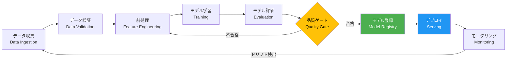
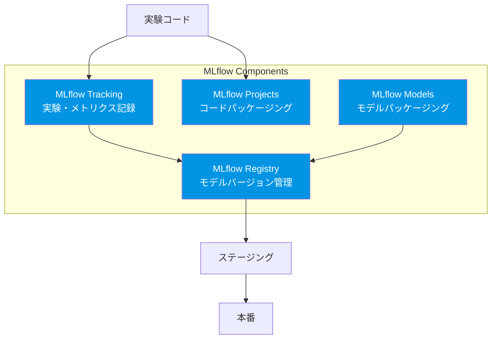

---
tags:
  - mlops
  - pipeline
  - mlflow
  - kubeflow
  - workflow
created: "2026-04-19"
status: draft
---

# ML パイプライン — データから本番デプロイまでの自動化

## 1. ML パイプラインの全体像

ML パイプラインとは、データ収集からモデルデプロイまでの一連のプロセスを自動化・再現可能にする仕組みである。手動で行うとエラーが多発し再現性がない作業を、コードとして定義し自動実行する。



## 2. パイプラインの各ステージ詳細

### 2.1 データ収集と検証

```python
from dataclasses import dataclass, field
from typing import Dict, List, Optional, Any
import numpy as np
import json
from datetime import datetime

@dataclass
class DataSchema:
    """データスキーマの定義と検証"""
    columns: Dict[str, str]  # カラム名 → 型
    required_columns: List[str]
    value_ranges: Dict[str, tuple] = field(default_factory=dict)
    
    def validate(self, data: dict) -> List[str]:
        """データをスキーマに対して検証"""
        errors = []
        
        # 必須カラムの存在確認
        for col in self.required_columns:
            if col not in data:
                errors.append(f"必須カラム '{col}' が欠損")
        
        # 値の範囲チェック
        for col, (min_val, max_val) in self.value_ranges.items():
            if col in data:
                values = np.array(data[col])
                if np.any(values < min_val) or np.any(values > max_val):
                    errors.append(f"'{col}' の値が範囲外 [{min_val}, {max_val}]")
        
        return errors


@dataclass
class DataStatistics:
    """データの統計情報（ドリフト検出用）"""
    means: Dict[str, float]
    stds: Dict[str, float]
    null_rates: Dict[str, float]
    row_count: int
    timestamp: str = field(default_factory=lambda: datetime.now().isoformat())
    
    def detect_drift(self, reference: 'DataStatistics', threshold: float = 2.0) -> List[str]:
        """参照統計との比較でドリフトを検出"""
        drifted_features = []
        for col in self.means:
            if col in reference.means and reference.stds.get(col, 0) > 0:
                z_score = abs(self.means[col] - reference.means[col]) / reference.stds[col]
                if z_score > threshold:
                    drifted_features.append(f"{col}: z={z_score:.2f}")
        return drifted_features


# データ検証パイプラインのデモ
schema = DataSchema(
    columns={"age": "int", "income": "float", "score": "float"},
    required_columns=["age", "income", "score"],
    value_ranges={"age": (0, 120), "income": (0, 1e8), "score": (0, 1)}
)

sample_data = {
    "age": [25, 30, 45, 150],  # 150 は異常値
    "income": [400000, 600000, 800000, 500000],
    "score": [0.8, 0.6, 0.9, 0.7],
}

errors = schema.validate(sample_data)
print("データ検証結果:")
for err in errors:
    print(f"  ⚠ {err}")
if not errors:
    print("  ✓ 全チェック通過")
```

### 2.2 特徴量エンジニアリング

```python
from abc import ABC, abstractmethod

class FeatureTransformer(ABC):
    """特徴量変換の基底クラス"""
    
    @abstractmethod
    def fit(self, data: np.ndarray) -> 'FeatureTransformer':
        pass
    
    @abstractmethod
    def transform(self, data: np.ndarray) -> np.ndarray:
        pass
    
    def fit_transform(self, data: np.ndarray) -> np.ndarray:
        return self.fit(data).transform(data)

class StandardScaler(FeatureTransformer):
    """標準化（パイプラインコンポーネント）"""
    
    def __init__(self):
        self.mean_ = None
        self.std_ = None
    
    def fit(self, data: np.ndarray) -> 'StandardScaler':
        self.mean_ = np.mean(data, axis=0)
        self.std_ = np.std(data, axis=0) + 1e-8
        return self
    
    def transform(self, data: np.ndarray) -> np.ndarray:
        return (data - self.mean_) / self.std_

class FeaturePipeline:
    """特徴量パイプライン: 変換の連鎖"""
    
    def __init__(self, steps: List[tuple]):
        self.steps = steps  # [(name, transformer), ...]
    
    def fit_transform(self, data: np.ndarray) -> np.ndarray:
        result = data.copy()
        for name, transformer in self.steps:
            print(f"  [{name}] 適用中...")
            result = transformer.fit_transform(result)
        return result
    
    def transform(self, data: np.ndarray) -> np.ndarray:
        result = data.copy()
        for name, transformer in self.steps:
            result = transformer.transform(result)
        return result

# 使用例
pipeline = FeaturePipeline([
    ("standardize", StandardScaler()),
])

data = np.random.randn(100, 4) * [10, 100, 0.1, 50] + [5, 200, 0.5, 100]
transformed = pipeline.fit_transform(data)
print(f"\n変換前: mean={data.mean(axis=0).round(2)}, std={data.std(axis=0).round(2)}")
print(f"変換後: mean={transformed.mean(axis=0).round(2)}, std={transformed.std(axis=0).round(2)}")
```

## 3. MLflow によるパイプライン管理



```python
class MLflowTracker:
    """MLflow Tracking の概念的実装"""
    
    def __init__(self, experiment_name: str):
        self.experiment_name = experiment_name
        self.runs: List[dict] = []
        self.current_run: Optional[dict] = None
    
    def start_run(self, run_name: str = None):
        self.current_run = {
            "run_name": run_name or f"run_{len(self.runs)}",
            "start_time": datetime.now().isoformat(),
            "params": {},
            "metrics": {},
            "artifacts": [],
            "tags": {},
        }
        return self
    
    def log_param(self, key: str, value: Any):
        self.current_run["params"][key] = value
    
    def log_params(self, params: dict):
        self.current_run["params"].update(params)
    
    def log_metric(self, key: str, value: float, step: int = None):
        if key not in self.current_run["metrics"]:
            self.current_run["metrics"][key] = []
        self.current_run["metrics"][key].append({"value": value, "step": step})
    
    def log_artifact(self, path: str):
        self.current_run["artifacts"].append(path)
    
    def end_run(self):
        self.current_run["end_time"] = datetime.now().isoformat()
        self.runs.append(self.current_run)
        run = self.current_run
        self.current_run = None
        return run
    
    def get_best_run(self, metric: str, higher_is_better: bool = True) -> dict:
        """指定メトリクスで最良の Run を取得"""
        best_run = None
        best_value = float('-inf') if higher_is_better else float('inf')
        
        for run in self.runs:
            if metric in run["metrics"]:
                values = [m["value"] for m in run["metrics"][metric]]
                last_value = values[-1]
                if higher_is_better and last_value > best_value:
                    best_value = last_value
                    best_run = run
                elif not higher_is_better and last_value < best_value:
                    best_value = last_value
                    best_run = run
        
        return best_run


# 実験管理デモ
tracker = MLflowTracker("loan_prediction")

for lr in [0.001, 0.01, 0.1]:
    for n_layers in [2, 4]:
        tracker.start_run(f"lr={lr}_layers={n_layers}")
        tracker.log_params({"learning_rate": lr, "n_layers": n_layers})
        
        # 学習シミュレーション
        np.random.seed(int(lr * 1000 + n_layers))
        for epoch in range(5):
            loss = 1.0 / (1 + epoch * lr * n_layers) + np.random.normal(0, 0.05)
            acc = 1 - loss + np.random.normal(0, 0.02)
            tracker.log_metric("loss", float(loss), step=epoch)
            tracker.log_metric("accuracy", float(acc), step=epoch)
        
        tracker.end_run()

best = tracker.get_best_run("accuracy")
print(f"=== 実験結果 ===")
print(f"総 Run 数: {len(tracker.runs)}")
print(f"最良 Run: {best['run_name']}")
print(f"パラメータ: {best['params']}")
print(f"最終精度: {best['metrics']['accuracy'][-1]['value']:.4f}")
```

## 4. Kubeflow Pipelines

```python
class KubeflowPipelineConcept:
    """Kubeflow Pipelines の概念的な DSL"""
    
    @staticmethod
    def define_pipeline():
        """
        実際の Kubeflow では @dsl.pipeline デコレータを使用
        各ステップは独立したコンテナで実行される
        """
        pipeline_definition = """
# Kubeflow Pipeline DSL の例（概念的）

from kfp import dsl

@dsl.pipeline(
    name='ML Training Pipeline',
    description='End-to-end ML training pipeline'
)
def ml_pipeline(
    data_path: str,
    model_type: str = 'xgboost',
    epochs: int = 10
):
    # Step 1: データ取得
    data_op = dsl.ContainerOp(
        name='data-ingestion',
        image='ml-pipeline/data-ingestion:v1',
        arguments=['--path', data_path],
        file_outputs={'data': '/output/data.parquet'}
    )
    
    # Step 2: データ検証
    validate_op = dsl.ContainerOp(
        name='data-validation',
        image='ml-pipeline/data-validation:v1',
        arguments=['--data', data_op.outputs['data']],
    )
    
    # Step 3: 特徴量エンジニアリング
    feature_op = dsl.ContainerOp(
        name='feature-engineering',
        image='ml-pipeline/feature-eng:v1',
        arguments=['--data', data_op.outputs['data']],
        file_outputs={'features': '/output/features.parquet'}
    ).after(validate_op)  # 検証後に実行
    
    # Step 4: モデル学習
    train_op = dsl.ContainerOp(
        name='model-training',
        image='ml-pipeline/training:v1',
        arguments=[
            '--features', feature_op.outputs['features'],
            '--model-type', model_type,
            '--epochs', epochs,
        ],
        file_outputs={'model': '/output/model.pkl'}
    )
    
    # Step 5: モデル評価 + 品質ゲート
    eval_op = dsl.ContainerOp(
        name='model-evaluation',
        image='ml-pipeline/evaluation:v1',
        arguments=['--model', train_op.outputs['model']],
    )
    
    # Step 6: 条件付きデプロイ
    with dsl.Condition(eval_op.outputs['accuracy'] > 0.9):
        deploy_op = dsl.ContainerOp(
            name='model-deploy',
            image='ml-pipeline/deploy:v1',
            arguments=['--model', train_op.outputs['model']],
        )
"""
        return pipeline_definition

print(KubeflowPipelineConcept.define_pipeline())
```

## 5. パイプラインツール比較

```python
tools_comparison = {
    "MLflow": {
        "得意分野": "実験管理、モデルレジストリ",
        "実行環境": "ローカル / クラウド問わず",
        "学習コスト": "低",
        "スケーラビリティ": "中",
        "向いているチーム": "小〜中規模、実験管理から始めたい",
    },
    "Kubeflow": {
        "得意分野": "パイプライン自動化、Kubernetes ネイティブ",
        "実行環境": "Kubernetes",
        "学習コスト": "高",
        "スケーラビリティ": "高",
        "向いているチーム": "大規模、K8s に精通したチーム",
    },
    "Airflow": {
        "得意分野": "汎用ワークフロー、スケジューリング",
        "実行環境": "サーバー / クラウド",
        "学習コスト": "中",
        "スケーラビリティ": "高",
        "向いているチーム": "データエンジニアリングチーム",
    },
    "ZenML": {
        "得意分野": "ML パイプラインの抽象化、ツール統合",
        "実行環境": "マルチクラウド",
        "学習コスト": "低〜中",
        "スケーラビリティ": "中〜高",
        "向いているチーム": "モダンなMLOps を始めたいチーム",
    },
}

print("=== MLOps パイプラインツール比較 ===\n")
for tool, info in tools_comparison.items():
    print(f"【{tool}】")
    for k, v in info.items():
        print(f"  {k}: {v}")
    print()
```

## 6. ハンズオン演習

### 演習1: MLflow で実験管理

MLflow をインストールし、scikit-learn のモデル学習をトラッキングしてください。複数のハイパーパラメータ設定を記録し、最良のモデルを Model Registry に登録してください。

```python
# pip install mlflow scikit-learn
import mlflow
import mlflow.sklearn
from sklearn.ensemble import RandomForestClassifier
from sklearn.datasets import load_iris
from sklearn.model_selection import train_test_split

mlflow.set_experiment("iris_classification")

X, y = load_iris(return_X_y=True)
X_train, X_test, y_train, y_test = train_test_split(X, y, test_size=0.2)

for n_estimators in [10, 50, 100, 200]:
    with mlflow.start_run(run_name=f"rf_n={n_estimators}"):
        mlflow.log_param("n_estimators", n_estimators)
        model = RandomForestClassifier(n_estimators=n_estimators)
        model.fit(X_train, y_train)
        acc = model.score(X_test, y_test)
        mlflow.log_metric("accuracy", acc)
        mlflow.sklearn.log_model(model, "model")
```

### 演習2: データ検証パイプラインの構築

上の `DataSchema` クラスを拡張し、以下を追加実装してください:
- NULL値の比率チェック
- カテゴリ変数の許可値チェック
- 統計的外れ値の検出

### 演習3: CI/CD パイプライン設計

GitHub Actions を使って、コードプッシュ時にモデルの再学習・評価・レジストリ登録を自動実行するパイプラインを設計してください。

## 7. まとめ

- ML パイプラインはデータ→デプロイの自動化と再現性を実現する
- データ検証は品質の門番であり、パイプラインの第一段階
- MLflow は実験管理、Kubeflow はパイプライン自動化に強い
- 品質ゲートにより不良モデルのデプロイを防ぐ
- モニタリングとフィードバックループで継続的に改善する

## 参考文献

- Sculley et al. (2015) "Hidden Technical Debt in Machine Learning Systems"
- MLflow Documentation: https://mlflow.org/docs/latest/
- Kubeflow Documentation: https://www.kubeflow.org/docs/
