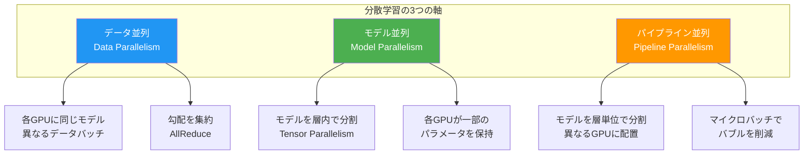
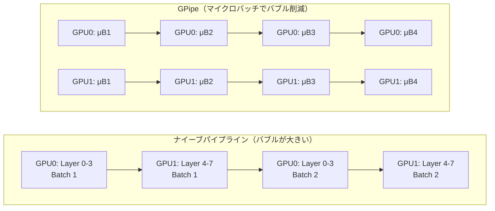

---
tags:
  - mlops
  - distributed-training
  - deepspeed
  - fsdp
  - zero
created: "2026-04-19"
status: draft
---

# 分散学習 — 大規模モデルを複数 GPU で効率的に学習する

## 1. なぜ分散学習が必要か

現代の大規模モデル（LLM等）は単一GPUのメモリに収まらない。例えば70Bパラメータのモデルはfp16で約140GBを要し、80GBのA100でも収まらない。分散学習は複数GPUにモデル・データを分割して学習する技術である。



## 2. データ並列（Data Parallelism）

### 2.1 基本的なデータ並列

```python
import numpy as np
from typing import List, Tuple

class DataParallelSimulator:
    """データ並列学習のシミュレーター"""
    
    def __init__(self, num_gpus: int, model_params: np.ndarray):
        self.num_gpus = num_gpus
        # 各GPUに同じモデルのコピーを配置
        self.gpu_params = [model_params.copy() for _ in range(num_gpus)]
        self.learning_rate = 0.01
    
    def train_step(self, global_batch: np.ndarray) -> dict:
        """1ステップの分散学習"""
        # 1. データをGPU数で分割
        micro_batches = np.array_split(global_batch, self.num_gpus)
        
        # 2. 各GPUで独立に前向き・後ろ向き計算
        gradients = []
        losses = []
        for gpu_id, micro_batch in enumerate(micro_batches):
            grad, loss = self._compute_gradient(
                self.gpu_params[gpu_id], micro_batch
            )
            gradients.append(grad)
            losses.append(loss)
        
        # 3. AllReduce: 全GPUの勾配を平均化
        avg_gradient = self._all_reduce(gradients)
        
        # 4. 全GPUで同じ勾配でパラメータ更新
        for gpu_id in range(self.num_gpus):
            self.gpu_params[gpu_id] -= self.learning_rate * avg_gradient
        
        return {
            "avg_loss": np.mean(losses),
            "gradient_norm": np.linalg.norm(avg_gradient),
            "param_sync": self._check_sync(),
        }
    
    def _compute_gradient(
        self, params: np.ndarray, batch: np.ndarray
    ) -> Tuple[np.ndarray, float]:
        """ダミーの勾配計算"""
        # 簡略化: MSE損失の勾配
        prediction = params @ batch.T
        loss = float(np.mean(prediction ** 2))
        gradient = 2 * (prediction @ batch) / len(batch)
        return gradient, loss
    
    def _all_reduce(self, gradients: List[np.ndarray]) -> np.ndarray:
        """AllReduce: 全GPUの勾配を平均化"""
        # Ring AllReduce の概念的実装
        total = np.zeros_like(gradients[0])
        for g in gradients:
            total += g
        return total / len(gradients)
    
    def _check_sync(self) -> bool:
        """全GPUのパラメータが同期しているか確認"""
        for i in range(1, self.num_gpus):
            if not np.allclose(self.gpu_params[0], self.gpu_params[i]):
                return False
        return True


# デモ
np.random.seed(42)
model = np.random.randn(10)
simulator = DataParallelSimulator(num_gpus=4, model_params=model)

print("=== データ並列学習シミュレーション (4 GPU) ===\n")
for step in range(5):
    batch = np.random.randn(64, 10)  # グローバルバッチ
    result = simulator.train_step(batch)
    print(f"Step {step}: loss={result['avg_loss']:.4f}, "
          f"grad_norm={result['gradient_norm']:.4f}, "
          f"sync={result['param_sync']}")
```

### 2.2 通信パターン: AllReduce

```python
def ring_allreduce_simulation(num_gpus: int, data_size: int):
    """
    Ring AllReduce のシミュレーション
    
    通信量: 2 * (N-1) / N * data_size（N = GPU数）
    → GPU数に依存しない通信量（ほぼ2倍のデータサイズ）
    """
    data = [np.random.randn(data_size) for _ in range(num_gpus)]
    expected_result = np.mean(data, axis=0)
    
    # Phase 1: Scatter-Reduce
    # 各GPUがデータを1/Nずつ担当し、リング状に部分和を蓄積
    chunks = [np.array_split(d, num_gpus) for d in data]
    
    print(f"=== Ring AllReduce ({num_gpus} GPUs, data_size={data_size}) ===")
    print(f"Phase 1: Scatter-Reduce ({num_gpus - 1} ステップ)")
    
    for step in range(num_gpus - 1):
        for gpu in range(num_gpus):
            send_chunk = (gpu - step) % num_gpus
            recv_gpu = (gpu + 1) % num_gpus
            # 受信側がchunkを足し合わせる
        print(f"  Step {step}: 各GPUが隣に1チャンクを送信")
    
    print(f"\nPhase 2: All-Gather ({num_gpus - 1} ステップ)")
    for step in range(num_gpus - 1):
        print(f"  Step {step}: 完成したチャンクを隣に転送")
    
    total_comm = 2 * (num_gpus - 1) / num_gpus * data_size
    print(f"\n総通信量: {total_comm:.0f} elements/GPU")
    print(f"理論最小: {2 * data_size:.0f} elements/GPU")
    print(f"効率: {2 * data_size / total_comm:.1%}")

ring_allreduce_simulation(num_gpus=8, data_size=1000000)
```

## 3. ZeRO（Zero Redundancy Optimizer）

```python
class ZeROSimulator:
    """
    ZeRO (DeepSpeed) の3段階を概念的にシミュレーション
    
    メモリ使用量の内訳 (mixed precision, Adam):
    - パラメータ (fp16): 2Ψ bytes
    - 勾配 (fp16): 2Ψ bytes
    - オプティマイザ状態 (fp32): 12Ψ bytes (params + momentum + variance)
    合計: 16Ψ bytes
    """
    
    def __init__(self, param_count_billions: float, num_gpus: int):
        self.Psi = param_count_billions * 1e9  # パラメータ数
        self.N = num_gpus
        
    def memory_per_gpu(self, zero_stage: int) -> dict:
        """各ZeROステージでのGPUあたりメモリ使用量"""
        Psi = self.Psi
        N = self.N
        
        # バイト単位 → GB単位
        to_gb = lambda x: x / (1024**3)
        
        if zero_stage == 0:
            # 標準データ並列（冗長あり）
            params = 2 * Psi
            grads = 2 * Psi
            optimizer = 12 * Psi
        elif zero_stage == 1:
            # ZeRO-1: オプティマイザ状態を分割
            params = 2 * Psi
            grads = 2 * Psi
            optimizer = 12 * Psi / N
        elif zero_stage == 2:
            # ZeRO-2: オプティマイザ + 勾配を分割
            params = 2 * Psi
            grads = 2 * Psi / N
            optimizer = 12 * Psi / N
        elif zero_stage == 3:
            # ZeRO-3: オプティマイザ + 勾配 + パラメータを分割
            params = 2 * Psi / N
            grads = 2 * Psi / N
            optimizer = 12 * Psi / N
        else:
            raise ValueError(f"Invalid ZeRO stage: {zero_stage}")
        
        total = params + grads + optimizer
        
        return {
            "params_gb": to_gb(params),
            "grads_gb": to_gb(grads),
            "optimizer_gb": to_gb(optimizer),
            "total_gb": to_gb(total),
            "reduction": f"{(1 - to_gb(total) / to_gb(16 * Psi)) * 100:.1f}%",
        }
    
    def report(self):
        """全ステージの比較レポート"""
        print(f"=== ZeRO メモリ分析 ===")
        print(f"モデル: {self.Psi/1e9:.0f}B parameters, {self.N} GPUs\n")
        print(f"{'Stage':>6} {'Params':>10} {'Grads':>10} {'Optim':>10} {'Total':>10} {'削減率':>8}")
        print("-" * 60)
        
        for stage in [0, 1, 2, 3]:
            mem = self.memory_per_gpu(stage)
            print(f"{'ZeRO-'+str(stage):>6} "
                  f"{mem['params_gb']:>9.1f}G "
                  f"{mem['grads_gb']:>9.1f}G "
                  f"{mem['optimizer_gb']:>9.1f}G "
                  f"{mem['total_gb']:>9.1f}G "
                  f"{mem['reduction']:>8}")

# LLaMA 70B を 8 GPU で学習する場合
sim = ZeROSimulator(param_count_billions=70, num_gpus=8)
sim.report()

print("\n--- 参考: A100 80GB で学習可能か? ---")
for stage in [0, 1, 2, 3]:
    mem = sim.memory_per_gpu(stage)
    fits = "✓" if mem['total_gb'] < 80 else "✗"
    print(f"ZeRO-{stage}: {mem['total_gb']:.1f} GB [{fits}]")
```

## 4. FSDP（Fully Sharded Data Parallel）

```python
"""
PyTorch FSDP: ZeRO-3 相当の機能を PyTorch ネイティブで提供

主な特徴:
- パラメータ・勾配・オプティマイザ状態を全GPU間でシャード
- 必要時にパラメータを一時的に集約（AllGather）
- 後ろ向き計算後にパラメータを即座に解放
"""

# FSDP の使用例（概念的コード）
fsdp_example = """
import torch
from torch.distributed.fsdp import (
    FullyShardedDataParallel as FSDP,
    MixedPrecision,
    ShardingStrategy,
)
from torch.distributed.fsdp.wrap import transformer_auto_wrap_policy

# 1. シャーディング戦略の選択
sharding_strategy = ShardingStrategy.FULL_SHARD  # ZeRO-3相当
# ShardingStrategy.SHARD_GRAD_OP  # ZeRO-2相当  
# ShardingStrategy.NO_SHARD       # DDP相当

# 2. Mixed Precision の設定
mixed_precision = MixedPrecision(
    param_dtype=torch.bfloat16,
    reduce_dtype=torch.bfloat16,
    buffer_dtype=torch.bfloat16,
)

# 3. 自動ラッピングポリシー
auto_wrap_policy = transformer_auto_wrap_policy(
    transformer_layer_cls={TransformerBlock},  # どの層でシャードするか
)

# 4. FSDP でモデルをラップ
model = FSDP(
    model,
    sharding_strategy=sharding_strategy,
    mixed_precision=mixed_precision,
    auto_wrap_policy=auto_wrap_policy,
    device_id=torch.cuda.current_device(),
)

# 5. 通常通り学習
optimizer = torch.optim.AdamW(model.parameters(), lr=1e-4)
for batch in dataloader:
    loss = model(batch)      # AllGather → Forward → パラメータ解放
    loss.backward()          # AllGather → Backward → ReduceScatter
    optimizer.step()         # シャードされたオプティマイザ状態で更新
    optimizer.zero_grad()
"""

print(fsdp_example)
```

## 5. パイプライン並列



```python
def pipeline_bubble_analysis(num_stages: int, num_microbatches: int):
    """
    パイプライン並列のバブル（アイドル時間）分析
    
    バブル比率 = (p - 1) / (p - 1 + m)
    p: ステージ数, m: マイクロバッチ数
    """
    p = num_stages
    m = num_microbatches
    
    # 1マイクロバッチの処理時間を1とする
    total_time = (p - 1) + m  # パイプラインの総ステップ数
    useful_time = m           # 実際の計算時間
    bubble_time = p - 1       # アイドル時間
    
    bubble_ratio = bubble_time / total_time
    efficiency = useful_time / total_time
    
    # スループット（理想比）
    throughput_vs_single = m / total_time * p  # p倍が理想
    
    return {
        "stages": p,
        "microbatches": m,
        "bubble_ratio": bubble_ratio,
        "efficiency": efficiency,
        "throughput_speedup": throughput_vs_single,
        "ideal_speedup": p,
    }

print("=== パイプライン並列のバブル分析 ===\n")
print(f"{'Stages':>7} {'μBatch':>7} {'バブル率':>10} {'効率':>8} {'速度向上':>10}")
print("-" * 50)

for stages in [2, 4, 8]:
    for mb in [4, 8, 16, 32]:
        result = pipeline_bubble_analysis(stages, mb)
        print(f"{stages:>7} {mb:>7} {result['bubble_ratio']:>9.1%} "
              f"{result['efficiency']:>7.1%} "
              f"{result['throughput_speedup']:>7.2f}x / {result['ideal_speedup']}x")
    print()
```

## 6. DeepSpeed 設定例

```python
deepspeed_config = {
    "train_batch_size": 256,
    "train_micro_batch_size_per_gpu": 4,
    "gradient_accumulation_steps": 8,  # 256 / (4 * 8 GPUs)
    
    "zero_optimization": {
        "stage": 3,
        "offload_optimizer": {"device": "cpu", "pin_memory": True},
        "offload_param": {"device": "cpu", "pin_memory": True},
        "overlap_comm": True,
        "contiguous_gradients": True,
        "sub_group_size": 1e9,
        "reduce_bucket_size": "auto",
        "stage3_prefetch_bucket_size": "auto",
        "stage3_param_persistence_threshold": "auto",
        "stage3_max_live_parameters": 1e9,
        "stage3_max_reuse_distance": 1e9,
    },
    
    "bf16": {"enabled": True},
    
    "gradient_clipping": 1.0,
    
    "optimizer": {
        "type": "AdamW",
        "params": {"lr": 1e-4, "betas": [0.9, 0.95], "weight_decay": 0.1}
    },
    
    "scheduler": {
        "type": "WarmupCosineAnnealing",
        "params": {"warmup_num_steps": 1000, "total_num_steps": 100000}
    },
}

import json
print("=== DeepSpeed ZeRO-3 + CPU Offload 設定 ===\n")
print(json.dumps(deepspeed_config, indent=2))
```

## 7. ハンズオン演習

### 演習1: PyTorch DDP の実装

2 GPU（なければ CPU プロセス）で PyTorch DistributedDataParallel を使い、MNIST 分類モデルを学習してください。単一 GPU との速度比較を行ってください。

### 演習2: メモリ計算

自分が学習したいモデルのパラメータ数から、各 ZeRO ステージに必要な GPU メモリを上の計算式で算出し、手持ちのハードウェアで学習可能か判断してください。

### 演習3: DeepSpeed で大規模モデル学習

DeepSpeed を使って GPT-2 (1.5B) を ZeRO-3 + CPU Offload でファインチューニングしてください。メモリ使用量とスループットを記録してください。

## 8. まとめ

- データ並列は最も基本的だが、モデルサイズの制約がある
- ZeRO はオプティマイザ/勾配/パラメータの冗長性を排除してメモリ効率を改善
- FSDP は PyTorch ネイティブの ZeRO-3 相当機能
- パイプライン並列はマイクロバッチでバブルを削減
- 実際の大規模学習では3D並列（データ+テンソル+パイプライン）を組み合わせる

## 参考文献

- Rajbhandari et al. (2020) "ZeRO: Memory Optimizations Toward Training Trillion Parameter Models"
- Narayanan et al. (2021) "Efficient Large-Scale Language Model Training on GPU Clusters Using Megatron-LM"
- Zhao et al. (2023) "PyTorch FSDP: Experiences on Scaling Fully Sharded Data Parallel"
