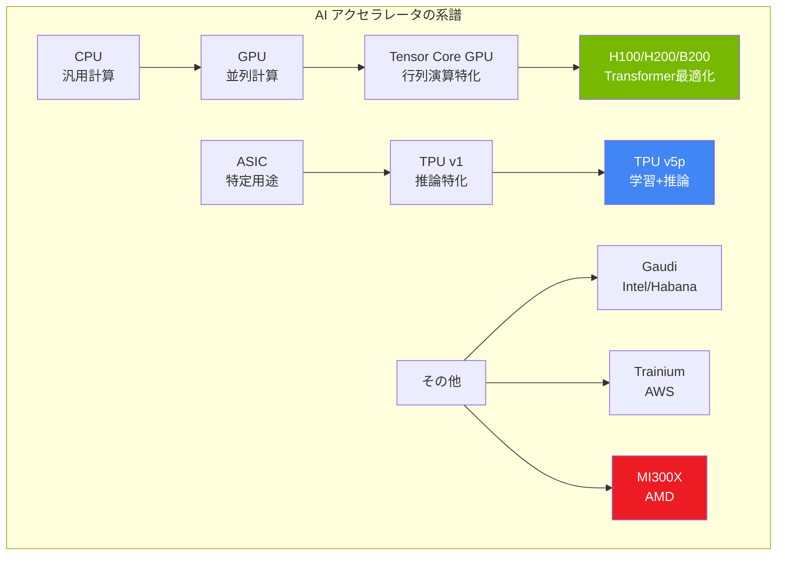
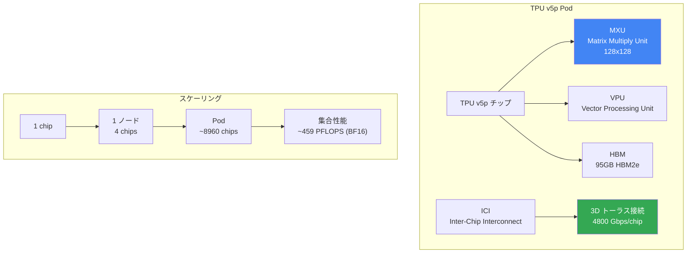

---
tags:
  - mlops
  - gpu
  - tpu
  - cuda
  - hardware
created: "2026-04-19"
status: draft
---

# GPU / TPU / ハードウェア — AI 計算基盤の理解と選定

## 1. AI コンピューティングの全体像

AI/ML のワークロードは膨大な行列演算を必要とし、汎用CPUでは非効率。専用ハードウェア（GPU, TPU, 専用ASIC）が不可欠である。



## 2. NVIDIA GPU 系譜

```python
from dataclasses import dataclass
from typing import Optional

@dataclass
class GPUSpec:
    name: str
    architecture: str
    year: int
    cuda_cores: int
    tensor_cores: int
    memory_gb: int
    memory_type: str
    memory_bandwidth_tbps: float
    fp16_tflops: float
    bf16_tflops: float
    fp8_tflops: Optional[float]
    interconnect: str
    tdp_watts: int
    price_approx: str  # 概算価格

nvidia_gpus = [
    GPUSpec("V100 (SXM2)", "Volta", 2017, 5120, 640, 32, "HBM2",
            0.9, 125, 0, None, "NVLink 2.0 (300GB/s)", 300, "$10,000"),
    GPUSpec("A100 (SXM4)", "Ampere", 2020, 6912, 432, 80, "HBM2e",
            2.0, 312, 312, None, "NVLink 3.0 (600GB/s)", 400, "$15,000"),
    GPUSpec("H100 (SXM5)", "Hopper", 2022, 16896, 528, 80, "HBM3",
            3.35, 989, 989, 1979, "NVLink 4.0 (900GB/s)", 700, "$30,000"),
    GPUSpec("H200", "Hopper", 2024, 16896, 528, 141, "HBM3e",
            4.8, 989, 989, 1979, "NVLink 4.0 (900GB/s)", 700, "$35,000"),
    GPUSpec("B200", "Blackwell", 2024, 18432, 576, 192, "HBM3e",
            8.0, 2250, 2250, 4500, "NVLink 5.0 (1800GB/s)", 1000, "$40,000+"),
    GPUSpec("GB200 (Grace)", "Blackwell", 2025, 18432, 576, 192, "HBM3e",
            8.0, 2250, 2250, 4500, "NVLink 5.0 + Grace CPU", 1000, "System"),
]

print("=== NVIDIA データセンター GPU 系譜 ===\n")
print(f"{'名前':14s} {'Arch':10s} {'Year':>4} {'Mem':>5} {'BF16 TFLOPS':>12} {'帯域':>8}")
print("-" * 62)
for gpu in nvidia_gpus:
    print(f"{gpu.name:14s} {gpu.architecture:10s} {gpu.year:>4} "
          f"{gpu.memory_gb:>3}GB {gpu.bf16_tflops:>11.0f} {gpu.memory_bandwidth_tbps:>6.1f}TB/s")
```

## 3. CUDA プログラミングの基礎概念

```python
"""
CUDA のメモリ階層と実行モデルの理解
"""

class CUDAConceptualModel:
    """CUDA の実行モデルを概念的に説明"""
    
    @staticmethod
    def memory_hierarchy():
        """CUDA メモリ階層"""
        hierarchy = {
            "レジスタ": {
                "サイズ": "スレッドあたり数百個",
                "速度": "最速（~0 サイクル）",
                "スコープ": "スレッド固有",
                "用途": "ローカル変数",
            },
            "共有メモリ": {
                "サイズ": "SMあたり 48-228 KB",
                "速度": "非常に高速（~5 サイクル）",
                "スコープ": "ブロック内で共有",
                "用途": "タイルド行列乗算のキャッシュ",
            },
            "L1/L2 キャッシュ": {
                "サイズ": "L1: SM毎 ~128KB, L2: ~50MB",
                "速度": "高速（~30 サイクル）",
                "スコープ": "自動管理",
                "用途": "頻繁にアクセスするデータ",
            },
            "グローバルメモリ (HBM)": {
                "サイズ": "80-192 GB",
                "速度": "低速（~400 サイクル）",
                "スコープ": "全スレッドからアクセス可能",
                "用途": "モデルパラメータ、活性化",
            },
        }
        return hierarchy

    @staticmethod
    def execution_model():
        """CUDA 実行モデル"""
        return """
        Grid (カーネル起動単位)
        ├── Block 0 [SM 0 にマッピング]
        │   ├── Warp 0 (32 threads)
        │   ├── Warp 1 (32 threads)
        │   └── ...
        ├── Block 1 [SM 1 にマッピング]
        │   ├── Warp 0 (32 threads)
        │   └── ...
        └── Block N [SM M にマッピング]
            └── ...
        
        重要概念:
        - Warp (32スレッド) が同時に同一命令を実行 (SIMT)
        - ブロック内のスレッドは共有メモリを介して協調可能
        - ブロック間の同期は不可（カーネル境界で暗黙同期）
        """

model = CUDAConceptualModel()

print("=== CUDA メモリ階層 ===\n")
for level, info in model.memory_hierarchy().items():
    print(f"【{level}】")
    for k, v in info.items():
        print(f"  {k}: {v}")
    print()

print("=== CUDA 実行モデル ===")
print(model.execution_model())
```

### 3.1 Tensor Core の動作原理

```python
import numpy as np

def tensor_core_simulation():
    """
    Tensor Core の動作をシミュレーション
    
    Tensor Core は 4x4 行列乗算 + 累積を1サイクルで実行:
    D = A * B + C  (A: fp16/bf16, B: fp16/bf16, C/D: fp32)
    """
    # fp16 での行列乗算
    A = np.random.randn(4, 4).astype(np.float16)
    B = np.random.randn(4, 4).astype(np.float16)
    C = np.zeros((4, 4), dtype=np.float32)
    
    # Tensor Core 演算: D = A @ B + C
    D = (A.astype(np.float32) @ B.astype(np.float32)) + C
    
    # CUDA Core での等価演算（比較用）
    ops_tensor_core = 1        # 1サイクルで完了
    ops_cuda_core = 4 * 4 * 4  # 64回の FMA 演算
    
    print("=== Tensor Core vs CUDA Core ===\n")
    print(f"4x4 行列積:")
    print(f"  Tensor Core: {ops_tensor_core} サイクル (4x4 MMA 命令)")
    print(f"  CUDA Core:   {ops_cuda_core} FMA 演算")
    print(f"  理論速度比:  {ops_cuda_core}x")
    
    print(f"\nH100 の演算性能:")
    print(f"  FP32 (CUDA Core):     67 TFLOPS")
    print(f"  FP16 (Tensor Core):   989 TFLOPS (~15x)")
    print(f"  FP8  (Tensor Core):   1,979 TFLOPS (~30x)")
    print(f"  INT8 (Tensor Core):   1,979 TOPS")

tensor_core_simulation()
```

## 4. TPU アーキテクチャ



```python
tpu_generations = [
    {"name": "TPU v2", "year": 2017, "bf16_tflops": 45.5, "hbm_gb": 8,
     "use_case": "学習入門"},
    {"name": "TPU v3", "year": 2018, "bf16_tflops": 123, "hbm_gb": 16,
     "use_case": "中規模学習"},
    {"name": "TPU v4", "year": 2022, "bf16_tflops": 275, "hbm_gb": 32,
     "use_case": "大規模学習"},
    {"name": "TPU v5e", "year": 2023, "bf16_tflops": 197, "hbm_gb": 16,
     "use_case": "推論・コスト効率"},
    {"name": "TPU v5p", "year": 2024, "bf16_tflops": 459, "hbm_gb": 95,
     "use_case": "最大規模学習"},
    {"name": "Trillium (v6e)", "year": 2025, "bf16_tflops": 918, "hbm_gb": 32,
     "use_case": "次世代汎用"},
]

print("=== Google TPU 世代比較 ===\n")
print(f"{'名前':16s} {'Year':>4} {'BF16':>8} {'HBM':>6} {'用途'}")
print("-" * 60)
for tpu in tpu_generations:
    print(f"{tpu['name']:16s} {tpu['year']:>4} "
          f"{tpu['bf16_tflops']:>6.0f}TF {tpu['hbm_gb']:>4}GB {tpu['use_case']}")
```

## 5. GPU vs TPU vs 他のアクセラレータ

```python
comparison = {
    "NVIDIA H100": {
        "エコシステム": "最も成熟。CUDA, PyTorch, TensorFlow 全対応",
        "柔軟性": "最高。あらゆるワークロードに対応",
        "スケーリング": "NVLink + InfiniBand (NVSwitch)",
        "コスト": "高い。需要過多で入手困難（2024-2025）",
        "最適用途": "汎用。研究・本番両方",
    },
    "Google TPU v5p": {
        "エコシステム": "JAX/XLA に最適化。PyTorch は TPU-XLA で対応",
        "柔軟性": "中。GCP ロックイン。カスタムオペレータは制限あり",
        "スケーリング": "ICI 3D トーラス（超大規模に強い）",
        "コスト": "GCP 上ではコスト効率が良い場合あり",
        "最適用途": "超大規模学習、JAX ベースの研究",
    },
    "AMD MI300X": {
        "エコシステム": "ROCm。PyTorch 対応が進展中",
        "柔軟性": "高。192GB HBM3（メモリ最大）",
        "スケーリング": "Infinity Fabric",
        "コスト": "H100 より安価な場合あり",
        "最適用途": "大メモリが必要なワークロード",
    },
    "AWS Trainium2": {
        "エコシステム": "Neuron SDK。PyTorch 対応",
        "柔軟性": "中。AWS ロックイン",
        "スケーリング": "NeuronLink",
        "コスト": "AWS 上ではコスト効率を主張",
        "最適用途": "AWS ネイティブな学習ワークロード",
    },
}

print("=== AI アクセラレータ比較 ===\n")
for name, info in comparison.items():
    print(f"【{name}】")
    for k, v in info.items():
        print(f"  {k}: {v}")
    print()
```

## 6. ハードウェア選定の指針

```python
def recommend_hardware(
    model_size_b: float,
    task: str,  # "training", "inference", "fine-tuning"
    budget: str,  # "low", "medium", "high"
    latency_requirement: str = "normal"  # "low", "normal", "batch"
) -> dict:
    """ワークロードに基づくハードウェア推薦"""
    
    # メモリ要件の概算
    if task == "training":
        memory_needed_gb = model_size_b * 16  # パラメータ + 勾配 + オプティマイザ
    elif task == "fine-tuning":
        memory_needed_gb = model_size_b * 8   # LoRA なら大幅削減可能
    else:  # inference
        memory_needed_gb = model_size_b * 2   # fp16 推論

    recommendations = []
    
    if memory_needed_gb <= 24:
        recommendations.append("RTX 4090 (24GB) — コスト効率最高")
    if memory_needed_gb <= 48:
        recommendations.append("A6000 (48GB) or L40S (48GB)")
    if memory_needed_gb <= 80:
        recommendations.append("A100 80GB or H100 80GB")
    if memory_needed_gb > 80:
        num_gpus = int(np.ceil(memory_needed_gb / 80))
        recommendations.append(f"H100 x{num_gpus} (ZeRO-3 / FSDP)")
    
    if budget == "low":
        recommendations.append("クラウドスポットインスタンス検討")
        recommendations.append("量子化 (4bit/8bit) でメモリ削減検討")
    
    return {
        "model_size": f"{model_size_b}B",
        "task": task,
        "estimated_memory_gb": memory_needed_gb,
        "recommendations": recommendations,
    }

# 選定例
for size, task in [(7, "inference"), (7, "fine-tuning"), (70, "training")]:
    result = recommend_hardware(size, task, "medium")
    print(f"\n=== {result['model_size']} {result['task']} ===")
    print(f"推定メモリ: {result['estimated_memory_gb']:.0f} GB")
    for rec in result['recommendations']:
        print(f"  → {rec}")
```

## 7. ハンズオン演習

### 演習1: GPU メモリプロファイリング

PyTorch の `torch.cuda.memory_summary()` を使い、モデルの各層のメモリ使用量をプロファイリングしてください。

### 演習2: Mixed Precision Training

FP32 と BF16 の学習速度・メモリ使用量を比較してください。精度の劣化がないか確認してください。

### 演習3: ハードウェアコスト計算

クラウド GPU の時間単価を調査し、特定のモデルの学習にかかる総コストを概算してください（GPU時間 x 単価）。

## 8. まとめ

- NVIDIA GPU が AI 計算の事実上の標準（CUDA エコシステム）
- Tensor Core は行列演算を大幅に高速化（FP16/BF16/FP8）
- TPU は超大規模学習と JAX エコシステムに強い
- ハードウェア選定はモデルサイズ・タスク・予算の三角形で決まる
- メモリ帯域幅がLLM推論のボトルネック（計算律速→メモリ律速）

## 参考文献

- NVIDIA (2024) "NVIDIA H100 Tensor Core GPU Architecture"
- Jouppi et al. (2023) "TPU v4: An Optically Reconfigurable Supercomputer"
- Dao et al. (2022) "FlashAttention: Fast and Memory-Efficient Exact Attention with IO-Awareness"
