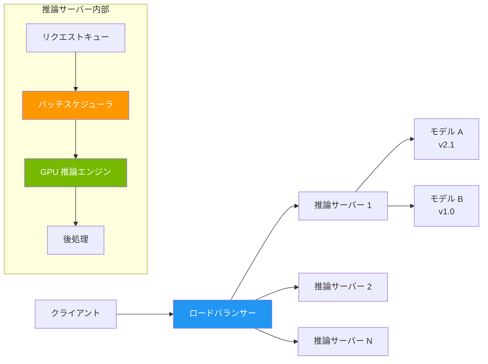
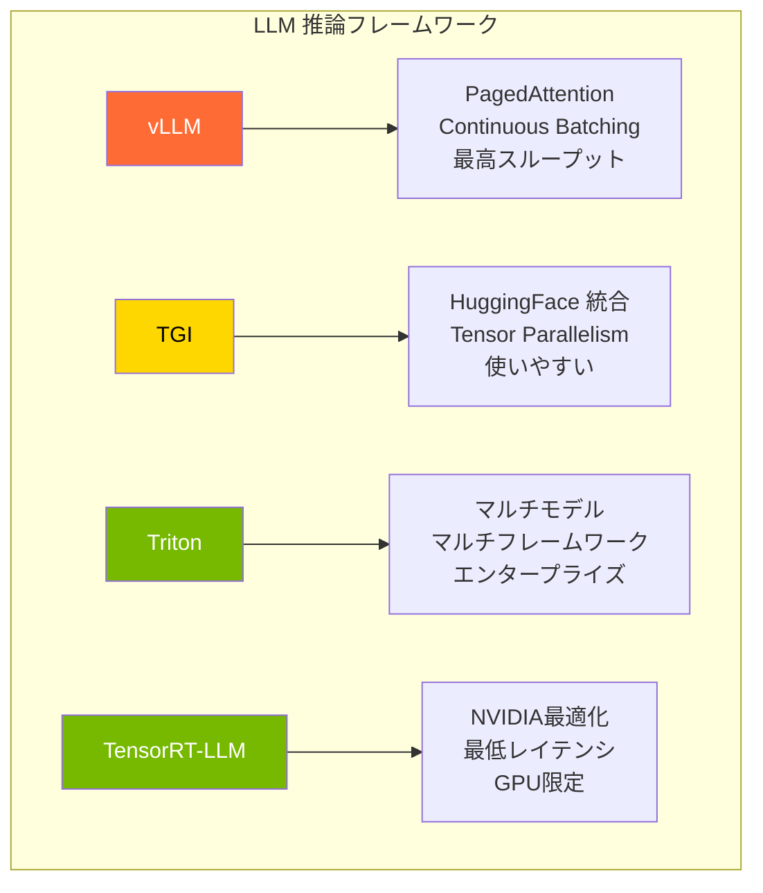

---
tags:
  - mlops
  - model-serving
  - inference
  - vllm
  - triton
created: "2026-04-19"
status: draft
---

# モデルサービング — 推論を本番で高速・安定に提供する

## 1. モデルサービングの全体像

学習済みモデルを本番環境で推論リクエストに応答させる技術。レイテンシ、スループット、コスト効率のバランスが鍵。



## 2. LLM 推論の最適化技術

### 2.1 KV Cache と Continuous Batching

```python
import numpy as np
from dataclasses import dataclass, field
from typing import List, Optional
import time

@dataclass
class KVCache:
    """
    KV Cache: 自己回帰生成で過去のKey/Valueを再計算せずに保持
    
    メモリ使用量 = 2 * n_layers * n_heads * head_dim * seq_len * batch_size * sizeof(dtype)
    """
    n_layers: int
    n_heads: int
    head_dim: int
    max_seq_len: int
    dtype_bytes: int = 2  # fp16
    
    def memory_usage_gb(self, current_seq_len: int, batch_size: int = 1) -> float:
        """現在のKV Cacheメモリ使用量（GB）"""
        # K と V で 2倍
        bytes_used = (2 * self.n_layers * self.n_heads * self.head_dim 
                     * current_seq_len * batch_size * self.dtype_bytes)
        return bytes_used / (1024**3)
    
    def memory_per_token_kb(self) -> float:
        """1トークンあたりのKV Cacheメモリ（KB）"""
        bytes_per_token = 2 * self.n_layers * self.n_heads * self.head_dim * self.dtype_bytes
        return bytes_per_token / 1024

# LLaMA 70B のKV Cacheメモリ分析
kv_cache = KVCache(n_layers=80, n_heads=64, head_dim=128)

print("=== KV Cache メモリ分析 (LLaMA 70B, fp16) ===\n")
print(f"1トークンあたり: {kv_cache.memory_per_token_kb():.1f} KB")
print(f"\nバッチサイズ=1:")
for seq_len in [512, 2048, 8192, 32768, 131072]:
    mem = kv_cache.memory_usage_gb(seq_len)
    print(f"  seq_len={seq_len:>6}: {mem:>6.2f} GB")

print(f"\nseq_len=4096, バッチサイズ別:")
for batch in [1, 4, 16, 64]:
    mem = kv_cache.memory_usage_gb(4096, batch)
    print(f"  batch={batch:>2}: {mem:>6.2f} GB")
```

### 2.2 PagedAttention (vLLM)

```python
@dataclass
class PagedAttentionSimulator:
    """
    vLLM の PagedAttention の概念的シミュレーション
    
    KV Cache を固定サイズの「ページ」に分割し、
    OS のバーチャルメモリのように管理する。
    → メモリの断片化を防ぎ、GPU メモリ使用率を最大化
    """
    page_size: int = 16  # 1ページあたりのトークン数
    total_pages: int = 1000  # GPU上の総ページ数
    
    def __post_init__(self):
        self.free_pages: List[int] = list(range(self.total_pages))
        self.allocations: dict = {}  # request_id -> [page_ids]
    
    def allocate(self, request_id: str, num_tokens: int) -> bool:
        """リクエストにページを割り当て"""
        pages_needed = (num_tokens + self.page_size - 1) // self.page_size
        
        if pages_needed > len(self.free_pages):
            return False
        
        allocated = [self.free_pages.pop() for _ in range(pages_needed)]
        self.allocations[request_id] = allocated
        return True
    
    def extend(self, request_id: str, additional_tokens: int) -> bool:
        """既存リクエストにページを追加（生成が進むにつれ）"""
        current_pages = len(self.allocations.get(request_id, []))
        current_capacity = current_pages * self.page_size
        total_tokens = current_capacity + additional_tokens
        total_pages_needed = (total_tokens + self.page_size - 1) // self.page_size
        new_pages_needed = total_pages_needed - current_pages
        
        if new_pages_needed > len(self.free_pages):
            return False
        
        for _ in range(new_pages_needed):
            self.allocations[request_id].append(self.free_pages.pop())
        return True
    
    def free(self, request_id: str):
        """完了したリクエストのページを解放"""
        if request_id in self.allocations:
            self.free_pages.extend(self.allocations.pop(request_id))
    
    def utilization(self) -> float:
        """メモリ使用率"""
        used = self.total_pages - len(self.free_pages)
        return used / self.total_pages

# デモ: 複数リクエストの動的メモリ管理
paged = PagedAttentionSimulator(page_size=16, total_pages=100)

print("=== PagedAttention デモ ===\n")

# 様々な長さのリクエストが到着
requests = [
    ("req_1", 50),
    ("req_2", 200),
    ("req_3", 30),
    ("req_4", 100),
]

for req_id, tokens in requests:
    success = paged.allocate(req_id, tokens)
    print(f"Allocate {req_id} ({tokens} tokens): "
          f"{'OK' if success else 'FAIL'}, "
          f"utilization: {paged.utilization():.1%}")

# req_1 完了 → メモリ解放
paged.free("req_1")
print(f"\nFree req_1: utilization: {paged.utilization():.1%}")

# 新しいリクエストが空きに入る
paged.allocate("req_5", 40)
print(f"Allocate req_5 (40 tokens): utilization: {paged.utilization():.1%}")

print(f"\n従来方式との比較:")
print(f"  従来: 最大長に合わせて事前確保 → メモリ浪費")
print(f"  PagedAttention: 必要時にページ単位で確保 → 断片化なし")
```

## 3. サービングフレームワーク比較



```python
serving_frameworks = {
    "vLLM": {
        "開発元": "UC Berkeley (Sky Computing)",
        "主な特徴": [
            "PagedAttention による最高のメモリ効率",
            "Continuous Batching で高スループット",
            "OpenAI互換 API サーバー",
            "Tensor Parallelism 対応",
            "Speculative Decoding 対応",
        ],
        "対応モデル": "LLaMA, Mistral, Qwen, GPT-NeoX 等多数",
        "最適用途": "高スループットのLLMサービング",
        "起動コマンド": "vllm serve meta-llama/Llama-3-70B --tensor-parallel-size 4",
    },
    "TGI (Text Generation Inference)": {
        "開発元": "Hugging Face",
        "主な特徴": [
            "HuggingFace Hub との緊密な統合",
            "Flash Attention 2 対応",
            "Quantization (GPTQ, AWQ, EETQ)",
            "Watermarking",
            "Guidance (構造化出力)",
        ],
        "対応モデル": "HuggingFace Hub 上の主要モデル",
        "最適用途": "HF エコシステムとの統合",
        "起動コマンド": "text-generation-launcher --model-id meta-llama/Llama-3-70B",
    },
    "Triton Inference Server": {
        "開発元": "NVIDIA",
        "主な特徴": [
            "マルチフレームワーク (PyTorch, TF, ONNX, TRT)",
            "マルチモデル同時サービング",
            "動的バッチング",
            "モデルアンサンブル",
            "Kubernetes ネイティブ",
        ],
        "対応モデル": "ほぼ全て（フレームワーク非依存）",
        "最適用途": "エンタープライズ、マルチモデル環境",
        "起動コマンド": "tritonserver --model-repository=/models",
    },
    "TensorRT-LLM": {
        "開発元": "NVIDIA",
        "主な特徴": [
            "NVIDIA GPU に最適化されたカーネル",
            "In-flight Batching",
            "FP8 / INT4 量子化",
            "Triton との統合",
        ],
        "対応モデル": "主要 LLM (事前コンパイル必要)",
        "最適用途": "最低レイテンシを求める本番環境",
        "起動コマンド": "trtllm-build + Triton でデプロイ",
    },
}

print("=== LLM サービングフレームワーク比較 ===\n")
for name, info in serving_frameworks.items():
    print(f"【{name}】({info['開発元']})")
    print(f"  最適用途: {info['最適用途']}")
    print(f"  主な特徴:")
    for feat in info['主な特徴'][:3]:
        print(f"    - {feat}")
    print(f"  起動: {info['起動コマンド']}")
    print()
```

## 4. バッチ推論 vs リアルタイム推論

```python
@dataclass
class InferenceConfig:
    """推論方式の設定と性能見積もり"""
    mode: str  # "realtime" or "batch"
    model_size_b: float
    gpu_type: str
    num_gpus: int
    
    def estimate_performance(self) -> dict:
        """概算性能の見積もり"""
        # 簡略化した性能モデル
        gpu_memory = {"A100": 80, "H100": 80, "H200": 141}
        gpu_throughput = {"A100": 1.0, "H100": 2.5, "H200": 2.8}  # 相対値
        
        mem = gpu_memory.get(self.gpu_type, 80)
        throughput_factor = gpu_throughput.get(self.gpu_type, 1.0)
        
        model_mem = self.model_size_b * 2  # fp16
        available_for_kv = (mem * self.num_gpus - model_mem) * 0.8
        
        if self.mode == "realtime":
            return {
                "latency_first_token_ms": 50 * self.model_size_b / (self.num_gpus * throughput_factor),
                "tokens_per_second": 30 * throughput_factor * self.num_gpus / self.model_size_b * 7,
                "max_concurrent_requests": max(1, int(available_for_kv / 2)),
                "sla": "p99 < 200ms TTFT",
            }
        else:  # batch
            return {
                "throughput_tokens_per_second": 100 * throughput_factor * self.num_gpus,
                "cost_per_million_tokens": 0.5 / throughput_factor,
                "optimal_batch_size": max(1, int(available_for_kv / 4)),
                "sla": "完了時間 SLA",
            }

# 比較
configs = [
    InferenceConfig("realtime", 70, "H100", 4),
    InferenceConfig("batch", 70, "H100", 4),
    InferenceConfig("realtime", 7, "H100", 1),
]

print("=== 推論方式の比較 ===\n")
for cfg in configs:
    perf = cfg.estimate_performance()
    print(f"[{cfg.mode}] {cfg.model_size_b}B on {cfg.gpu_type}x{cfg.num_gpus}")
    for k, v in perf.items():
        print(f"  {k}: {v}")
    print()
```

## 5. 量子化による高速化

```python
def quantization_comparison():
    """量子化方式の比較"""
    methods = {
        "FP16": {"bits": 16, "memory_ratio": 1.0, "quality": "baseline", "speed": "1x"},
        "BF16": {"bits": 16, "memory_ratio": 1.0, "quality": "≈FP16", "speed": "1x"},
        "FP8 (E4M3)": {"bits": 8, "memory_ratio": 0.5, "quality": "-0.1% on avg", "speed": "2x"},
        "INT8 (W8A8)": {"bits": 8, "memory_ratio": 0.5, "quality": "-0.3% on avg", "speed": "1.5-2x"},
        "INT4 (GPTQ)": {"bits": 4, "memory_ratio": 0.25, "quality": "-1-2%", "speed": "1.5-2.5x"},
        "INT4 (AWQ)": {"bits": 4, "memory_ratio": 0.25, "quality": "-0.5-1%", "speed": "1.5-2.5x"},
        "GGUF Q4_K_M": {"bits": 4.5, "memory_ratio": 0.28, "quality": "-0.5-1%", "speed": "CPU/GPUで高速"},
    }
    
    print("=== 量子化方式の比較 ===\n")
    print(f"{'方式':16s} {'bit':>4} {'メモリ比':>8} {'品質劣化':>14} {'速度':>8}")
    print("-" * 58)
    for name, info in methods.items():
        print(f"{name:16s} {info['bits']:>4.1f} {info['memory_ratio']:>7.0%} "
              f"{info['quality']:>14s} {info['speed']:>8s}")
    
    # 70B モデルのメモリ比較
    print(f"\n70B モデルのメモリ使用量:")
    base_mem = 70 * 2  # FP16 = 140GB
    for name, info in methods.items():
        mem = base_mem * info['memory_ratio']
        fits_a100 = "✓" if mem < 80 else "✗"
        fits_rtx4090 = "✓" if mem < 24 else "✗"
        print(f"  {name:16s}: {mem:>5.0f} GB  A100[{fits_a100}]  RTX4090[{fits_rtx4090}]")

quantization_comparison()
```

## 6. ハンズオン演習

### 演習1: vLLM でモデルサービング

vLLM を使って 7B モデルを OpenAI 互換 API としてデプロイし、レイテンシとスループットをベンチマークしてください。

### 演習2: 量子化の効果測定

同一モデルを FP16 / INT8 / INT4 でロードし、メモリ使用量・推論速度・出力品質を比較してください。

### 演習3: バッチ推論パイプライン

100件のプロンプトを効率的にバッチ処理するパイプラインを構築し、1件ずつ処理する場合との速度差を測定してください。

## 7. まとめ

- KV Cache がLLM推論のメモリボトルネック
- PagedAttention (vLLM) がメモリ断片化を解決
- Continuous Batching で GPU 利用率を最大化
- リアルタイム vs バッチで要件と最適化が異なる
- 量子化は精度を維持しつつメモリ・速度を大幅改善

## 参考文献

- Kwon et al. (2023) "Efficient Memory Management for Large Language Model Serving with PagedAttention"
- NVIDIA (2024) "TensorRT-LLM Documentation"
- Dettmers et al. (2022) "LLM.int8(): 8-bit Matrix Multiplication for Transformers at Scale"
