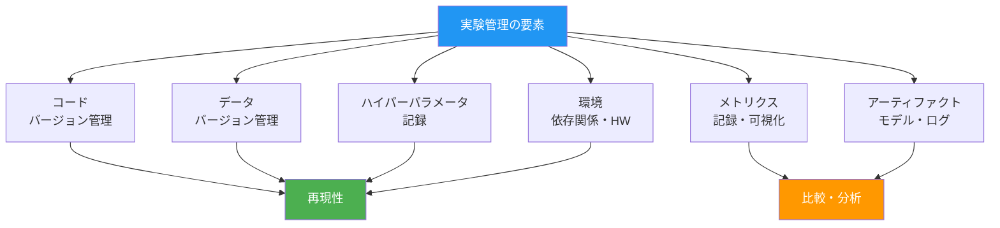
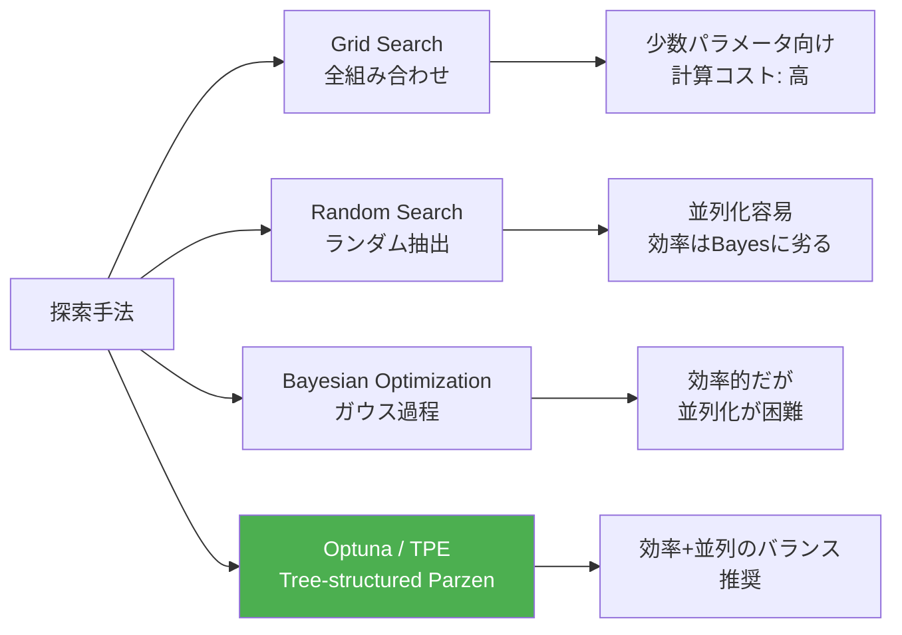

---
tags:
  - mlops
  - experiment-tracking
  - mlflow
  - wandb
  - reproducibility
created: "2026-04-19"
status: draft
---

# 実験管理 — 再現性と効率的なハイパーパラメータ探索

## 1. なぜ実験管理が重要か

ML開発では数十〜数千の実験を行う。パラメータ・コード・データ・結果を追跡しなければ、「あの良い結果をどう再現するか」が分からなくなる。



## 2. MLflow 実践

### 2.1 MLflow Tracking の完全な使用例

```python
"""
MLflow Tracking の実践的パターン
"""

# --- 概念的コード（実際の MLflow API を使用）---

mlflow_example = """
import mlflow
import mlflow.pytorch
from mlflow.tracking import MlflowClient

# 実験の作成・設定
mlflow.set_tracking_uri("http://localhost:5000")
mlflow.set_experiment("text-classification-v2")

# 学習パラメータ
config = {
    "model_name": "bert-base-uncased",
    "learning_rate": 2e-5,
    "batch_size": 32,
    "max_epochs": 10,
    "warmup_steps": 100,
    "weight_decay": 0.01,
    "seed": 42,
}

with mlflow.start_run(run_name="bert-lr2e5-bs32") as run:
    # 1. パラメータの記録
    mlflow.log_params(config)
    
    # 2. Git 情報の自動記録
    mlflow.set_tag("mlflow.source.git.commit", "abc123")
    mlflow.set_tag("developer", "your-name")
    mlflow.set_tag("purpose", "baseline experiment")
    
    # 3. 学習ループ内でメトリクスを記録
    for epoch in range(config["max_epochs"]):
        train_loss, train_acc = train_one_epoch(model, train_loader)
        val_loss, val_acc = evaluate(model, val_loader)
        
        mlflow.log_metrics({
            "train_loss": train_loss,
            "train_acc": train_acc,
            "val_loss": val_loss,
            "val_acc": val_acc,
        }, step=epoch)
    
    # 4. モデルの保存
    mlflow.pytorch.log_model(model, "model")
    
    # 5. アーティファクトの保存
    mlflow.log_artifact("confusion_matrix.png")
    mlflow.log_artifact("classification_report.txt")
    
    # 6. カスタムメトリクス
    mlflow.log_metric("final_f1", 0.92)
    mlflow.log_metric("inference_latency_ms", 15.3)
    
    print(f"Run ID: {run.info.run_id}")
"""

print(mlflow_example)
```

### 2.2 MLflow Model Registry

```python
from dataclasses import dataclass, field
from enum import Enum
from typing import Optional, List
from datetime import datetime

class ModelStage(Enum):
    NONE = "None"
    STAGING = "Staging"
    PRODUCTION = "Production"
    ARCHIVED = "Archived"

@dataclass
class ModelVersion:
    """MLflow Model Registry のバージョン管理を概念的に実装"""
    name: str
    version: int
    run_id: str
    stage: ModelStage = ModelStage.NONE
    description: str = ""
    tags: dict = field(default_factory=dict)
    created_at: str = field(default_factory=lambda: datetime.now().isoformat())

class SimpleModelRegistry:
    def __init__(self):
        self.models: dict = {}  # model_name -> [ModelVersion]
    
    def register(self, name: str, run_id: str, description: str = "") -> ModelVersion:
        if name not in self.models:
            self.models[name] = []
        
        version = len(self.models[name]) + 1
        mv = ModelVersion(name=name, version=version, run_id=run_id, description=description)
        self.models[name].append(mv)
        return mv
    
    def transition_stage(self, name: str, version: int, stage: ModelStage):
        # 同じモデルの同じステージに既存バージョンがあればアーカイブ
        if stage == ModelStage.PRODUCTION:
            for mv in self.models.get(name, []):
                if mv.stage == ModelStage.PRODUCTION:
                    mv.stage = ModelStage.ARCHIVED
        
        for mv in self.models.get(name, []):
            if mv.version == version:
                mv.stage = stage
                return mv
        return None
    
    def get_production(self, name: str) -> Optional[ModelVersion]:
        for mv in self.models.get(name, []):
            if mv.stage == ModelStage.PRODUCTION:
                return mv
        return None
    
    def list_versions(self, name: str):
        for mv in self.models.get(name, []):
            print(f"  v{mv.version} [{mv.stage.value:10s}] run={mv.run_id[:8]}... {mv.description}")

# デモ
registry = SimpleModelRegistry()

# モデル登録
v1 = registry.register("text-classifier", "run_abc123", "Baseline BERT")
v2 = registry.register("text-classifier", "run_def456", "BERT + data augmentation")
v3 = registry.register("text-classifier", "run_ghi789", "DeBERTa-v3 large")

# ステージ遷移
registry.transition_stage("text-classifier", 1, ModelStage.ARCHIVED)
registry.transition_stage("text-classifier", 2, ModelStage.PRODUCTION)
registry.transition_stage("text-classifier", 3, ModelStage.STAGING)

print("=== Model Registry 状態 ===\n")
registry.list_versions("text-classifier")

prod = registry.get_production("text-classifier")
print(f"\n本番モデル: v{prod.version} ({prod.description})")
```

## 3. Weights & Biases (W&B)

```python
"""
W&B の特徴的な機能
"""

wandb_features = {
    "Experiment Tracking": {
        "説明": "MLflow同様の実験記録、だがリアルタイムダッシュボードが強力",
        "コード例": """
import wandb

wandb.init(
    project="text-classification",
    config={"lr": 2e-5, "epochs": 10},
    tags=["baseline", "bert"],
)

for epoch in range(10):
    wandb.log({"loss": 0.5, "acc": 0.9}, step=epoch)

wandb.finish()
""",
    },
    "Sweeps (ハイパーパラメータ探索)": {
        "説明": "ベイズ最適化・ランダムサーチ・Grid Searchを統合管理",
        "コード例": """
sweep_config = {
    "method": "bayes",
    "metric": {"name": "val_acc", "goal": "maximize"},
    "parameters": {
        "learning_rate": {"min": 1e-5, "max": 1e-3, "distribution": "log_uniform_values"},
        "batch_size": {"values": [16, 32, 64]},
        "weight_decay": {"min": 0.0, "max": 0.1},
    },
}

sweep_id = wandb.sweep(sweep_config, project="my-project")
wandb.agent(sweep_id, function=train, count=50)
""",
    },
    "Tables & Artifacts": {
        "説明": "データセット・予測結果をテーブルとして記録・比較",
        "コード例": """
# 予測結果をテーブルに記録
table = wandb.Table(columns=["input", "prediction", "ground_truth", "correct"])
for inp, pred, gt in results:
    table.add_data(inp, pred, gt, pred == gt)
wandb.log({"predictions": table})
""",
    },
}

print("=== Weights & Biases 主要機能 ===\n")
for name, info in wandb_features.items():
    print(f"【{name}】")
    print(f"  {info['説明']}")
    print(f"  コード例:{info['コード例']}")
```

## 4. ハイパーパラメータ最適化



```python
import numpy as np

class SimpleTPE:
    """
    Tree-structured Parzen Estimator (TPE) の簡略実装
    Optuna の基盤アルゴリズム
    """
    
    def __init__(self, gamma: float = 0.25):
        self.gamma = gamma  # 上位γ%を「良い」とみなす
        self.trials: list = []
    
    def suggest(self, param_name: str, low: float, high: float) -> float:
        """次の試行パラメータを提案"""
        if len(self.trials) < 10:
            # 初期は一様ランダム
            return np.random.uniform(low, high)
        
        # 過去の試行を性能でソート
        sorted_trials = sorted(self.trials, key=lambda t: t["objective"])
        n_good = max(1, int(len(sorted_trials) * self.gamma))
        
        good_values = [t["params"][param_name] for t in sorted_trials[:n_good]
                      if param_name in t["params"]]
        bad_values = [t["params"][param_name] for t in sorted_trials[n_good:]
                     if param_name in t["params"]]
        
        if not good_values or not bad_values:
            return np.random.uniform(low, high)
        
        # カーネル密度推定（簡略版）
        candidates = np.random.uniform(low, high, 100)
        
        # l(x) / g(x) を最大化するxを選択
        # l(x): good分布, g(x): bad分布
        best_candidate = candidates[0]
        best_ratio = -float('inf')
        
        for c in candidates:
            l_x = self._kde(c, good_values)
            g_x = self._kde(c, bad_values)
            ratio = l_x / (g_x + 1e-8)
            if ratio > best_ratio:
                best_ratio = ratio
                best_candidate = c
        
        return best_candidate
    
    def _kde(self, x: float, values: list, bandwidth: float = 0.1) -> float:
        """カーネル密度推定（ガウスカーネル）"""
        return sum(np.exp(-((x - v) ** 2) / (2 * bandwidth ** 2)) for v in values) / len(values)
    
    def add_trial(self, params: dict, objective: float):
        self.trials.append({"params": params, "objective": objective})


# デモ: ハイパーパラメータ最適化
np.random.seed(42)
tpe = SimpleTPE(gamma=0.25)

# 真の最適値: lr=0.003, wd=0.01 付近
def objective_function(lr: float, wd: float) -> float:
    return -((lr - 0.003) ** 2 * 1e6 + (wd - 0.01) ** 2 * 100) + np.random.normal(0, 0.01)

print("=== TPE ハイパーパラメータ最適化 ===\n")
best_obj = float('-inf')
for trial in range(30):
    lr = tpe.suggest("lr", 1e-5, 1e-2)
    wd = tpe.suggest("wd", 0.0, 0.1)
    
    obj = objective_function(lr, wd)
    tpe.add_trial({"lr": lr, "wd": wd}, -obj)  # 最小化
    
    if obj > best_obj:
        best_obj = obj
        print(f"Trial {trial:>2}: lr={lr:.6f}, wd={wd:.4f}, obj={obj:.4f} ← NEW BEST")
```

## 5. 再現性の確保

```python
reproducibility_checklist = {
    "コード": [
        "Git でバージョン管理（コミットハッシュを記録）",
        "依存パッケージのバージョン固定 (requirements.txt / pyproject.toml)",
        "Docker イメージで環境を完全に固定",
    ],
    "データ": [
        "データのバージョン管理 (DVC, lakeFS)",
        "データのハッシュ値を記録",
        "前処理パイプラインをコード化（手動操作を排除）",
    ],
    "乱数シード": [
        "Python, NumPy, PyTorch, CUDA の全シードを固定",
        "CUBLAS_WORKSPACE_CONFIG=:4096:8 で CUDA の非決定性を排除",
        "DataLoader の worker_init_fn でシード設定",
    ],
    "ハードウェア": [
        "GPU型番・ドライババージョンを記録",
        "浮動小数点演算の非決定性に注意（fp16, tf32）",
        "分散学習のプロセス数・順序を記録",
    ],
}

print("=== 再現性チェックリスト ===\n")
for category, items in reproducibility_checklist.items():
    print(f"【{category}】")
    for item in items:
        print(f"  □ {item}")
    print()

# PyTorch の再現性設定
seed_setup_code = """
import torch
import numpy as np
import random

def set_seed(seed: int = 42):
    random.seed(seed)
    np.random.seed(seed)
    torch.manual_seed(seed)
    torch.cuda.manual_seed_all(seed)
    torch.backends.cudnn.deterministic = True
    torch.backends.cudnn.benchmark = False
    # CUDA 非決定性の排除（速度低下あり）
    torch.use_deterministic_algorithms(True)
"""
print("=== PyTorch 再現性設定コード ===")
print(seed_setup_code)
```

## 6. ハンズオン演習

### 演習1: MLflow で完全な実験管理

3つの異なるモデルアーキテクチャを MLflow で管理し、メトリクス比較ダッシュボードを作成してください。

### 演習2: Optuna でハイパーパラメータ最適化

Optuna を使い、学習率・バッチサイズ・隠れ層サイズ・ドロップアウト率を最適化してください。TPE vs Random Search の効率を比較してください。

### 演習3: 再現性の検証

同一設定で3回学習を行い、結果が完全に一致するか検証してください。不一致がある場合、原因を特定してください。

## 7. まとめ

- 実験管理は ML 開発の基盤（管理なしは技術的負債の塊）
- MLflow はオープンソース、W&B はクラウドサービスで使いやすい
- Model Registry でモデルのライフサイクルを管理
- ハイパーパラメータ探索は TPE（Optuna）が効率と並列性のバランスが良い
- 再現性はコード・データ・乱数・環境の4要素を固定して確保

## 参考文献

- Zaharia et al. (2018) "Accelerating the Machine Learning Lifecycle with MLflow"
- Akiba et al. (2019) "Optuna: A Next-generation Hyperparameter Optimization Framework"
- Biewald (2020) "Experiment Tracking with Weights and Biases"
