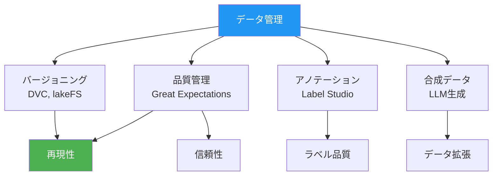
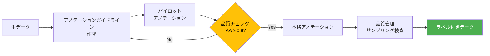

---
tags:
  - mlops
  - data-management
  - dvc
  - data-quality
  - annotation
created: "2026-04-19"
status: draft
---

# データ管理 — ML の燃料を品質管理する

## 1. データ管理の全体像

ML モデルの性能はデータ品質に依存する。「Garbage In, Garbage Out」を防ぐためのデータバージョニング、品質管理、アノテーション、合成データ生成の技術を解説する。



## 2. DVC（Data Version Control）

```python
"""
DVC の概念と使い方
Git ではバージョン管理できない大きなデータファイルを管理する
"""

dvc_workflow = """
# 1. DVC の初期化
$ git init && dvc init

# 2. データファイルの追跡
$ dvc add data/training_data.parquet
# → data/training_data.parquet.dvc (メタファイル) が作成される
# → .gitignore にデータファイルが追加される

# 3. リモートストレージの設定
$ dvc remote add -d myremote s3://my-bucket/dvc-store

# 4. データのプッシュ
$ dvc push

# 5. Git でメタファイルをコミット
$ git add data/training_data.parquet.dvc .gitignore
$ git commit -m "Add training data v1"

# 6. データの更新
$ dvc add data/training_data.parquet  # 新バージョン
$ git add data/training_data.parquet.dvc
$ git commit -m "Update training data v2"

# 7. 過去バージョンの復元
$ git checkout v1 -- data/training_data.parquet.dvc
$ dvc checkout
"""

print(dvc_workflow)

# DVC パイプライン定義 (dvc.yaml)
dvc_pipeline = """
# dvc.yaml - ML パイプラインの定義
stages:
  prepare:
    cmd: python src/prepare.py
    deps:
      - src/prepare.py
      - data/raw/
    outs:
      - data/prepared/
    
  train:
    cmd: python src/train.py --lr ${train.lr} --epochs ${train.epochs}
    deps:
      - src/train.py
      - data/prepared/
    params:
      - train.lr
      - train.epochs
    outs:
      - models/model.pkl
    metrics:
      - metrics.json:
          cache: false
    plots:
      - plots/loss.csv:
          x: epoch
          y: loss
  
  evaluate:
    cmd: python src/evaluate.py
    deps:
      - src/evaluate.py
      - models/model.pkl
      - data/prepared/test.csv
    metrics:
      - eval_metrics.json:
          cache: false
"""

print("=== DVC Pipeline (dvc.yaml) ===")
print(dvc_pipeline)
```

## 3. データ品質管理

```python
import numpy as np
from dataclasses import dataclass
from typing import List, Callable, Any

@dataclass
class DataQualityCheck:
    name: str
    check_fn: Callable
    severity: str  # "error", "warning", "info"
    description: str

class DataQualityFramework:
    """データ品質チェックフレームワーク（Great Expectations風）"""
    
    def __init__(self):
        self.checks: List[DataQualityCheck] = []
        self.results: List[dict] = []
    
    def expect_column_not_null(self, data: dict, column: str, max_null_ratio: float = 0.0):
        null_count = sum(1 for v in data.get(column, []) if v is None or (isinstance(v, float) and np.isnan(v)))
        total = len(data.get(column, []))
        null_ratio = null_count / total if total > 0 else 0
        passed = null_ratio <= max_null_ratio
        self.results.append({
            "check": f"NULL率チェック: {column}",
            "passed": passed,
            "detail": f"NULL率: {null_ratio:.2%} (閾値: {max_null_ratio:.2%})",
            "severity": "error" if not passed else "info",
        })
        return passed
    
    def expect_column_values_in_range(self, data: dict, column: str, min_val: float, max_val: float):
        values = [v for v in data.get(column, []) if v is not None]
        out_of_range = sum(1 for v in values if v < min_val or v > max_val)
        passed = out_of_range == 0
        self.results.append({
            "check": f"範囲チェック: {column} [{min_val}, {max_val}]",
            "passed": passed,
            "detail": f"範囲外: {out_of_range}/{len(values)}件",
            "severity": "error" if not passed else "info",
        })
        return passed
    
    def expect_column_unique_ratio(self, data: dict, column: str, min_ratio: float = 0.5):
        values = data.get(column, [])
        unique_ratio = len(set(values)) / len(values) if values else 0
        passed = unique_ratio >= min_ratio
        self.results.append({
            "check": f"ユニーク率チェック: {column}",
            "passed": passed,
            "detail": f"ユニーク率: {unique_ratio:.2%} (閾値: {min_ratio:.2%})",
            "severity": "warning" if not passed else "info",
        })
        return passed
    
    def expect_schema_match(self, data: dict, expected_columns: List[str]):
        actual = set(data.keys())
        expected = set(expected_columns)
        missing = expected - actual
        extra = actual - expected
        passed = len(missing) == 0
        self.results.append({
            "check": "スキーマチェック",
            "passed": passed,
            "detail": f"不足: {missing or 'なし'}, 余分: {extra or 'なし'}",
            "severity": "error" if not passed else "info",
        })
        return passed
    
    def report(self) -> str:
        lines = ["=== データ品質レポート ===\n"]
        passed = sum(1 for r in self.results if r["passed"])
        total = len(self.results)
        
        lines.append(f"結果: {passed}/{total} チェック通過\n")
        
        for r in self.results:
            status = "✓" if r["passed"] else "✗"
            lines.append(f"[{status}] {r['check']}")
            lines.append(f"    {r['detail']}")
        
        return "\n".join(lines)


# デモ
data = {
    "user_id": [1, 2, 3, 4, 5, None, 7, 8],
    "age": [25, 30, 45, 22, 200, 33, 28, 41],  # 200 は異常値
    "score": [0.8, 0.6, None, 0.7, 0.9, 0.5, 0.85, 0.7],
    "label": ["pos", "neg", "pos", "pos", "neg", "pos", "neg", "pos"],
}

qf = DataQualityFramework()
qf.expect_schema_match(data, ["user_id", "age", "score", "label", "timestamp"])
qf.expect_column_not_null(data, "user_id", max_null_ratio=0.05)
qf.expect_column_not_null(data, "score", max_null_ratio=0.05)
qf.expect_column_values_in_range(data, "age", 0, 120)
qf.expect_column_unique_ratio(data, "user_id", min_ratio=0.8)

print(qf.report())
```

## 4. アノテーション管理



```python
import numpy as np

def compute_inter_annotator_agreement(
    annotator_1: List[int],
    annotator_2: List[int],
) -> dict:
    """
    アノテーター間一致度の計算
    """
    a1 = np.array(annotator_1)
    a2 = np.array(annotator_2)
    
    # 単純一致率
    agreement = np.mean(a1 == a2)
    
    # Cohen's Kappa
    labels = list(set(a1) | set(a2))
    n = len(a1)
    
    # 各ラベルの周辺確率
    p_e = 0
    for label in labels:
        p1 = np.mean(a1 == label)
        p2 = np.mean(a2 == label)
        p_e += p1 * p2
    
    kappa = (agreement - p_e) / (1 - p_e) if p_e < 1 else 0
    
    # Kappa の解釈
    if kappa >= 0.81: interpretation = "ほぼ完全一致"
    elif kappa >= 0.61: interpretation = "実質的一致"
    elif kappa >= 0.41: interpretation = "中程度の一致"
    elif kappa >= 0.21: interpretation = "公正な一致"
    else: interpretation = "わずかな一致"
    
    return {
        "agreement": agreement,
        "cohens_kappa": kappa,
        "interpretation": interpretation,
    }

# デモ
np.random.seed(42)
n_samples = 200

# 2人のアノテーター（ある程度一致するがノイズあり）
true_labels = np.random.choice([0, 1, 2], n_samples)
ann1 = true_labels.copy()
ann2 = true_labels.copy()

# ランダムにラベルを変更（不一致を模擬）
flip_mask_1 = np.random.random(n_samples) < 0.1  # 10% ノイズ
flip_mask_2 = np.random.random(n_samples) < 0.15  # 15% ノイズ
ann1[flip_mask_1] = np.random.choice([0, 1, 2], np.sum(flip_mask_1))
ann2[flip_mask_2] = np.random.choice([0, 1, 2], np.sum(flip_mask_2))

result = compute_inter_annotator_agreement(ann1.tolist(), ann2.tolist())
print("=== アノテーター間一致度 ===\n")
print(f"単純一致率: {result['agreement']:.3f}")
print(f"Cohen's Kappa: {result['cohens_kappa']:.3f}")
print(f"解釈: {result['interpretation']}")
```

## 5. 合成データ生成

```python
class SyntheticDataGenerator:
    """LLM を使った合成データ生成の概念的実装"""
    
    @staticmethod
    def generate_classification_data(
        task_description: str,
        labels: List[str],
        num_per_label: int = 10,
    ) -> str:
        """
        LLM プロンプトで分類用合成データを生成
        """
        prompt = f"""以下のタスクのための学習データを生成してください。

タスク: {task_description}
ラベル: {', '.join(labels)}
各ラベルにつき{num_per_label}件のサンプルを生成してください。

出力形式 (JSONL):
{{"text": "サンプルテキスト", "label": "ラベル名"}}

注意:
- 多様な表現を使用すること
- 実際のユースケースを反映すること
- ラベル間のバランスを保つこと
- 曖昧なサンプルも少数含めること（モデルの頑健性向上のため）
"""
        return prompt

    @staticmethod
    def quality_filter(samples: List[dict], min_length: int = 10) -> List[dict]:
        """生成されたデータの品質フィルタリング"""
        filtered = []
        for sample in samples:
            text = sample.get("text", "")
            # 短すぎるサンプルを除外
            if len(text) < min_length:
                continue
            # 重複チェック（簡易）
            if text not in [s["text"] for s in filtered]:
                filtered.append(sample)
        return filtered

# デモ
gen = SyntheticDataGenerator()
prompt = gen.generate_classification_data(
    task_description="カスタマーサポートのメール分類",
    labels=["問い合わせ", "クレーム", "感謝", "解約"],
    num_per_label=20,
)
print("=== 合成データ生成プロンプト ===\n")
print(prompt)

print("\n=== 合成データのベストプラクティス ===")
best_practices = [
    "種データ（Seed Data）を少量準備し、LLMに多様化させる",
    "生成後は必ず人手で品質チェック（全量は不要、サンプリング）",
    "合成データ only は危険。実データと混合がベスト",
    "合成データの比率は実データの 1-5 倍程度が目安",
    "モデル崩壊（Model Collapse）に注意: 合成で学習→合成で生成の循環は避ける",
]
for bp in best_practices:
    print(f"  - {bp}")
```

## 6. ハンズオン演習

### 演習1: DVC パイプラインの構築
DVC で小さなデータセットのバージョン管理を行い、`dvc repro` でパイプラインを実行してください。

### 演習2: データ品質ダッシュボード
DataQualityFramework を拡張し、時系列でのデータ品質推移を追跡する機能を実装してください。

### 演習3: 合成データの有効性検証
LLM で合成データを生成し、実データのみ・合成データ混合でモデルの精度を比較してください。

## 7. まとめ

- データバージョニング（DVC）は ML 再現性の基盤
- データ品質チェックはパイプラインに組み込んで自動化
- アノテーション品質は IAA で定量管理（Kappa >= 0.8 が目標）
- 合成データは実データを補完するが、品質管理が不可欠

## 参考文献

- DVC Documentation: https://dvc.org/doc
- Great Expectations Documentation: https://docs.greatexpectations.io
- Long (2023) "Scaling Data-Centric AI: Challenges and Opportunities"
