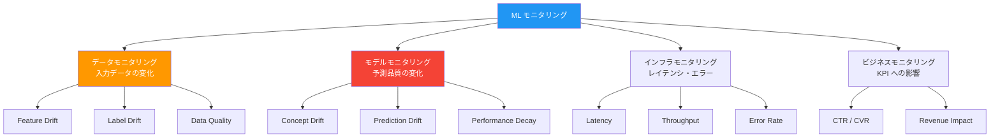
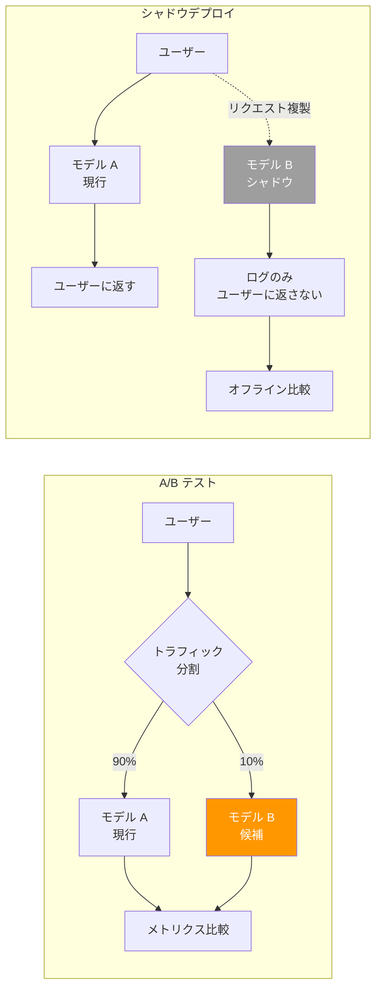

---
tags:
  - mlops
  - monitoring
  - model-drift
  - ab-testing
  - observability
created: "2026-04-19"
status: draft
---

# モニタリングと監視 — 本番モデルの健全性を守る

## 1. ML モニタリングの全体像

デプロイ後のモデルは時間とともに性能が劣化する。データの分布変化（ドリフト）、モデルの陳腐化、インフラ障害を検出し対応するのがMLモニタリングである。



## 2. モデルドリフト検出

### 2.1 ドリフトの種類

```python
import numpy as np
from scipy import stats
from typing import Tuple

class DriftDetector:
    """モデルドリフト検出器"""
    
    @staticmethod
    def ks_test(reference: np.ndarray, current: np.ndarray, threshold: float = 0.05) -> dict:
        """
        Kolmogorov-Smirnov 検定
        2つの分布が同一かを検定。p値 < threshold でドリフトと判定。
        """
        statistic, p_value = stats.ks_2samp(reference, current)
        return {
            "method": "KS Test",
            "statistic": float(statistic),
            "p_value": float(p_value),
            "drift_detected": p_value < threshold,
            "threshold": threshold,
        }
    
    @staticmethod
    def psi(reference: np.ndarray, current: np.ndarray, bins: int = 10) -> dict:
        """
        Population Stability Index (PSI)
        
        PSI < 0.1: 変化なし
        0.1 <= PSI < 0.2: 軽微な変化
        PSI >= 0.2: 有意な変化（要対応）
        """
        # ビン分割
        breakpoints = np.percentile(reference, np.linspace(0, 100, bins + 1))
        breakpoints[0] = -np.inf
        breakpoints[-1] = np.inf
        
        ref_counts = np.histogram(reference, bins=breakpoints)[0]
        cur_counts = np.histogram(current, bins=breakpoints)[0]
        
        # 0除算防止
        ref_pct = (ref_counts + 1) / (len(reference) + bins)
        cur_pct = (cur_counts + 1) / (len(current) + bins)
        
        psi_value = float(np.sum((cur_pct - ref_pct) * np.log(cur_pct / ref_pct)))
        
        if psi_value < 0.1:
            interpretation = "変化なし"
        elif psi_value < 0.2:
            interpretation = "軽微な変化"
        else:
            interpretation = "有意な変化（要対応）"
        
        return {
            "method": "PSI",
            "psi": psi_value,
            "interpretation": interpretation,
            "drift_detected": psi_value >= 0.2,
        }
    
    @staticmethod
    def page_hinkley(
        values: np.ndarray,
        delta: float = 0.005,
        threshold: float = 50
    ) -> dict:
        """
        Page-Hinkley 検定
        オンライン（逐次的）なドリフト検出。ストリーミングデータ向き。
        """
        n = len(values)
        cumulative_sum = 0
        min_sum = 0
        drift_point = -1
        
        running_mean = 0
        for i in range(n):
            running_mean = (running_mean * i + values[i]) / (i + 1)
            cumulative_sum += values[i] - running_mean - delta
            min_sum = min(min_sum, cumulative_sum)
            
            if cumulative_sum - min_sum > threshold:
                drift_point = i
                break
        
        return {
            "method": "Page-Hinkley",
            "drift_detected": drift_point >= 0,
            "drift_point": drift_point,
            "final_statistic": float(cumulative_sum - min_sum),
        }


# デモ: ドリフト検出
np.random.seed(42)

# 参照データ（デプロイ時の分布）
reference = np.random.normal(0, 1, 1000)

# シナリオ1: ドリフトなし
current_no_drift = np.random.normal(0, 1, 500)

# シナリオ2: 平均がシフト（Covariate Drift）
current_mean_shift = np.random.normal(0.5, 1, 500)

# シナリオ3: 分散が変化
current_var_change = np.random.normal(0, 2, 500)

detector = DriftDetector()

print("=== ドリフト検出デモ ===\n")
for name, current in [
    ("ドリフトなし", current_no_drift),
    ("平均シフト (+0.5)", current_mean_shift),
    ("分散増加 (σ: 1→2)", current_var_change),
]:
    print(f"--- {name} ---")
    ks = detector.ks_test(reference, current)
    psi = detector.psi(reference, current)
    print(f"  KS Test: stat={ks['statistic']:.4f}, p={ks['p_value']:.4f}, "
          f"drift={ks['drift_detected']}")
    print(f"  PSI:     {psi['psi']:.4f} ({psi['interpretation']})")
    print()
```

### 2.2 多変量ドリフト検出

```python
def multivariate_drift_detection(
    reference: np.ndarray,  # (n_ref, n_features)
    current: np.ndarray,    # (n_cur, n_features)
) -> dict:
    """
    多変量ドリフト検出
    Maximum Mean Discrepancy (MMD) を使用
    """
    def rbf_kernel(X, Y, sigma=1.0):
        """RBF カーネル"""
        XX = np.sum(X ** 2, axis=1, keepdims=True)
        YY = np.sum(Y ** 2, axis=1, keepdims=True)
        distances = XX + YY.T - 2 * X @ Y.T
        return np.exp(-distances / (2 * sigma ** 2))
    
    n_ref = len(reference)
    n_cur = len(current)
    
    # MMD^2 = E[k(x,x')] - 2E[k(x,y)] + E[k(y,y')]
    K_xx = rbf_kernel(reference, reference)
    K_yy = rbf_kernel(current, current)
    K_xy = rbf_kernel(reference, current)
    
    mmd_squared = (
        (np.sum(K_xx) - np.trace(K_xx)) / (n_ref * (n_ref - 1))
        - 2 * np.sum(K_xy) / (n_ref * n_cur)
        + (np.sum(K_yy) - np.trace(K_yy)) / (n_cur * (n_cur - 1))
    )
    
    # 置換検定で有意性を評価
    combined = np.vstack([reference, current])
    n_permutations = 100
    null_mmds = []
    
    for _ in range(n_permutations):
        perm = np.random.permutation(len(combined))
        perm_ref = combined[perm[:n_ref]]
        perm_cur = combined[perm[n_ref:]]
        
        K_xx_p = rbf_kernel(perm_ref, perm_ref)
        K_yy_p = rbf_kernel(perm_cur, perm_cur)
        K_xy_p = rbf_kernel(perm_ref, perm_cur)
        
        null_mmd = (
            (np.sum(K_xx_p) - np.trace(K_xx_p)) / (n_ref * (n_ref - 1))
            - 2 * np.sum(K_xy_p) / (n_ref * n_cur)
            + (np.sum(K_yy_p) - np.trace(K_yy_p)) / (n_cur * (n_cur - 1))
        )
        null_mmds.append(null_mmd)
    
    p_value = np.mean([m >= mmd_squared for m in null_mmds])
    
    return {
        "mmd_squared": float(mmd_squared),
        "p_value": float(p_value),
        "drift_detected": p_value < 0.05,
    }

# デモ
np.random.seed(42)
ref_data = np.random.multivariate_normal([0, 0, 0], np.eye(3), 200)
cur_drifted = np.random.multivariate_normal([0.3, 0.2, -0.1], np.eye(3) * 1.2, 200)

result = multivariate_drift_detection(ref_data, cur_drifted)
print("=== 多変量ドリフト検出 (MMD) ===\n")
print(f"MMD²: {result['mmd_squared']:.6f}")
print(f"p値:  {result['p_value']:.4f}")
print(f"ドリフト: {'検出' if result['drift_detected'] else '未検出'}")
```

## 3. A/B テストとシャドウデプロイ



```python
import numpy as np
from scipy import stats

class ABTestAnalyzer:
    """A/B テスト結果の統計的分析"""
    
    def __init__(self, control: np.ndarray, treatment: np.ndarray):
        self.control = control
        self.treatment = treatment
    
    def z_test_proportions(self) -> dict:
        """比率の Z 検定（CTR 等の比較用）"""
        p1 = np.mean(self.control)
        p2 = np.mean(self.treatment)
        n1 = len(self.control)
        n2 = len(self.treatment)
        
        # プール比率
        p_pool = (np.sum(self.control) + np.sum(self.treatment)) / (n1 + n2)
        
        # Z 統計量
        se = np.sqrt(p_pool * (1 - p_pool) * (1/n1 + 1/n2))
        z = (p2 - p1) / se if se > 0 else 0
        p_value = 2 * (1 - stats.norm.cdf(abs(z)))
        
        return {
            "control_rate": float(p1),
            "treatment_rate": float(p2),
            "relative_lift": float((p2 - p1) / p1) if p1 > 0 else 0,
            "z_statistic": float(z),
            "p_value": float(p_value),
            "significant": p_value < 0.05,
            "sample_size": {"control": n1, "treatment": n2},
        }
    
    @staticmethod
    def required_sample_size(
        baseline_rate: float,
        minimum_detectable_effect: float,
        alpha: float = 0.05,
        power: float = 0.80
    ) -> int:
        """必要サンプルサイズの計算"""
        z_alpha = stats.norm.ppf(1 - alpha / 2)
        z_beta = stats.norm.ppf(power)
        
        p1 = baseline_rate
        p2 = baseline_rate * (1 + minimum_detectable_effect)
        
        n = (z_alpha * np.sqrt(2 * p1 * (1-p1)) + 
             z_beta * np.sqrt(p1*(1-p1) + p2*(1-p2))) ** 2 / (p2 - p1) ** 2
        
        return int(np.ceil(n))

# デモ
np.random.seed(42)
control = np.random.binomial(1, 0.10, 5000)   # 10% CTR
treatment = np.random.binomial(1, 0.11, 5000)  # 11% CTR (+10% lift)

analyzer = ABTestAnalyzer(control, treatment)
result = analyzer.z_test_proportions()

print("=== A/B テスト結果 ===\n")
print(f"Control CTR:   {result['control_rate']:.4f}")
print(f"Treatment CTR: {result['treatment_rate']:.4f}")
print(f"相対的改善:    {result['relative_lift']:.2%}")
print(f"p値:          {result['p_value']:.4f}")
print(f"統計的有意:    {'はい' if result['significant'] else 'いいえ'}")

# 必要サンプルサイズ
n = ABTestAnalyzer.required_sample_size(0.10, 0.05)
print(f"\n5%改善を検出するための必要サンプルサイズ: {n:,}件/グループ")
```

## 4. アラート設計

```python
from dataclasses import dataclass, field
from enum import Enum
from typing import List, Callable, Optional

class AlertSeverity(Enum):
    INFO = "info"
    WARNING = "warning"
    CRITICAL = "critical"

@dataclass
class AlertRule:
    name: str
    metric: str
    condition: Callable[[float], bool]
    severity: AlertSeverity
    cooldown_minutes: int = 60
    description: str = ""

class AlertManager:
    """ML モデルのアラート管理"""
    
    def __init__(self):
        self.rules: List[AlertRule] = []
        self.fired_alerts: List[dict] = []
    
    def add_rule(self, rule: AlertRule):
        self.rules.append(rule)
    
    def evaluate(self, metrics: dict) -> List[dict]:
        alerts = []
        for rule in self.rules:
            if rule.metric in metrics:
                value = metrics[rule.metric]
                if rule.condition(value):
                    alert = {
                        "rule": rule.name,
                        "metric": rule.metric,
                        "value": value,
                        "severity": rule.severity.value,
                        "description": rule.description,
                    }
                    alerts.append(alert)
                    self.fired_alerts.append(alert)
        return alerts

# アラートルールの設定
manager = AlertManager()

manager.add_rule(AlertRule(
    name="高レイテンシ",
    metric="p99_latency_ms",
    condition=lambda x: x > 500,
    severity=AlertSeverity.WARNING,
    description="P99レイテンシが500msを超過"
))
manager.add_rule(AlertRule(
    name="精度劣化",
    metric="accuracy",
    condition=lambda x: x < 0.85,
    severity=AlertSeverity.CRITICAL,
    description="モデル精度が閾値を下回った"
))
manager.add_rule(AlertRule(
    name="ドリフト検出",
    metric="psi_score",
    condition=lambda x: x > 0.2,
    severity=AlertSeverity.WARNING,
    description="入力データの分布変化を検出"
))
manager.add_rule(AlertRule(
    name="エラー率上昇",
    metric="error_rate",
    condition=lambda x: x > 0.05,
    severity=AlertSeverity.CRITICAL,
    description="推論エラー率が5%を超過"
))

# 評価
metrics = {
    "p99_latency_ms": 650,
    "accuracy": 0.82,
    "psi_score": 0.15,
    "error_rate": 0.02,
}

alerts = manager.evaluate(metrics)
print("=== アラート評価結果 ===\n")
print(f"メトリクス: {metrics}\n")
for alert in alerts:
    print(f"[{alert['severity'].upper()}] {alert['rule']}")
    print(f"  {alert['description']}")
    print(f"  値: {alert['metric']}={alert['value']}")
    print()
if not alerts:
    print("アラートなし")
```

## 5. ハンズオン演習

### 演習1: ドリフト検出パイプライン
1時間ごとに入力データの分布を参照データと比較し、PSI > 0.2 でアラートを発するパイプラインを構築してください。

### 演習2: A/B テストの設計
モデルの新バージョンをデプロイする際のA/Bテスト計画を作成してください（サンプルサイズ計算、期間、成功基準を含む）。

### 演習3: 監視ダッシュボード
Grafana + Prometheus（または同等のツール）でモデルの推論レイテンシ、スループット、エラー率を可視化するダッシュボードを構築してください。

## 6. まとめ

- デプロイ後のモデルは必ず劣化する。モニタリングは必須
- ドリフト検出は KS 検定・PSI・MMD 等の統計的手法で行う
- A/B テストでモデル変更の効果を統計的に検証
- シャドウデプロイでリスクなく新モデルを評価
- アラートルールは段階的に設計（INFO → WARNING → CRITICAL）

## 参考文献

- Lu et al. (2018) "Learning under Concept Drift: A Review"
- Sculley et al. (2015) "Hidden Technical Debt in Machine Learning Systems"
- Google (2020) "ML Test Score: A Rubric for ML Production Readiness"
