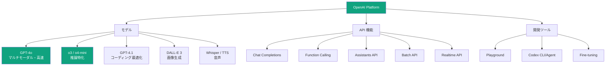
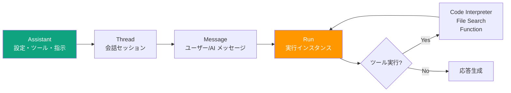

---
tags:
  - ai-services
  - openai
  - gpt
  - function-calling
  - api
created: "2026-04-19"
status: draft
---

# OpenAI プラットフォーム — GPT-4o, o3, Codex, API 設計

## 1. OpenAI エコシステムの全体像



## 2. モデルラインナップ（2026年4月時点）

```python
from dataclasses import dataclass
from typing import Optional, List

@dataclass
class OpenAIModel:
    name: str
    category: str
    context_window: int
    max_output: int
    input_price_per_mtok: float   # $/1M tokens
    output_price_per_mtok: float
    strengths: List[str]
    multimodal: bool = False

models = [
    OpenAIModel("gpt-4o", "フラッグシップ", 128_000, 16_384,
                2.50, 10.00,
                ["マルチモーダル", "高速", "バランス型"], True),
    OpenAIModel("gpt-4o-mini", "軽量", 128_000, 16_384,
                0.15, 0.60,
                ["超低コスト", "高速", "軽量タスク向け"], True),
    OpenAIModel("o3", "推論特化", 200_000, 100_000,
                10.00, 40.00,
                ["複雑な推論", "数学", "コーディング"], True),
    OpenAIModel("o4-mini", "推論軽量", 200_000, 100_000,
                1.10, 4.40,
                ["推論タスク", "コスト効率", "高速"], True),
    OpenAIModel("gpt-4.1", "コーディング", 1_000_000, 32_768,
                2.00, 8.00,
                ["長文脈", "コード生成", "指示追従"], False),
    OpenAIModel("gpt-4.1-mini", "コーディング軽量", 1_000_000, 32_768,
                0.40, 1.60,
                ["長文脈", "低コスト"], False),
    OpenAIModel("gpt-4.1-nano", "最軽量", 1_000_000, 32_768,
                0.10, 0.40,
                ["最低コスト", "高速", "分類タスク"], False),
]

print("=== OpenAI モデル比較 ===\n")
print(f"{'モデル':16s} {'コンテキスト':>12} {'入力$/M':>8} {'出力$/M':>8} {'主な強み'}")
print("-" * 75)
for m in models:
    ctx = f"{m.context_window:,}"
    print(f"{m.name:16s} {ctx:>12} ${m.input_price_per_mtok:>6.2f} "
          f"${m.output_price_per_mtok:>6.2f}  {', '.join(m.strengths[:2])}")
```

## 3. Chat Completions API

```python
# OpenAI API の基本的な使用パターン

api_example = """
from openai import OpenAI

client = OpenAI()  # OPENAI_API_KEY 環境変数から自動取得

# 基本的な会話
response = client.chat.completions.create(
    model="gpt-4o",
    messages=[
        {"role": "system", "content": "あなたは親切なアシスタントです。"},
        {"role": "user", "content": "Pythonのデコレータを説明して"},
    ],
    temperature=0.7,
    max_tokens=1000,
)

print(response.choices[0].message.content)
print(f"使用トークン: {response.usage.total_tokens}")

# ストリーミング
stream = client.chat.completions.create(
    model="gpt-4o",
    messages=[{"role": "user", "content": "量子コンピュータとは？"}],
    stream=True,
)

for chunk in stream:
    if chunk.choices[0].delta.content:
        print(chunk.choices[0].delta.content, end="", flush=True)
"""

print(api_example)
```

## 4. Function Calling（ツール使用）

```python
import json

# Function Calling の定義と使用パターン
function_calling_example = """
from openai import OpenAI
import json

client = OpenAI()

# ツール（関数）の定義
tools = [
    {
        "type": "function",
        "function": {
            "name": "get_weather",
            "description": "指定された都市の現在の天気を取得",
            "parameters": {
                "type": "object",
                "properties": {
                    "city": {
                        "type": "string",
                        "description": "都市名（例: 東京, 大阪）"
                    },
                    "unit": {
                        "type": "string",
                        "enum": ["celsius", "fahrenheit"],
                        "description": "温度の単位"
                    }
                },
                "required": ["city"]
            }
        }
    },
    {
        "type": "function",
        "function": {
            "name": "search_database",
            "description": "社内データベースを検索",
            "parameters": {
                "type": "object",
                "properties": {
                    "query": {"type": "string", "description": "検索クエリ"},
                    "table": {"type": "string", "enum": ["users", "orders", "products"]},
                    "limit": {"type": "integer", "description": "結果の最大件数", "default": 10}
                },
                "required": ["query", "table"]
            }
        }
    }
]

# 1. モデルにツール付きで問い合わせ
response = client.chat.completions.create(
    model="gpt-4o",
    messages=[{"role": "user", "content": "東京の天気を教えて"}],
    tools=tools,
    tool_choice="auto",  # "auto", "required", "none", or specific
)

# 2. モデルが関数呼び出しを要求した場合
if response.choices[0].message.tool_calls:
    tool_call = response.choices[0].message.tool_calls[0]
    func_name = tool_call.function.name
    func_args = json.loads(tool_call.function.arguments)
    
    # 3. 実際の関数を実行
    result = get_weather(**func_args)  # 実装は別途
    
    # 4. 結果をモデルに返す
    messages = [
        {"role": "user", "content": "東京の天気を教えて"},
        response.choices[0].message,
        {
            "role": "tool",
            "tool_call_id": tool_call.id,
            "content": json.dumps(result)
        }
    ]
    
    # 5. モデルが最終回答を生成
    final = client.chat.completions.create(
        model="gpt-4o",
        messages=messages,
        tools=tools,
    )
    print(final.choices[0].message.content)
"""

print("=== Function Calling パターン ===")
print(function_calling_example)
```

## 5. Assistants API



```python
assistants_api_example = """
from openai import OpenAI

client = OpenAI()

# 1. Assistant の作成
assistant = client.beta.assistants.create(
    name="データ分析アシスタント",
    instructions="あなたはデータ分析の専門家です。CSVファイルを分析し、洞察を提供してください。",
    model="gpt-4o",
    tools=[
        {"type": "code_interpreter"},  # Python 実行環境
        {"type": "file_search"},       # ファイル検索（RAG）
    ],
)

# 2. Thread（会話セッション）の作成
thread = client.beta.threads.create()

# 3. メッセージの追加
message = client.beta.threads.messages.create(
    thread_id=thread.id,
    role="user",
    content="売上データを分析して、トレンドを教えてください",
    attachments=[{
        "file_id": uploaded_file.id,
        "tools": [{"type": "code_interpreter"}]
    }],
)

# 4. Run の実行（ストリーミング）
with client.beta.threads.runs.stream(
    thread_id=thread.id,
    assistant_id=assistant.id,
) as stream:
    for text in stream.text_deltas:
        print(text, end="", flush=True)
"""

print("=== Assistants API パターン ===")
print(assistants_api_example)
```

## 6. OpenAI Codex (CLI Agent)

```python
codex_overview = {
    "概要": "ターミナルベースの AI コーディングエージェント",
    "モデル": "o4-mini（デフォルト）、codex-mini-latest",
    "特徴": [
        "サンドボックス内でコード実行",
        "ファイル読み書き・コマンド実行が可能",
        "マルチファイル編集",
        "Git 操作の自動化",
    ],
    "実行モード": {
        "suggest": "変更を提案、確認後に実行",
        "auto-edit": "ファイル編集は自動、コマンドは確認",
        "full-auto": "全て自動実行（サンドボックス内）",
    },
    "使用例": [
        "codex 'このプロジェクトのテストを書いて'",
        "codex 'README.mdを日本語に翻訳して'",
        "codex 'パフォーマンスのボトルネックを見つけて修正して'",
    ],
}

print("=== OpenAI Codex (CLI Agent) ===\n")
for k, v in codex_overview.items():
    if isinstance(v, list):
        print(f"{k}:")
        for item in v:
            print(f"  - {item}")
    elif isinstance(v, dict):
        print(f"{k}:")
        for kk, vv in v.items():
            print(f"  {kk}: {vv}")
    else:
        print(f"{k}: {v}")
    print()
```

## 7. ハンズオン演習

### 演習1: Function Calling でツールチェーン
天気API + カレンダーAPI + メール送信の3つのツールを定義し、「明日雨なら予定をリマインドして」を処理するエージェントを構築してください。

### 演習2: Assistants API でデータ分析ボット
Code Interpreter を使って CSV ファイルを分析し、グラフ生成と洞察レポートを自動作成するアシスタントを構築してください。

### 演習3: コスト最適化
同一タスクを gpt-4o / gpt-4o-mini / gpt-4.1-nano で処理し、品質とコストのトレードオフを定量的に比較してください。

## 8. まとめ

- GPT-4o はマルチモーダル汎用、o3 は複雑推論、4.1 はコーディング特化
- Function Calling でLLMに外部ツールを接続（エージェントの基盤）
- Assistants API は状態管理・ファイル操作・コード実行を統合
- Codex はターミナルベースの実用的コーディングエージェント
- モデル選択はタスク複雑度とコストのバランスで決定

## 参考文献

- OpenAI API Documentation: https://platform.openai.com/docs
- OpenAI Cookbook: https://cookbook.openai.com
