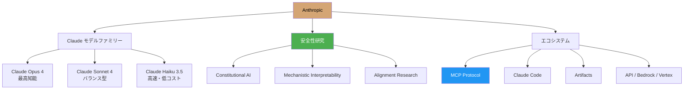
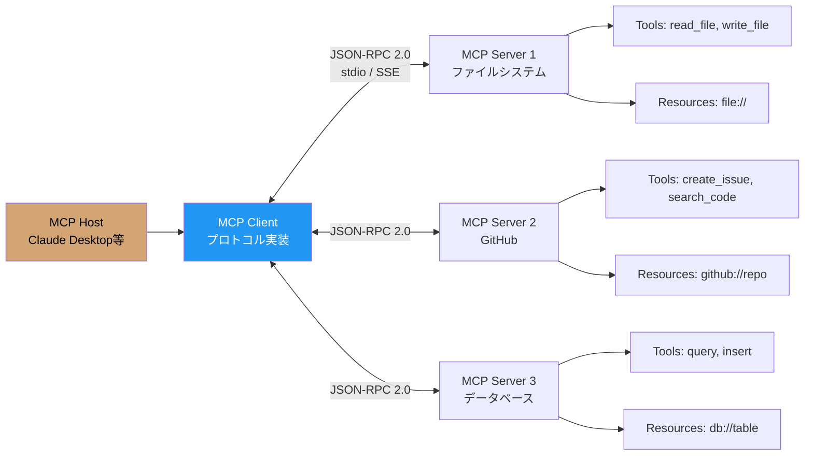

---
tags:
  - ai-services
  - anthropic
  - claude
  - constitutional-ai
  - mcp
created: "2026-04-19"
status: draft
---

# Anthropic / Claude — Constitutional AI, Tool Use, MCP

## 1. Anthropic と Claude の全体像

Anthropic は AI Safety を企業ミッションの中核に据えた AI 企業。Claude は安全性と有用性のバランスを重視して設計された LLM ファミリーである。



## 2. Claude モデル比較

```python
from dataclasses import dataclass
from typing import List

@dataclass
class ClaudeModel:
    name: str
    context_window: int
    max_output: int
    input_price: float   # $/1M tokens
    output_price: float  # $/1M tokens
    strengths: List[str]
    extended_thinking: bool

models = [
    ClaudeModel("claude-opus-4", 200_000, 32_000,
                15.00, 75.00,
                ["最高の知能", "複雑な分析", "エージェント", "コーディング"],
                True),
    ClaudeModel("claude-sonnet-4", 200_000, 16_000,
                3.00, 15.00,
                ["バランス型", "コーディング", "エージェント", "コスト効率"],
                True),
    ClaudeModel("claude-haiku-3.5", 200_000, 8_192,
                0.80, 4.00,
                ["高速", "低コスト", "分類", "抽出"],
                False),
]

print("=== Claude モデル比較 ===\n")
for m in models:
    print(f"【{m.name}】")
    print(f"  コンテキスト: {m.context_window:,} tokens")
    print(f"  最大出力: {m.max_output:,} tokens")
    print(f"  料金: 入力 ${m.input_price}/M, 出力 ${m.output_price}/M")
    print(f"  Extended Thinking: {'対応' if m.extended_thinking else '非対応'}")
    print(f"  強み: {', '.join(m.strengths)}")
    print()
```

## 3. Constitutional AI（CAI）

```python
"""
Constitutional AI: Anthropic の安全性アプローチ

従来の RLHF: 人間がフィードバック → コスト高・スケールしない
CAI: AI 自身が憲法（原則）に基づいて自己改善 → スケーラブル
"""

class ConstitutionalAIConcept:
    """Constitutional AI の概念的実装"""
    
    def __init__(self):
        # 「憲法」= AI が従うべき原則
        self.constitution = [
            "有害なコンテンツを生成しない",
            "正確な情報を提供し、不確かな場合はその旨を明示する",
            "全ての人を平等に扱い、差別的な表現を避ける",
            "ユーザーの安全を最優先する",
            "法律に違反する行為を支援しない",
            "プライバシーを尊重する",
        ]
    
    def critique_and_revise(self, response: str, principle: str) -> dict:
        """
        CAI の2段階プロセス:
        
        1. Critique: AI が自分の応答を原則に照らして批評
        2. Revision: 批評に基づいて応答を修正
        """
        # 概念的な処理フロー
        critique_prompt = f"""
以下の応答を、この原則に照らして批評してください:
原則: {principle}
応答: {response}

この応答はこの原則に違反していますか？もしそうなら、どのように改善すべきですか？
"""
        revision_prompt = f"""
批評を踏まえて、原則に沿うように応答を修正してください:
原則: {principle}
元の応答: {response}
批評: [上記の批評結果]

修正された応答:
"""
        return {
            "original": response,
            "critique_prompt": critique_prompt,
            "revision_prompt": revision_prompt,
            "process": "Critique → Revision → RLAIF (AI Feedback で強化学習)"
        }
    
    def training_pipeline(self):
        """CAI の学習パイプライン"""
        return """
        1. SL-CAI (Supervised Learning phase)
           - 有害なプロンプトに対する初期応答を生成
           - 各応答を憲法の各原則で批評
           - 批評に基づいて修正
           - 修正後の応答でファインチューニング
        
        2. RL-CAI (Reinforcement Learning phase)  
           - 修正された応答で「AI フィードバックモデル」を学習
           - このフィードバックモデルで RLAIF を実行
           - 人間のフィードバック不要でスケーラブル
        
        利点:
        - 人間のラベリングコストを大幅削減
        - 原則を明示的に記述できる（透明性）
        - 新しい原則を追加してアップデート可能
        """

cai = ConstitutionalAIConcept()
print("=== Constitutional AI ===\n")
print("憲法（原則）:")
for i, p in enumerate(cai.constitution, 1):
    print(f"  {i}. {p}")
print(cai.training_pipeline())
```

## 4. Claude Tool Use

```python
tool_use_example = """
import anthropic

client = anthropic.Anthropic()

# ツールの定義
tools = [
    {
        "name": "get_stock_price",
        "description": "指定された銘柄の現在の株価を取得する",
        "input_schema": {
            "type": "object",
            "properties": {
                "symbol": {
                    "type": "string",
                    "description": "株式ティッカーシンボル（例: AAPL, GOOGL）"
                }
            },
            "required": ["symbol"]
        }
    },
    {
        "name": "calculate_portfolio_value",
        "description": "ポートフォリオの総価値を計算する",
        "input_schema": {
            "type": "object",
            "properties": {
                "holdings": {
                    "type": "array",
                    "items": {
                        "type": "object",
                        "properties": {
                            "symbol": {"type": "string"},
                            "shares": {"type": "number"}
                        }
                    }
                }
            },
            "required": ["holdings"]
        }
    }
]

# Tool Use のフロー
response = client.messages.create(
    model="claude-sonnet-4-20250514",
    max_tokens=1024,
    tools=tools,
    messages=[{
        "role": "user",
        "content": "AAPLを100株持っています。現在の価値を教えて"
    }]
)

# stop_reason が "tool_use" なら関数実行が必要
if response.stop_reason == "tool_use":
    tool_block = next(b for b in response.content if b.type == "tool_use")
    
    # 関数を実行
    result = get_stock_price(symbol=tool_block.input["symbol"])
    
    # 結果を返す
    final = client.messages.create(
        model="claude-sonnet-4-20250514",
        max_tokens=1024,
        tools=tools,
        messages=[
            {"role": "user", "content": "AAPLを100株持っています。現在の価値を教えて"},
            {"role": "assistant", "content": response.content},
            {
                "role": "user",
                "content": [{
                    "type": "tool_result",
                    "tool_use_id": tool_block.id,
                    "content": json.dumps(result)
                }]
            }
        ]
    )
"""

print("=== Claude Tool Use ===")
print(tool_use_example)
```

## 5. MCP（Model Context Protocol）



```python
"""
MCP サーバーの実装例（Python SDK）
"""

mcp_server_example = """
from mcp.server import Server
from mcp.types import Tool, TextContent
import mcp.server.stdio

# サーバーの作成
server = Server("my-tool-server")

# ツールの定義
@server.list_tools()
async def list_tools():
    return [
        Tool(
            name="query_database",
            description="SQLiteデータベースにクエリを実行する",
            inputSchema={
                "type": "object",
                "properties": {
                    "sql": {
                        "type": "string",
                        "description": "実行するSQLクエリ"
                    },
                    "database": {
                        "type": "string",
                        "description": "データベースファイルのパス"
                    }
                },
                "required": ["sql", "database"]
            }
        ),
        Tool(
            name="summarize_table",
            description="テーブルの統計サマリーを取得する",
            inputSchema={
                "type": "object",
                "properties": {
                    "table_name": {"type": "string"},
                    "database": {"type": "string"}
                },
                "required": ["table_name", "database"]
            }
        )
    ]

# ツールの実行
@server.call_tool()
async def call_tool(name: str, arguments: dict):
    if name == "query_database":
        import sqlite3
        conn = sqlite3.connect(arguments["database"])
        cursor = conn.execute(arguments["sql"])
        results = cursor.fetchall()
        columns = [d[0] for d in cursor.description] if cursor.description else []
        conn.close()
        return [TextContent(
            type="text",
            text=f"Columns: {columns}\\nResults: {results}"
        )]
    
    elif name == "summarize_table":
        # テーブルの統計情報を返す
        pass

# サーバーの起動
async def main():
    async with mcp.server.stdio.stdio_server() as (read, write):
        await server.run(read, write, server.create_initialization_options())

import asyncio
asyncio.run(main())
"""

print("=== MCP サーバー実装例 ===")
print(mcp_server_example)

# claude_desktop_config.json の設定例
mcp_config = {
    "mcpServers": {
        "my-db-server": {
            "command": "python",
            "args": ["path/to/server.py"],
            "env": {"DB_PATH": "/data/mydb.sqlite"}
        },
        "github": {
            "command": "npx",
            "args": ["-y", "@modelcontextprotocol/server-github"],
            "env": {"GITHUB_TOKEN": "ghp_xxxxx"}
        }
    }
}

import json
print("\n=== Claude Desktop 設定 ===")
print(json.dumps(mcp_config, indent=2, ensure_ascii=False))
```

## 6. Extended Thinking

```python
extended_thinking_example = """
# Extended Thinking: Claude が「考える」プロセスを可視化

response = client.messages.create(
    model="claude-sonnet-4-20250514",
    max_tokens=16000,
    thinking={
        "type": "enabled",
        "budget_tokens": 10000  # 思考に使えるトークン上限
    },
    messages=[{
        "role": "user",
        "content": "このバグの原因を特定して: [コードスニペット]"
    }]
)

# 応答には thinking ブロックと text ブロックが含まれる
for block in response.content:
    if block.type == "thinking":
        print(f"[思考プロセス] {block.thinking}")
    elif block.type == "text":
        print(f"[回答] {block.text}")
"""

print("=== Extended Thinking ===")
print(extended_thinking_example)

# 使い分けガイド
use_cases = {
    "Extended Thinking が有効な場面": [
        "複雑なデバッグ・コードレビュー",
        "数学的推論・証明",
        "戦略的な計画立案",
        "複雑な設計判断",
    ],
    "Extended Thinking が不要な場面": [
        "単純な Q&A",
        "テキスト翻訳",
        "フォーマット変換",
        "レイテンシが重要なリアルタイム応答",
    ],
}
print("\n=== Extended Thinking 使い分け ===")
for category, items in use_cases.items():
    print(f"\n{category}:")
    for item in items:
        print(f"  - {item}")
```

## 7. ハンズオン演習

### 演習1: Claude Tool Use でエージェント構築
ファイル操作 + Web検索 + 計算の3つのツールを持つエージェントを構築してください。

### 演習2: MCP サーバーの実装
SQLite データベースを操作する MCP サーバーを実装し、Claude Desktop から接続してください。

### 演習3: プロンプトキャッシュの効果測定
長いシステムプロンプトでのプロンプトキャッシュの効果（コスト削減・レイテンシ改善）を測定してください。

## 8. まとめ

- Claude は Constitutional AI で安全性と有用性を両立
- Tool Use で外部システムとの統合が容易
- MCP はツール接続の標準プロトコル（エコシステム拡大中）
- Extended Thinking は複雑なタスクの精度を向上
- Claude Code はターミナルベースの強力なコーディングエージェント

## 参考文献

- Bai et al. (2022) "Constitutional AI: Harmlessness from AI Feedback"
- Anthropic (2024) "Model Context Protocol Specification"
- Anthropic API Documentation: https://docs.anthropic.com
