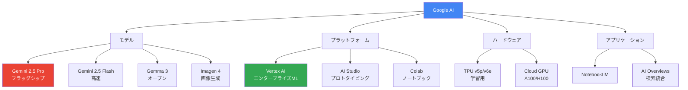
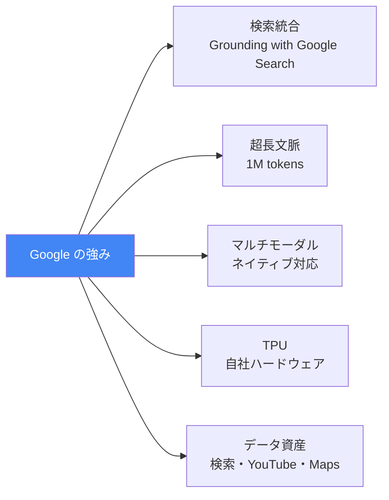

---
tags:
  - ai-services
  - google
  - gemini
  - vertex-ai
  - tpu
created: "2026-04-19"
status: draft
---

# Google AI — Gemini, Vertex AI, TPU, AI Studio

## 1. Google AI エコシステム



## 2. Gemini モデルファミリー

```python
from dataclasses import dataclass
from typing import List

@dataclass
class GeminiModel:
    name: str
    context_window: int
    input_price: float
    output_price: float
    features: List[str]
    best_for: str

models = [
    GeminiModel("Gemini 2.5 Pro", 1_000_000, 1.25, 10.00,
                ["思考モード", "マルチモーダル", "コーディング", "ツール使用"],
                "複雑な推論・コーディング"),
    GeminiModel("Gemini 2.5 Flash", 1_000_000, 0.15, 0.60,
                ["高速", "思考モード", "マルチモーダル"],
                "バランス型・コスト効率"),
    GeminiModel("Gemini 2.0 Flash", 1_000_000, 0.10, 0.40,
                ["超高速", "マルチモーダル出力", "ネイティブツール"],
                "リアルタイム・低レイテンシ"),
    GeminiModel("Gemma 3 27B", 128_000, 0, 0,
                ["オープンウェイト", "ローカル実行可能", "マルチモーダル"],
                "オンプレミス・カスタマイズ"),
]

print("=== Gemini モデル比較 ===\n")
for m in models:
    print(f"【{m.name}】")
    print(f"  コンテキスト: {m.context_window:,} tokens")
    price = f"${m.input_price}/{m.output_price}" if m.input_price > 0 else "無料 (オープン)"
    print(f"  料金: {price} per M tokens")
    print(f"  最適用途: {m.best_for}")
    print(f"  特徴: {', '.join(m.features)}")
    print()
```

## 3. Vertex AI プラットフォーム

```python
vertex_ai_services = {
    "Vertex AI Studio": {
        "機能": "モデルのプロトタイピング、プロンプト設計、評価",
        "対応モデル": "Gemini, PaLM 2, Imagen, Codey, Claude (Model Garden)",
    },
    "Model Garden": {
        "機能": "100以上のモデルをワンクリックデプロイ",
        "対応モデル": "Google, Anthropic, Meta, Mistral 等",
    },
    "Vertex AI Pipelines": {
        "機能": "ML パイプラインのオーケストレーション (Kubeflow ベース)",
        "特徴": "サーバーレス、自動スケーリング",
    },
    "Vertex AI Feature Store": {
        "機能": "特徴量の管理・共有・サービング",
        "特徴": "リアルタイム + バッチ対応",
    },
    "Vertex AI Endpoints": {
        "機能": "モデルのデプロイ・サービング",
        "特徴": "A/B テスト、オートスケーリング、GPU対応",
    },
    "Vertex AI Search & Conversation": {
        "機能": "RAG ベースの検索・会話エンジン（マネージド）",
        "特徴": "データ取り込み→インデックス→検索を自動化",
    },
}

print("=== Vertex AI サービス一覧 ===\n")
for name, info in vertex_ai_services.items():
    print(f"【{name}】")
    for k, v in info.items():
        print(f"  {k}: {v}")
    print()
```

## 4. Gemini API の使用

```python
gemini_api_example = """
import google.generativeai as genai

genai.configure(api_key="YOUR_API_KEY")

# 基本的な生成
model = genai.GenerativeModel("gemini-2.5-pro-preview-05-06")

# テキスト生成
response = model.generate_content("量子コンピュータの基礎を説明して")
print(response.text)

# マルチモーダル（画像 + テキスト）
import PIL.Image
image = PIL.Image.open("diagram.png")
response = model.generate_content(["この図を解説して", image])

# ストリーミング
response = model.generate_content("長い説明をして", stream=True)
for chunk in response:
    print(chunk.text, end="")

# チャット
chat = model.start_chat()
response = chat.send_message("Pythonとは？")
response = chat.send_message("型ヒントについて詳しく")

# 思考モード（Thinking）
response = model.generate_content(
    "この数学問題を解いて: ...",
    generation_config=genai.GenerationConfig(
        thinking_config=genai.ThinkingConfig(thinking_budget=8192)
    )
)
# response.candidates[0].content.parts に思考プロセスが含まれる

# Function Calling
tools = [genai.protos.Tool(function_declarations=[{
    "name": "get_weather",
    "description": "天気を取得",
    "parameters": {
        "type": "object",
        "properties": {"city": {"type": "string"}},
        "required": ["city"]
    }
}])]

model_with_tools = genai.GenerativeModel("gemini-2.5-flash", tools=tools)
response = model_with_tools.generate_content("東京の天気は？")
"""

print("=== Gemini API 使用例 ===")
print(gemini_api_example)
```

## 5. Google AI の独自強み



```python
google_advantages = {
    "Grounding with Google Search": {
        "説明": "Gemini の回答を Google 検索結果で裏付け",
        "用途": "最新情報が必要なタスク、事実確認",
        "競合優位": "他社にはない検索インフラとの直接統合",
    },
    "超長文脈 (1M tokens)": {
        "説明": "100万トークン = 約700,000語 = 書籍数冊分",
        "用途": "大規模コードベース分析、文書全体の要約",
        "競合優位": "Claude の200Kを大幅に上回る（ただし品質の比較は必要）",
    },
    "NotebookLM": {
        "説明": "ドキュメントアップロード → AI が専門家として対話",
        "用途": "研究論文の理解、学習資料の作成",
        "特徴": "Audio Overview（ポッドキャスト形式の要約生成）",
    },
}

print("=== Google AI の独自強み ===\n")
for name, info in google_advantages.items():
    print(f"【{name}】")
    for k, v in info.items():
        print(f"  {k}: {v}")
    print()
```

## 6. ハンズオン演習

### 演習1: Gemini API でマルチモーダル分析
画像とテキストを組み合わせた分析タスクを Gemini API で実行し、Claude との出力品質を比較してください。

### 演習2: 長文脈の活用
1M token コンテキストに大規模コードベースを入力し、アーキテクチャ分析を行ってください。

### 演習3: Vertex AI でモデルデプロイ
Vertex AI Endpoints にカスタムモデルをデプロイし、A/B テストを設定してください。

## 7. まとめ

- Gemini 2.5 Pro は推論特化、Flash はコスト効率に優れる
- Google 検索統合（Grounding）は他社にない強み
- 1M token の超長文脈は大規模分析に有利
- Vertex AI はエンタープライズ ML の統合プラットフォーム
- Gemma はオープンウェイトでローカル実行・カスタマイズ可能

## 参考文献

- Google (2025) "Gemini 2.5 Technical Report"
- Vertex AI Documentation: https://cloud.google.com/vertex-ai/docs
- Google AI Studio: https://aistudio.google.com
