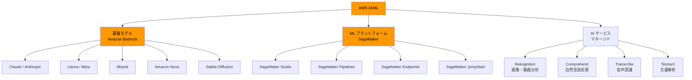
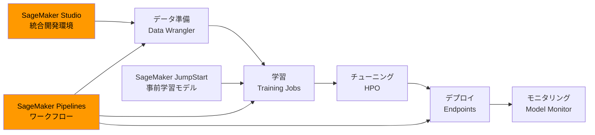

---
tags:
  - ai-services
  - aws
  - bedrock
  - sagemaker
  - cloud
created: "2026-04-19"
status: draft
---

# AWS AI サービス — Bedrock, SageMaker, マルチモデル戦略

## 1. AWS AI サービスの全体像



## 2. Amazon Bedrock

```python
bedrock_models = {
    "Anthropic Claude": {
        "モデル": ["Claude Opus 4", "Claude Sonnet 4", "Claude Haiku 3.5"],
        "強み": "安全性、推論、コーディング",
        "Bedrock独自機能": "Guardrails 統合, Knowledge Bases",
    },
    "Meta Llama": {
        "モデル": ["Llama 4 Scout", "Llama 4 Maverick", "Llama 3.3 70B"],
        "強み": "オープン、カスタマイズ性",
        "Bedrock独自機能": "ファインチューニング可能",
    },
    "Amazon Nova": {
        "モデル": ["Nova Pro", "Nova Lite", "Nova Micro"],
        "強み": "低コスト、AWS統合最適化",
        "Bedrock独自機能": "最もコスト効率が良い（AWS自社モデル）",
    },
    "Mistral": {
        "モデル": ["Mistral Large", "Mistral Small"],
        "強み": "多言語、欧州データ主権",
        "Bedrock独自機能": "EU リージョン対応",
    },
}

print("=== Amazon Bedrock モデルカタログ ===\n")
for provider, info in bedrock_models.items():
    print(f"【{provider}】")
    print(f"  モデル: {', '.join(info['モデル'])}")
    print(f"  強み: {info['強み']}")
    print(f"  Bedrock機能: {info['Bedrock独自機能']}")
    print()
```

### Bedrock API の使用

```python
bedrock_api_example = """
import boto3
import json

# Bedrock Runtime クライアント
bedrock = boto3.client('bedrock-runtime', region_name='us-east-1')

# --- Claude via Bedrock ---
response = bedrock.invoke_model(
    modelId='anthropic.claude-sonnet-4-20250514-v1:0',
    body=json.dumps({
        "anthropic_version": "bedrock-2023-05-31",
        "max_tokens": 1024,
        "messages": [
            {"role": "user", "content": "AWSのベストプラクティスを教えて"}
        ]
    })
)
result = json.loads(response['body'].read())
print(result['content'][0]['text'])

# --- Converse API (モデル非依存) ---
response = bedrock.converse(
    modelId='anthropic.claude-sonnet-4-20250514-v1:0',
    messages=[{
        "role": "user",
        "content": [{"text": "Lambda関数の最適化方法は？"}]
    }],
    inferenceConfig={"maxTokens": 1024, "temperature": 0.7}
)
print(response['output']['message']['content'][0]['text'])

# --- Knowledge Bases (RAG) ---
bedrock_agent = boto3.client('bedrock-agent-runtime')
response = bedrock_agent.retrieve_and_generate(
    input={"text": "セキュリティポリシーについて教えて"},
    retrieveAndGenerateConfiguration={
        "type": "KNOWLEDGE_BASE",
        "knowledgeBaseConfiguration": {
            "knowledgeBaseId": "KB_ID",
            "modelArn": "arn:aws:bedrock:us-east-1::foundation-model/anthropic.claude-sonnet-4-20250514-v1:0"
        }
    }
)
"""

print("=== Bedrock API 使用例 ===")
print(bedrock_api_example)
```

## 3. Amazon SageMaker



```python
sagemaker_features = {
    "SageMaker Studio": "統合 IDE（JupyterLab ベース）",
    "SageMaker Pipelines": "MLパイプラインの定義と自動実行",
    "SageMaker JumpStart": "350以上の事前学習モデルをワンクリックデプロイ",
    "SageMaker Endpoints": {
        "リアルタイム": "常時稼働、低レイテンシ",
        "サーバーレス": "リクエスト時のみ起動、コスト最適化",
        "非同期": "大きな入力の処理、キュー型",
        "バッチ変換": "大量データの一括処理",
    },
    "SageMaker Model Monitor": "データドリフト・品質の自動監視",
    "SageMaker Clarify": "モデルの公平性・説明可能性の分析",
}

print("=== SageMaker 主要機能 ===\n")
for name, desc in sagemaker_features.items():
    if isinstance(desc, dict):
        print(f"【{name}】")
        for k, v in desc.items():
            print(f"  {k}: {v}")
    else:
        print(f"【{name}】 {desc}")
    print()
```

## 4. AWS AI マネージドサービス

```python
aws_ai_services = [
    {"name": "Amazon Rekognition", "category": "視覚",
     "機能": "画像・動画分析、顔認識、物体検出、コンテンツモデレーション",
     "ユースケース": "本人確認、不適切画像検出、在庫管理"},
    {"name": "Amazon Comprehend", "category": "言語",
     "機能": "感情分析、エンティティ抽出、トピック分類、PII検出",
     "ユースケース": "カスタマーレビュー分析、文書分類"},
    {"name": "Amazon Transcribe", "category": "音声",
     "機能": "音声→テキスト変換、リアルタイム対応、多言語",
     "ユースケース": "コールセンター分析、字幕生成"},
    {"name": "Amazon Textract", "category": "文書",
     "機能": "OCR、テーブル抽出、フォーム解析",
     "ユースケース": "請求書処理、契約書解析"},
    {"name": "Amazon Translate", "category": "翻訳",
     "機能": "75以上の言語対応、リアルタイム翻訳",
     "ユースケース": "多言語コンテンツ、カスタマーサポート"},
]

print("=== AWS AI マネージドサービス ===\n")
for svc in aws_ai_services:
    print(f"【{svc['name']}】({svc['category']})")
    print(f"  機能: {svc['機能']}")
    print(f"  用途: {svc['ユースケース']}")
    print()
```

## 5. ハンズオン演習

### 演習1: Bedrock で RAG 構築
S3 にドキュメントをアップロードし、Knowledge Bases + Claude で社内文書検索を構築してください。

### 演習2: SageMaker でモデルデプロイ
SageMaker JumpStart から LLM を選択し、サーバーレスエンドポイントにデプロイしてください。

### 演習3: Bedrock Guardrails
Guardrails を設定し、不適切な入出力をフィルタリングする安全な AI アプリを構築してください。

## 6. まとめ

- Bedrock はマルチモデル戦略の中核（モデル切替が容易）
- SageMaker はカスタムモデルの学習・デプロイに強い
- Converse API でモデル間の統一的な呼び出しが可能
- AWS の既存サービス（S3, Lambda, IAM）との統合が最大の強み
- マネージド AI サービスは ML 知識なしで利用可能

## 参考文献

- AWS Bedrock Documentation: https://docs.aws.amazon.com/bedrock/
- AWS SageMaker Documentation: https://docs.aws.amazon.com/sagemaker/
