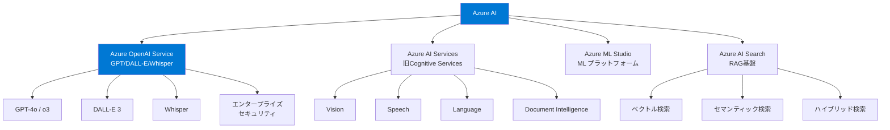
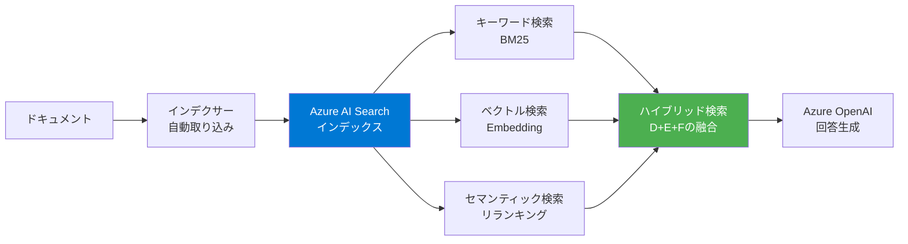

---
tags:
  - ai-services
  - azure
  - openai
  - microsoft
  - enterprise
created: "2026-04-19"
status: draft
---

# Azure AI — Azure OpenAI Service, Cognitive Services, 企業統合

## 1. Azure AI の全体像



## 2. Azure OpenAI Service

```python
azure_openai_advantages = {
    "エンタープライズセキュリティ": [
        "データは Azure リージョン内に保持",
        "VNET 統合・Private Endpoint 対応",
        "Azure AD（Entra ID）認証",
        "コンテンツフィルタリング内蔵",
        "顧客データでモデルを学習しない保証",
    ],
    "コンプライアンス": [
        "SOC 2 Type 2, ISO 27001, HIPAA, PCI DSS",
        "日本リージョン (Japan East) 対応",
        "データ所在地の保証",
        "監査ログの完全な記録",
    ],
    "運用機能": [
        "Provisioned Throughput Units (PTU) で性能保証",
        "モデルのファインチューニング",
        "コンテンツフィルタのカスタマイズ",
        "複数デプロイメントの管理",
    ],
}

print("=== Azure OpenAI Service の優位性 ===\n")
for category, items in azure_openai_advantages.items():
    print(f"【{category}】")
    for item in items:
        print(f"  - {item}")
    print()
```

### Azure OpenAI API の使用

```python
azure_api_example = """
from openai import AzureOpenAI

# Azure 固有の設定
client = AzureOpenAI(
    api_key="YOUR_KEY",
    api_version="2024-12-01-preview",
    azure_endpoint="https://YOUR_RESOURCE.openai.azure.com"
)

# API は OpenAI SDK と同一インターフェース
response = client.chat.completions.create(
    model="gpt-4o",  # Azure のデプロイメント名
    messages=[
        {"role": "system", "content": "あなたは企業向けアシスタントです。"},
        {"role": "user", "content": "コンプライアンスレポートを作成して"}
    ],
    temperature=0.3,
)

# ストリーミング（同一API）
stream = client.chat.completions.create(
    model="gpt-4o",
    messages=[{"role": "user", "content": "要約して"}],
    stream=True,
)
for chunk in stream:
    if chunk.choices and chunk.choices[0].delta.content:
        print(chunk.choices[0].delta.content, end="")

# --- On Your Data（RAG統合）---
# Azure AI Search と直接統合した RAG
response = client.chat.completions.create(
    model="gpt-4o",
    messages=[{"role": "user", "content": "社内規定について教えて"}],
    extra_body={
        "data_sources": [{
            "type": "azure_search",
            "parameters": {
                "endpoint": "https://YOUR_SEARCH.search.windows.net",
                "index_name": "company-docs",
                "authentication": {"type": "api_key", "key": "SEARCH_KEY"},
            }
        }]
    }
)
# response には引用元ドキュメントへの参照が含まれる
"""

print("=== Azure OpenAI API 使用例 ===")
print(azure_api_example)
```

## 3. Azure AI Search（RAG 基盤）



```python
azure_search_features = {
    "ベクトル検索": {
        "対応次元": "最大3072次元",
        "アルゴリズム": "HNSW, Exhaustive KNN",
        "Embedding": "Azure OpenAI text-embedding-3 統合",
    },
    "セマンティックランキング": {
        "説明": "Microsoft のクロスエンコーダーで検索結果をリランク",
        "利点": "キーワードマッチでは見つからない意味的に関連する結果を上位に",
    },
    "ハイブリッド検索": {
        "説明": "BM25 + ベクトル + セマンティックの3方式を融合",
        "RRF": "Reciprocal Rank Fusion でスコアを統合",
    },
    "統合インデクサー": {
        "対応ソース": "Blob Storage, SQL Database, Cosmos DB, SharePoint",
        "AI Enrichment": "OCR, エンティティ抽出, 翻訳を取り込み時に自動適用",
    },
}

print("=== Azure AI Search 機能 ===\n")
for feature, info in azure_search_features.items():
    print(f"【{feature}】")
    for k, v in info.items():
        print(f"  {k}: {v}")
    print()
```

## 4. Microsoft 365 Copilot との統合

```python
m365_integration = {
    "Copilot Studio": "ノーコードでカスタムCopilotを構築",
    "Teams AI": "Teams チャットボットにLLMを統合",
    "SharePoint連携": "社内文書をAIで検索・要約",
    "Power Platform": "Power Automate + AIで業務自動化",
    "Graph API": "M365データ（メール、カレンダー、ファイル）をAIに接続",
}

print("=== Microsoft 365 + AI 統合 ===\n")
for name, desc in m365_integration.items():
    print(f"  {name}: {desc}")
```

## 5. ハンズオン演習

### 演習1: Azure OpenAI + AI Search で RAG
Azure AI Search にドキュメントをインデックスし、On Your Data 機能で RAG チャットボットを構築してください。

### 演習2: コンテンツフィルタのカスタマイズ
Azure OpenAI のコンテンツフィルタ設定を調整し、業務特化のフィルタリングルールを作成してください。

### 演習3: PTU vs PAYG のコスト比較
Provisioned Throughput Units と従量課金のコストをワークロード別に比較し、最適な契約形態を選択してください。

## 6. まとめ

- Azure OpenAI は OpenAI モデルにエンタープライズセキュリティを付加
- Azure AI Search は RAG の高品質な検索基盤（ハイブリッド検索）
- Microsoft 365 との統合が最大の差別化要因
- 日本リージョン対応でデータ所在地の要件を満たす
- PTU で性能保証、コンプライアンスで規制産業に対応

## 参考文献

- Azure OpenAI Documentation: https://learn.microsoft.com/azure/ai-services/openai/
- Azure AI Search Documentation: https://learn.microsoft.com/azure/search/
