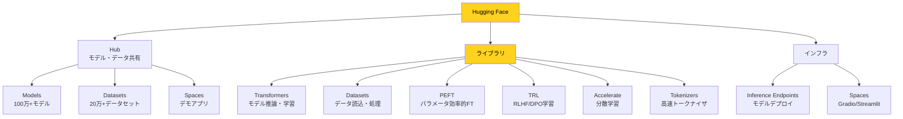
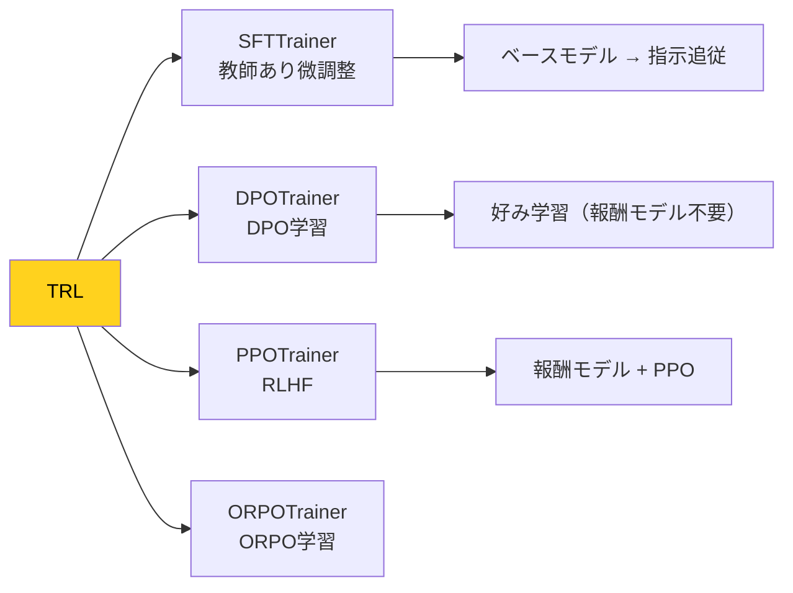

---
tags:
  - ai-services
  - huggingface
  - transformers
  - peft
  - open-source
created: "2026-04-19"
status: draft
---

# Hugging Face エコシステム — Transformers, Hub, PEFT, TRL

## 1. Hugging Face エコシステムの全体像



## 2. Transformers ライブラリ

```python
transformers_patterns = """
from transformers import (
    AutoTokenizer, AutoModelForCausalLM, AutoModelForSequenceClassification,
    pipeline, Trainer, TrainingArguments
)

# --- パターン1: Pipeline (最もシンプル) ---
classifier = pipeline("text-classification", model="bert-base-uncased")
result = classifier("This movie is great!")
# [{'label': 'POSITIVE', 'score': 0.9998}]

# テキスト生成
generator = pipeline("text-generation", model="meta-llama/Llama-3.1-8B-Instruct",
                     device_map="auto", torch_dtype="bfloat16")
output = generator("Explain quantum computing:", max_new_tokens=200)

# --- パターン2: Auto Classes (より制御が必要な場合) ---
tokenizer = AutoTokenizer.from_pretrained("meta-llama/Llama-3.1-8B-Instruct")
model = AutoModelForCausalLM.from_pretrained(
    "meta-llama/Llama-3.1-8B-Instruct",
    torch_dtype=torch.bfloat16,
    device_map="auto",           # 自動的にGPUに配置
    attn_implementation="flash_attention_2",  # FlashAttention 2
)

inputs = tokenizer("Hello, world!", return_tensors="pt").to(model.device)
outputs = model.generate(**inputs, max_new_tokens=100, temperature=0.7)
print(tokenizer.decode(outputs[0], skip_special_tokens=True))

# --- パターン3: Trainer API (学習) ---
training_args = TrainingArguments(
    output_dir="./results",
    num_train_epochs=3,
    per_device_train_batch_size=8,
    learning_rate=2e-5,
    bf16=True,
    logging_steps=10,
    eval_strategy="epoch",
    save_strategy="epoch",
    push_to_hub=True,  # 学習後 Hub に自動アップロード
)

trainer = Trainer(
    model=model,
    args=training_args,
    train_dataset=train_dataset,
    eval_dataset=eval_dataset,
)
trainer.train()
trainer.push_to_hub()  # Hub に公開
"""

print("=== Transformers ライブラリ 主要パターン ===")
print(transformers_patterns)
```

## 3. PEFT（Parameter-Efficient Fine-Tuning）

```python
peft_overview = """
from peft import (
    LoraConfig, get_peft_model, TaskType,
    prepare_model_for_kbit_training
)
from transformers import AutoModelForCausalLM, BitsAndBytesConfig
import torch

# --- QLoRA (4bit量子化 + LoRA) ---

# 1. 4bit 量子化でモデルをロード
bnb_config = BitsAndBytesConfig(
    load_in_4bit=True,
    bnb_4bit_quant_type="nf4",
    bnb_4bit_compute_dtype=torch.bfloat16,
    bnb_4bit_use_double_quant=True,
)

model = AutoModelForCausalLM.from_pretrained(
    "meta-llama/Llama-3.1-8B",
    quantization_config=bnb_config,
    device_map="auto",
)
model = prepare_model_for_kbit_training(model)

# 2. LoRA 設定
lora_config = LoraConfig(
    r=16,                    # LoRA のランク（低いほど軽量）
    lora_alpha=32,           # スケーリング係数
    target_modules=[         # LoRA を適用する層
        "q_proj", "k_proj", "v_proj", "o_proj",
        "gate_proj", "up_proj", "down_proj"
    ],
    lora_dropout=0.05,
    bias="none",
    task_type=TaskType.CAUSAL_LM,
)

# 3. PEFT モデルの作成
peft_model = get_peft_model(model, lora_config)
peft_model.print_trainable_parameters()
# trainable params: 13,631,488 || all params: 8,030,261,248 || trainable%: 0.17%

# 4. 学習（通常のTrainerで学習可能）
# trainer = Trainer(model=peft_model, ...)
# trainer.train()

# 5. アダプタの保存（数十MBのみ）
# peft_model.save_pretrained("my-lora-adapter")
"""

print("=== PEFT / QLoRA 実装パターン ===")
print(peft_overview)

# PEFT 手法の比較
peft_methods = {
    "LoRA": {"パラメータ": "0.1-1%", "メモリ": "低", "品質": "高", "速度": "速い",
             "原理": "重み行列を低ランク分解 W + BA (B: d×r, A: r×d)"},
    "QLoRA": {"パラメータ": "0.1-1%", "メモリ": "最低", "品質": "高", "速度": "やや遅い",
              "原理": "4bit量子化 + LoRA で16GBのGPUでも70Bを学習可能"},
    "Prefix Tuning": {"パラメータ": "<0.1%", "メモリ": "最低", "品質": "中", "速度": "最速",
                      "原理": "入力にソフトプロンプトを追加"},
    "IA3": {"パラメータ": "<0.01%", "メモリ": "最低", "品質": "中", "速度": "最速",
            "原理": "活性化をスカラーで重み付け"},
}

print("\n=== PEFT 手法比較 ===\n")
print(f"{'手法':16s} {'パラメータ':>10} {'メモリ':>6} {'品質':>4} {'速度':>8}")
print("-" * 52)
for name, info in peft_methods.items():
    print(f"{name:16s} {info['パラメータ']:>10} {info['メモリ']:>6} {info['品質']:>4} {info['速度']:>8}")
```

## 4. TRL（Transformer Reinforcement Learning）



```python
trl_example = """
from trl import SFTTrainer, SFTConfig, DPOTrainer, DPOConfig
from datasets import load_dataset

# --- SFT (Supervised Fine-Tuning) ---
dataset = load_dataset("HuggingFaceH4/ultrachat_200k", split="train_sft")

sft_config = SFTConfig(
    output_dir="./sft-model",
    num_train_epochs=1,
    per_device_train_batch_size=4,
    gradient_accumulation_steps=4,
    learning_rate=2e-5,
    bf16=True,
    max_seq_length=2048,
    packing=True,  # 短いサンプルをパッキングして効率化
)

trainer = SFTTrainer(
    model="meta-llama/Llama-3.1-8B",
    args=sft_config,
    train_dataset=dataset,
)
trainer.train()

# --- DPO (Direct Preference Optimization) ---
dpo_dataset = load_dataset("HuggingFaceH4/ultrafeedback_binarized")

dpo_config = DPOConfig(
    output_dir="./dpo-model",
    num_train_epochs=1,
    per_device_train_batch_size=2,
    gradient_accumulation_steps=8,
    learning_rate=5e-7,
    beta=0.1,  # DPO の温度パラメータ
    bf16=True,
)

dpo_trainer = DPOTrainer(
    model=sft_model,       # SFT後のモデル
    ref_model=ref_model,   # 参照モデル（SFT直後のコピー）
    args=dpo_config,
    train_dataset=dpo_dataset["train"],
)
dpo_trainer.train()
"""

print("=== TRL: SFT → DPO パイプライン ===")
print(trl_example)
```

## 5. Datasets と Hub

```python
datasets_usage = """
from datasets import load_dataset, Dataset

# Hub からデータセット読み込み
dataset = load_dataset("squad_v2", split="train")
print(dataset[0])  # {'id': '...', 'context': '...', 'question': '...', ...}

# ストリーミング（大規模データセット向け）
dataset = load_dataset("allenai/c4", "en", split="train", streaming=True)
for example in dataset:
    process(example)
    break

# カスタムデータセットのアップロード
my_dataset = Dataset.from_dict({
    "text": ["Hello", "World"],
    "label": [0, 1]
})
my_dataset.push_to_hub("my-username/my-dataset")

# データセット処理
dataset = dataset.map(
    lambda x: tokenizer(x["text"], padding="max_length", truncation=True),
    batched=True,
    num_proc=4,  # マルチプロセス
)
"""

print("=== Datasets ライブラリ ===")
print(datasets_usage)
```

## 6. ハンズオン演習

### 演習1: QLoRA で LLM ファインチューニング
Llama 3.1 8B を QLoRA で日本語の指示追従データセットを使ってファインチューニングしてください。

### 演習2: DPO アライメント
SFT 後のモデルに対して DPO を適用し、応答品質の改善を評価してください。

### 演習3: Hub にモデル公開
学習したモデルを Model Card 付きで Hub に公開し、Spaces でデモアプリを作成してください。

## 7. まとめ

- Hugging Face はオープンソース AI のエコシステムの中心
- Transformers は統一的な API でほぼ全てのモデルを扱える
- PEFT (LoRA/QLoRA) で少ないリソースでも大規模モデルを調整可能
- TRL で SFT → DPO/RLHF のアライメントパイプラインを構築
- Hub はモデル・データセットの共有プラットフォーム

## 参考文献

- Wolf et al. (2020) "Transformers: State-of-the-Art NLP"
- Hu et al. (2021) "LoRA: Low-Rank Adaptation of Large Language Models"
- Dettmers et al. (2023) "QLoRA: Efficient Finetuning of Quantized LLMs"
