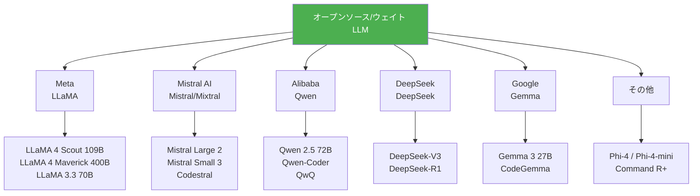
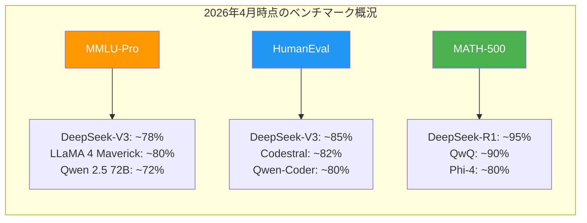

---
tags:
  - ai-services
  - open-source
  - llama
  - mistral
  - deepseek
created: "2026-04-19"
status: draft
---

# オープンソースモデル — LLaMA, Mistral, Qwen, DeepSeek, Gemma

## 1. オープンソースモデルの全体像



## 2. 主要モデル比較

```python
from dataclasses import dataclass
from typing import List, Optional

@dataclass
class OpenSourceModel:
    name: str
    organization: str
    params_b: float
    architecture: str
    context: int
    license: str
    release_date: str
    strengths: List[str]
    notable: str

models = [
    OpenSourceModel("LLaMA 4 Scout", "Meta", 109, "MoE (17B active)", 10_000_000,
                    "Llama 4 Community", "2025-04",
                    ["10M token コンテキスト", "MoE効率", "多言語"],
                    "Scout は軽量 MoE で長文脈特化"),
    OpenSourceModel("LLaMA 3.3 70B", "Meta", 70, "Dense Transformer", 128_000,
                    "Llama 3.3 Community", "2024-12",
                    ["バランス型", "広いエコシステム", "商用利用可"],
                    "最も広く使われているオープンモデルの一つ"),
    OpenSourceModel("Mistral Large 2", "Mistral AI", 123, "Dense", 128_000,
                    "Mistral Research", "2024-07",
                    ["多言語", "コーディング", "推論"],
                    "欧州発、GDPR 対応で欧州企業に人気"),
    OpenSourceModel("Qwen 2.5 72B", "Alibaba", 72, "Dense Transformer", 131_072,
                    "Apache 2.0", "2024-09",
                    ["多言語（中日韓英）", "コーディング", "数学"],
                    "Apache 2.0 で最も自由度が高いライセンス"),
    OpenSourceModel("DeepSeek-V3", "DeepSeek", 671, "MoE (37B active)", 128_000,
                    "DeepSeek License", "2024-12",
                    ["超低コスト学習", "MoE", "コーディング"],
                    "学習コスト $5.5M で GPT-4o 級。FP8学習の先駆"),
    OpenSourceModel("DeepSeek-R1", "DeepSeek", 671, "MoE (37B active)", 128_000,
                    "MIT License", "2025-01",
                    ["推論特化", "思考過程の明示", "o1級"],
                    "MIT License。蒸留モデル（1.5B-70B）も公開"),
    OpenSourceModel("Gemma 3 27B", "Google", 27, "Dense Transformer", 128_000,
                    "Gemma Terms of Use", "2025-03",
                    ["軽量", "マルチモーダル", "ShieldGemma"],
                    "Google のオープンモデル。効率重視"),
    OpenSourceModel("Phi-4", "Microsoft", 14, "Dense Transformer", 16_384,
                    "MIT License", "2025-02",
                    ["小型高性能", "推論強い", "教育データ重視"],
                    "14Bで70B級の推論性能を主張"),
]

print("=== オープンソースモデル比較 ===\n")
print(f"{'モデル':20s} {'パラメータ':>10} {'コンテキスト':>12} {'ライセンス':18s}")
print("-" * 68)
for m in models:
    params = f"{m.params_b:.0f}B"
    ctx = f"{m.context:,}"
    print(f"{m.name:20s} {params:>10} {ctx:>12} {m.license:18s}")
    print(f"  → {m.notable}")
```

## 3. ライセンス比較

```python
licenses = {
    "Apache 2.0": {
        "自由度": "最高",
        "商用利用": "無制限",
        "改変": "可",
        "制限": "なし",
        "代表モデル": "Qwen 2.5, Mistral 7B",
    },
    "MIT License": {
        "自由度": "最高",
        "商用利用": "無制限",
        "改変": "可",
        "制限": "なし",
        "代表モデル": "DeepSeek-R1, Phi-4",
    },
    "Llama Community License": {
        "自由度": "高（条件付き）",
        "商用利用": "月間アクティブ7億未満は可",
        "改変": "可",
        "制限": "Meta 競合への使用禁止、大規模利用は要申請",
        "代表モデル": "LLaMA 4, LLaMA 3.3",
    },
    "Gemma Terms of Use": {
        "自由度": "中",
        "商用利用": "可（条件あり）",
        "改変": "可",
        "制限": "モデルの出力でGemmaを学習させることを禁止",
        "代表モデル": "Gemma 3",
    },
}

print("=== ライセンス比較 ===\n")
for name, info in licenses.items():
    print(f"【{name}】")
    for k, v in info.items():
        print(f"  {k}: {v}")
    print()

print("選定指針:")
print("  商用利用で制限を避けたい → Apache 2.0 / MIT (Qwen, DeepSeek-R1)")
print("  最高性能を求める → Llama 4 (条件を確認)")
print("  欧州データ主権 → Mistral")
```

## 4. ベンチマーク比較



```python
# ベンチマークの注意点
benchmark_caveats = [
    "ベンチマークスコアは実タスクの性能を必ずしも反映しない",
    "データ汚染（学習データにベンチマーク問題が含まれる）の懸念",
    "モデルサイズと推論コストの考慮が必要",
    "日本語性能は英語ベンチマークとは別途評価が必要",
    "MoE モデルは総パラメータ数ではなくアクティブパラメータ数で比較すべき",
    "Chatbot Arena (LMSYS) のようなヒューマン評価も参照する",
]

print("=== ベンチマーク評価の注意点 ===\n")
for i, caveat in enumerate(benchmark_caveats, 1):
    print(f"  {i}. {caveat}")
```

## 5. ローカル実行環境

```python
local_tools = {
    "Ollama": {
        "説明": "macOS/Linux で LLM を簡単にローカル実行",
        "使い方": "ollama run llama3.1:8b",
        "特徴": "ワンコマンド、自動量子化、API サーバー内蔵",
    },
    "llama.cpp": {
        "説明": "C/C++ 実装の高速 LLM 推論エンジン",
        "使い方": "./llama-cli -m model.gguf -p 'Hello'",
        "特徴": "CPU推論可能、GGUF形式、量子化対応",
    },
    "vLLM": {
        "説明": "GPU向け高スループット推論エンジン",
        "使い方": "vllm serve meta-llama/Llama-3.1-8B",
        "特徴": "PagedAttention、OpenAI互換API",
    },
    "LM Studio": {
        "説明": "GUIベースのローカルLLM実行環境",
        "使い方": "GUIでモデル選択・ダウンロード・実行",
        "特徴": "初心者向け、Mac/Windows対応",
    },
}

print("=== ローカル LLM 実行ツール ===\n")
for name, info in local_tools.items():
    print(f"【{name}】")
    for k, v in info.items():
        print(f"  {k}: {v}")
    print()
```

## 6. ハンズオン演習

### 演習1: Ollama でモデル比較
Ollama で 3 つの 7-8B モデル（Llama, Qwen, Gemma）をローカル実行し、日本語タスクの品質を比較してください。

### 演習2: GGUF 量子化
llama.cpp で異なる量子化レベル（Q4, Q5, Q8, FP16）のモデルを作成し、品質と速度のトレードオフを測定してください。

### 演習3: オープンモデルの選定
自社のユースケースに最適なオープンモデルを選定し、ライセンス・性能・コストの観点から比較レポートを作成してください。

## 7. まとめ

- オープンモデルは急速に進化し、プロプライエタリモデルに迫る性能
- ライセンスは Apache 2.0 / MIT が最も自由度が高い
- DeepSeek は MoE + FP8 で学習コスト効率の革命を起こした
- ローカル実行は Ollama / llama.cpp で手軽に可能
- ベンチマークだけでなく実タスクでの評価が重要

## 参考文献

- Touvron et al. (2023) "LLaMA: Open and Efficient Foundation Language Models"
- DeepSeek (2024) "DeepSeek-V3 Technical Report"
- Jiang et al. (2023) "Mistral 7B"
