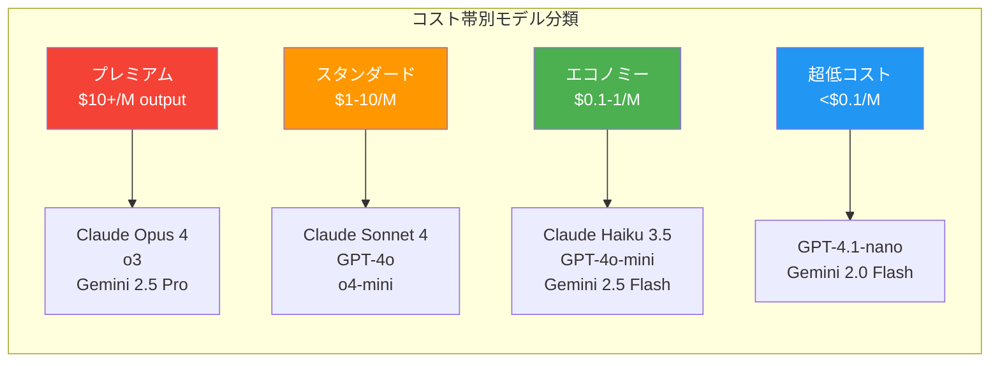
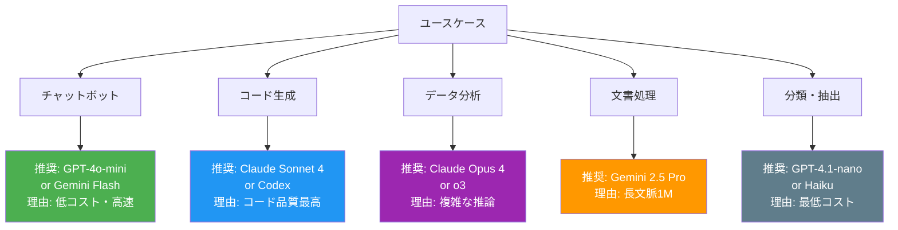

---
tags:
  - ai-services
  - comparison
  - pricing
  - benchmarks
  - selection
created: "2026-04-19"
status: draft
---

# AI サービス徹底比較 — 価格, 性能, レイテンシ, ユースケース別推奨

## 1. 主要モデルの価格比較



```python
from dataclasses import dataclass
from typing import Optional

@dataclass
class ModelPricing:
    provider: str
    model: str
    input_per_mtok: float
    output_per_mtok: float
    context_window: int
    cached_input: Optional[float] = None  # プロンプトキャッシュ

pricing = [
    # OpenAI
    ModelPricing("OpenAI", "o3", 10.00, 40.00, 200_000, 2.50),
    ModelPricing("OpenAI", "GPT-4o", 2.50, 10.00, 128_000, 1.25),
    ModelPricing("OpenAI", "GPT-4o-mini", 0.15, 0.60, 128_000, 0.075),
    ModelPricing("OpenAI", "GPT-4.1", 2.00, 8.00, 1_000_000, 0.50),
    ModelPricing("OpenAI", "GPT-4.1-nano", 0.10, 0.40, 1_000_000, 0.025),
    
    # Anthropic
    ModelPricing("Anthropic", "Claude Opus 4", 15.00, 75.00, 200_000, 1.50),
    ModelPricing("Anthropic", "Claude Sonnet 4", 3.00, 15.00, 200_000, 0.30),
    ModelPricing("Anthropic", "Claude Haiku 3.5", 0.80, 4.00, 200_000, 0.08),
    
    # Google
    ModelPricing("Google", "Gemini 2.5 Pro", 1.25, 10.00, 1_000_000),
    ModelPricing("Google", "Gemini 2.5 Flash", 0.15, 0.60, 1_000_000),
    ModelPricing("Google", "Gemini 2.0 Flash", 0.10, 0.40, 1_000_000),
]

print("=== API 価格比較 ($/1M tokens, 2026-04時点) ===\n")
print(f"{'プロバイダ':10s} {'モデル':22s} {'入力':>7} {'出力':>7} {'キャッシュ':>8} {'CTX':>10}")
print("-" * 72)
for p in sorted(pricing, key=lambda x: x.output_per_mtok, reverse=True):
    cache = f"${p.cached_input:.2f}" if p.cached_input else "N/A"
    print(f"{p.provider:10s} {p.model:22s} ${p.input_per_mtok:>5.2f} "
          f"${p.output_per_mtok:>5.2f} {cache:>8} {p.context_window:>10,}")
```

## 2. コスト計算ツール

```python
def calculate_cost(
    model_input_price: float,
    model_output_price: float,
    avg_input_tokens: int,
    avg_output_tokens: int,
    requests_per_day: int,
    cache_hit_rate: float = 0.0,
    cached_price: Optional[float] = None,
) -> dict:
    """月間 API コストの計算"""
    
    input_tokens_per_month = avg_input_tokens * requests_per_day * 30
    output_tokens_per_month = avg_output_tokens * requests_per_day * 30
    
    if cached_price and cache_hit_rate > 0:
        effective_input_price = (
            model_input_price * (1 - cache_hit_rate) + 
            cached_price * cache_hit_rate
        )
    else:
        effective_input_price = model_input_price
    
    input_cost = (input_tokens_per_month / 1_000_000) * effective_input_price
    output_cost = (output_tokens_per_month / 1_000_000) * model_output_price
    total = input_cost + output_cost
    
    return {
        "monthly_requests": requests_per_day * 30,
        "monthly_input_tokens": input_tokens_per_month,
        "monthly_output_tokens": output_tokens_per_month,
        "input_cost": input_cost,
        "output_cost": output_cost,
        "total_monthly_cost": total,
        "cost_per_request": total / (requests_per_day * 30),
    }

# チャットボットのコスト比較
print("=== ユースケース: チャットボット (1000 req/day, 500入力+300出力tok) ===\n")
scenarios = [
    ("Claude Opus 4", 15.00, 75.00, 1.50),
    ("Claude Sonnet 4", 3.00, 15.00, 0.30),
    ("GPT-4o", 2.50, 10.00, 1.25),
    ("GPT-4o-mini", 0.15, 0.60, 0.075),
    ("Gemini 2.5 Flash", 0.15, 0.60, None),
]

print(f"{'モデル':22s} {'月額コスト':>12} {'リクエスト単価':>14}")
print("-" * 52)
for name, inp, out, cache in scenarios:
    result = calculate_cost(inp, out, 500, 300, 1000, 0.5, cache)
    print(f"{name:22s} ${result['total_monthly_cost']:>10.2f} "
          f"${result['cost_per_request']:>12.6f}")
```

## 3. 性能比較（ベンチマーク）

```python
# 主要ベンチマークスコア（概算値、2026年4月時点）
benchmarks = {
    "モデル": [
        "Claude Opus 4", "Claude Sonnet 4", "GPT-4o", "o3",
        "Gemini 2.5 Pro", "DeepSeek-V3", "LLaMA 4 Maverick"
    ],
    "MMLU-Pro": [85, 80, 78, 86, 82, 78, 80],
    "HumanEval": [90, 88, 85, 92, 84, 85, 82],
    "MATH-500": [82, 78, 74, 95, 80, 75, 72],
    "SWE-bench": [72, 68, 52, 70, 58, 55, 50],
    "Chatbot Arena": [1380, 1340, 1320, 1370, 1350, 1310, 1290],
}

print("=== ベンチマーク比較（概算値）===\n")
models_list = benchmarks["モデル"]
metrics = [k for k in benchmarks if k != "モデル"]

header = f"{'':22s}" + "".join(f"{m:>14}" for m in metrics)
print(header)
print("-" * (22 + 14 * len(metrics)))

for i, model in enumerate(models_list):
    scores = "".join(f"{benchmarks[m][i]:>14}" for m in metrics)
    print(f"{model:22s}{scores}")
```

## 4. レイテンシ比較

```python
latency_profiles = {
    "GPT-4o": {"TTFT_ms": 300, "tokens_per_sec": 80, "特性": "安定・高速"},
    "GPT-4o-mini": {"TTFT_ms": 150, "tokens_per_sec": 120, "特性": "最速クラス"},
    "o3": {"TTFT_ms": 3000, "tokens_per_sec": 40, "特性": "思考時間が長い"},
    "Claude Sonnet 4": {"TTFT_ms": 400, "tokens_per_sec": 70, "特性": "バランス型"},
    "Claude Haiku 3.5": {"TTFT_ms": 200, "tokens_per_sec": 100, "特性": "高速"},
    "Gemini 2.5 Flash": {"TTFT_ms": 200, "tokens_per_sec": 100, "特性": "超高速"},
}

print("=== レイテンシ比較（概算）===\n")
print(f"{'モデル':22s} {'TTFT':>8} {'tok/s':>8} {'500tok生成':>12} {'特性'}")
print("-" * 68)
for model, stats in latency_profiles.items():
    gen_time = stats["TTFT_ms"] + (500 / stats["tokens_per_sec"]) * 1000
    print(f"{model:22s} {stats['TTFT_ms']:>6}ms {stats['tokens_per_sec']:>6}/s "
          f"{gen_time/1000:>10.1f}s  {stats['特性']}")
```

## 5. ユースケース別推奨



```python
recommendations = {
    "カスタマーサポートBot": {
        "推奨": "GPT-4o-mini or Gemini 2.5 Flash",
        "理由": "低コスト・高速レスポンス・十分な品質",
        "月間コスト目安": "$50-200 (1万件/月)",
    },
    "コードレビュー・生成": {
        "推奨": "Claude Sonnet 4 or GPT-4.1",
        "理由": "コード理解力最高クラス、長文脈",
        "月間コスト目安": "$100-500",
    },
    "複雑な分析・意思決定": {
        "推奨": "Claude Opus 4 or o3",
        "理由": "最高の推論能力、正確性重視",
        "月間コスト目安": "$500-5000",
    },
    "大量文書の要約": {
        "推奨": "Gemini 2.5 Pro (1M ctx) or GPT-4.1 (1M ctx)",
        "理由": "超長文脈で文書全体を一度に処理",
        "月間コスト目安": "$200-1000",
    },
    "分類・タグ付け": {
        "推奨": "GPT-4.1-nano or 自前ファインチューニング",
        "理由": "最低コスト、単純タスクに最適",
        "月間コスト目安": "$10-50 (10万件/月)",
    },
    "プライバシー重視": {
        "推奨": "オープンモデル (Llama/Qwen) + vLLM",
        "理由": "データが外部に出ない、完全制御",
        "月間コスト目安": "GPU費用 $500-3000",
    },
}

print("=== ユースケース別推奨モデル ===\n")
for usecase, info in recommendations.items():
    print(f"【{usecase}】")
    for k, v in info.items():
        print(f"  {k}: {v}")
    print()
```

## 6. ハンズオン演習

### 演習1: マルチモデル評価
同一のプロンプトセット（20問以上）を5つの異なるモデルに投入し、品質・速度・コストを定量比較してください。

### 演習2: コスト最適化戦略
現在の API 使用パターンを分析し、モデルルーティング（難易度に応じたモデル切替）でコストを30%以上削減する方法を設計してください。

### 演習3: フォールバック設計
プライマリ API が障害時に別プロバイダにフォールバックする仕組みを実装してください。

## 7. まとめ

- モデル選択は「タスク複雑度 x コスト x レイテンシ」の三角形
- 90%のタスクは mini/Flash クラスで十分（コスト100倍の差）
- プロンプトキャッシュで入力コストを50-90%削減可能
- プロバイダロックインを避けるため、抽象化レイヤーを設計すべき
- ベンチマークより実タスクでの評価を重視する

## 参考文献

- 各社公式ドキュメント・価格表
- LMSYS Chatbot Arena: https://chat.lmsys.org
- Artificial Analysis: https://artificialanalysis.ai
