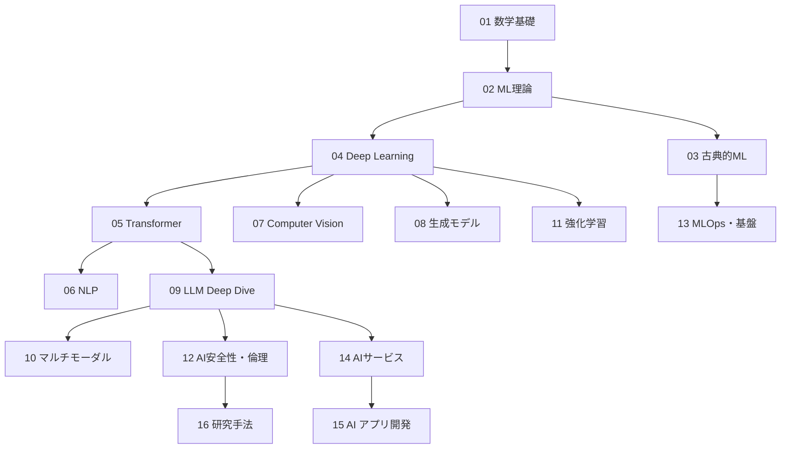

# AI 体系学習カリキュラム

## 目標
大学教授レベルの AI 理論理解 + トップエンジニアとしての AI 開発力

## 対象者
- エンジニア経験 3 年以上
- 大学レベルの数学（線形代数・微積分・確率統計）を理解
- Python でのプログラミング経験あり

## ロードマップ（推奨順序）

## フォルダ構成

### Phase 1: 理論基盤（教授レベルの理解に必須）
| # | フォルダ | 内容 | 資料数目安 |
|---|---------|------|-----------|
| 01 | [[01_Math_Foundations]] | 線形代数, 確率統計, 最適化理論, 情報理論 | 8-10 |
| 02 | [[02_ML_Theory]] | 統計的学習理論, PAC学習, バイアス-バリアンス, VC次元 | 6-8 |
| 03 | [[03_Classical_ML]] | SVM, 決定木, アンサンブル, ベイズ, クラスタリング | 8-10 |

### Phase 2: ディープラーニング基盤
| # | フォルダ | 内容 | 資料数目安 |
|---|---------|------|-----------|
| 04 | [[04_Deep_Learning]] | NN基礎, CNN, RNN/LSTM, 最適化, 正則化, BatchNorm | 10-12 |
| 05 | [[05_Transformer_Architecture]] | Attention, Transformer, 位置エンコーディング, BERT, GPT | 8-10 |

### Phase 3: 応用領域
| # | フォルダ | 内容 | 資料数目安 |
|---|---------|------|-----------|
| 06 | [[06_NLP]] | トークナイゼーション, 埋め込み, Seq2Seq, 翻訳, 要約 | 6-8 |
| 07 | [[07_Computer_Vision]] | 画像分類, 物体検出, セグメンテーション, ViT | 6-8 |
| 08 | [[08_Generative_Models]] | VAE, GAN, Diffusion Models, Flow-based | 8-10 |
| 09 | [[09_LLM_Deep_Dive]] | スケーリング則, RLHF, CoT, ICL, MoE, KV Cache | 10-12 |
| 10 | [[10_Multimodal_AI]] | CLIP, マルチモーダルLLM, 音声+画像+テキスト統合 | 4-6 |
| 11 | [[11_Reinforcement_Learning]] | MDP, Q学習, Policy Gradient, Actor-Critic, RLHF | 6-8 |

### Phase 4: 実務・最先端
| # | フォルダ | 内容 | 資料数目安 |
|---|---------|------|-----------|
| 12 | [[12_AI_Safety_Ethics]] | アライメント, 解釈可能性, バイアス, レッドチーミング | 4-6 |
| 13 | [[13_MLOps_Infrastructure]] | 学習パイプライン, 分散学習, モデルサービング, GPU/TPU | 6-8 |
| 14 | [[14_AI_Services]] | OpenAI, Anthropic, Google, AWS, HuggingFace 徹底比較 | 8-10 |
| 15 | [[15_AI_App_Development]] | API統合, RAG, ファインチューニング, エージェント, MCP | 8-10 |
| 16 | [[16_Research_Methods]] | 論文の読み方, 重要論文 30 選, ベンチマーク, 最新動向 | 4-6 |

## 合計: 約 120-140 資料

## 学習時間の目安
- Phase 1: 約 40 時間
- Phase 2: 約 30 時間
- Phase 3: 約 50 時間
- Phase 4: 約 40 時間
- **合計: 約 160 時間**（1日2時間 → 約 3 ヶ月）
