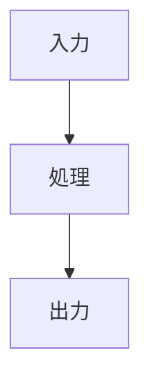

# {{title}}

## Overview
- **目的**:
- **対象者**:
- **所要時間**: 約30min
- **前提知識**:

## Concept（概念）

### 何を解決するか

### 仕組み（図解）



### 主要な用語

| 用語 | 説明 |
|------|------|
| | |

## Deep Dive（詳細）

### アーキテクチャ / アルゴリズム

### トレードオフ

| 観点 | メリット | デメリット |
|------|---------|-----------|
| | | |

## Code Example（コード例）

### 最小構成

```python
# 最小限の動作例
```

### 実践パターン

```python
# 本番に近い使い方
```

## Hands-on（演習）

### Exercise 1:

**目標**:
**手順**:
1.
2.
3.

**期待結果**:

## Comparison（比較）

| | 手法A | 手法B |
|---|-------|-------|
| 精度 | | |
| 速度 | | |
| コスト | | |

## Summary（まとめ）
-

## References
- [公式ドキュメント]()
- [論文/ブログ]()
- [関連ノート]()
